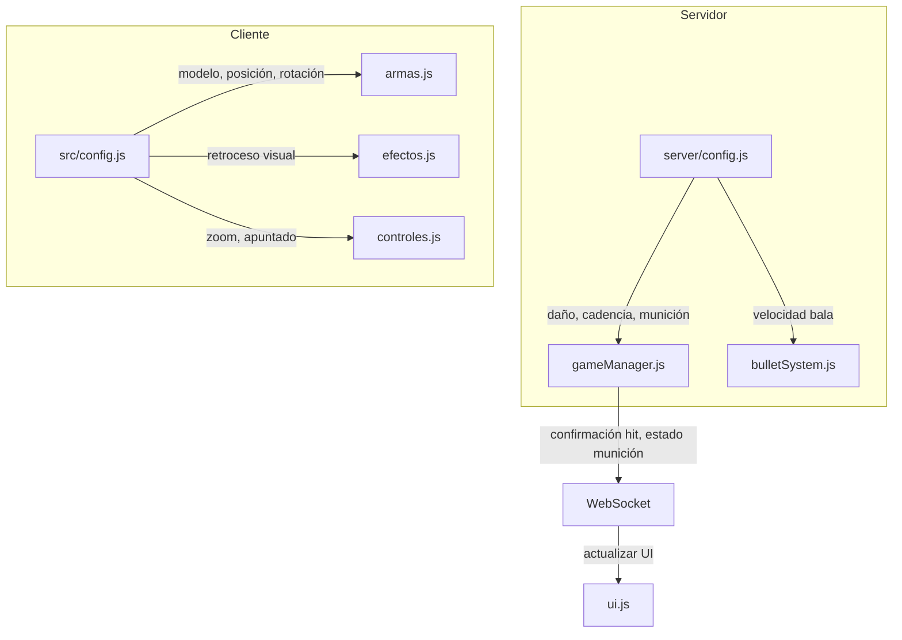

# Documento de Diseño

## Visión General

Este diseño elimina la duplicación de valores entre `src/config.js` (cliente) y `server/config.js` (servidor) siguiendo el principio "el servidor manda, el cliente refleja".

**Separación de responsabilidades:**
- **Servidor**: Valores autoritativos de gameplay (daño, cadencia, munición, headshot, velocidad bala)
- **Cliente**: Valores visuales y de presentación (modelos 3D, posiciones, retroceso visual, apuntado, zoom)

## Arquitectura



## Componentes e Interfaces

### server/config.js (Configuración Autoritativa)

```javascript
// Valores que SOLO el servidor conoce y controla
export const WEAPON_CONFIG = {
  M4A1: {
    damage: 30,              // Daño por bala
    fireRate: 75,            // Milisegundos entre disparos
    magazineSize: 30,        // Balas por cargador
    totalAmmo: 120,          // Munición total
    reloadTime: 2000,        // Tiempo de recarga (ms)
    bulletSpeed: 35,         // Velocidad para cálculos de hit
    headshotMultiplier: 2.0, // Multiplicador headshot
    projectiles: 1,          // Proyectiles por disparo (escopeta = 12)
    spread: 0                // Dispersión (escopeta = 0.45)
  },
  // ... otras armas
};
```

### src/config.js (Configuración Visual)

```javascript
// Valores que el cliente usa para renderizado
export const CONFIG = {
  armas: {
    M4A1: {
      nombre: "M4A1",
      tipo: "rifle",
      modelo: "modelos/FBX/Weapons/M4A1.fbx",
      posicion: { x: 0.3, y: -0.3, z: -0.5 },
      rotacion: { x: 0, y: Math.PI, z: 0 },
      retroceso: {
        cantidad: 0.04,
        arriba: 0.02,
        duracion: 50
      },
      apuntado: {
        zoom: 1.5,
        reduccionRetroceso: 0.6,
        tiempoTransicion: 0.2,
        posicionArma: { x: 0, y: -0.1, z: -0.2 },
        miraTelescopica: false
      },
      semiAutomatica: false
    },
    // ... otras armas
  }
};
```

## Modelos de Datos

### Propiedades por Ubicación

| Propiedad | Servidor | Cliente | Razón |
|-----------|----------|---------|-------|
| damage | ✅ | ❌ | Afecta gameplay |
| fireRate | ✅ | ❌ | Afecta gameplay |
| magazineSize | ✅ | ❌ | Afecta gameplay |
| totalAmmo | ✅ | ❌ | Afecta gameplay |
| reloadTime | ✅ | ❌ | Afecta gameplay |
| bulletSpeed | ✅ | ❌ | Cálculos de hit |
| headshotMultiplier | ✅ | ❌ | Afecta gameplay |
| projectiles | ✅ | ❌ | Afecta gameplay |
| spread | ✅ | ❌ | Afecta gameplay |
| modelo | ❌ | ✅ | Solo visual |
| posicion | ❌ | ✅ | Solo visual |
| rotacion | ❌ | ✅ | Solo visual |
| retroceso | ❌ | ✅ | Animación visual |
| apuntado | ❌ | ✅ | Efectos visuales |
| nombre | ❌ | ✅ | UI/display |
| tipo | ❌ | ✅ | UI/categorización |
| semiAutomatica | ❌ | ✅ | Control de input |

## Propiedades de Correctitud

*Una propiedad es una característica o comportamiento que debe mantenerse verdadero en todas las ejecuciones válidas del sistema - esencialmente, una declaración formal sobre lo que el sistema debe hacer. Las propiedades sirven como puente entre especificaciones legibles por humanos y garantías de correctitud verificables por máquina.*

### Propiedad 1: Valores de gameplay exclusivos del servidor

*Para cualquier* arma definida en el sistema, las propiedades de gameplay (damage, fireRate, magazineSize, totalAmmo, reloadTime, bulletSpeed, headshotMultiplier, projectiles, spread) DEBEN existir únicamente en `server/config.js` y NO en `src/config.js`.

**Valida: Requisitos 1.1, 1.2, 1.3, 1.4, 3.1, 3.2, 3.3, 3.4**

### Propiedad 2: Valores visuales exclusivos del cliente

*Para cualquier* arma definida en el sistema, las propiedades visuales (modelo, posicion, rotacion, retroceso, apuntado, nombre, tipo) DEBEN existir únicamente en `src/config.js` y NO en `server/config.js`.

**Valida: Requisitos 2.1, 2.2, 2.3**

### Propiedad 3: Nomenclatura en español para cliente

*Para cualquier* propiedad en la configuración de armas del cliente, el nombre de la propiedad DEBE estar en español (usando el conjunto de nombres permitidos: nombre, tipo, modelo, posicion, rotacion, retroceso, apuntado, semiAutomatica, dispersionSinMira).

**Valida: Requisitos 5.1**

## Manejo de Errores

1. **Arma no encontrada en servidor**: Usar configuración `default` como fallback
2. **Arma no encontrada en cliente**: Log de error y usar modelo genérico
3. **Desincronización cliente-servidor**: El servidor siempre tiene la última palabra

## Estrategia de Testing

### Tests Unitarios

- Verificar que `server/config.js` exporta todas las armas con propiedades requeridas
- Verificar que `src/config.js` exporta todas las armas con propiedades visuales
- Verificar que `getWeaponConfig()` retorna valores correctos

### Tests Basados en Propiedades

Se usará **fast-check** como librería de property-based testing para JavaScript.

Cada test debe:
- Ejecutar mínimo 100 iteraciones
- Estar etiquetado con el formato: `**Feature: config-sin-duplicacion, Property {número}: {descripción}**`
- Referenciar el requisito que valida

**Propiedades a testear:**

1. **Exclusividad de valores de gameplay**: Para cualquier nombre de arma, verificar que las propiedades de gameplay no existen en config del cliente
2. **Exclusividad de valores visuales**: Para cualquier nombre de arma, verificar que las propiedades visuales no existen en config del servidor
3. **Nomenclatura española**: Para cualquier propiedad de arma en cliente, verificar que está en el conjunto de nombres permitidos en español
