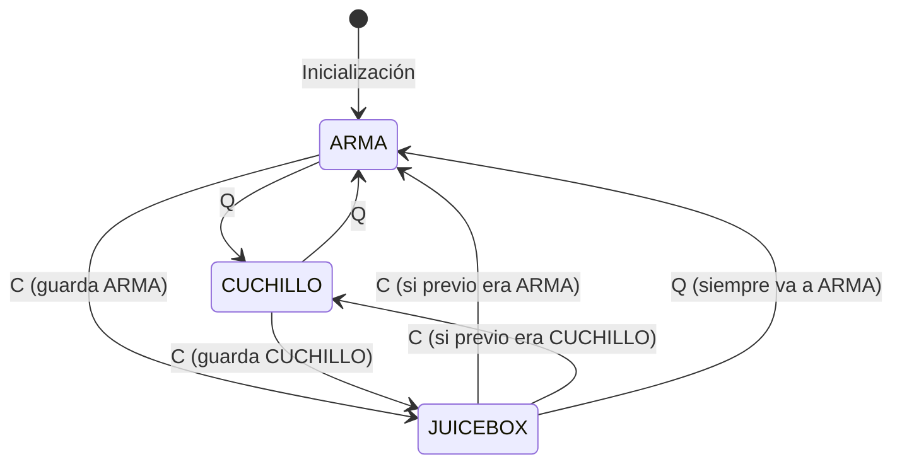

# Design Document: Fix Equipment Toggle System

## Overview

Este diseño corrige el bug en el sistema de equipamiento donde al alternar Q → C → Q el jugador no ve ningún item. El problema raíz es que los tres estados (arma, cuchillo, JuiceBox) no se manejan de forma mutuamente excluyente.

La solución introduce un estado unificado `itemEquipado` que puede ser exactamente uno de: `'ARMA'`, `'CUCHILLO'`, o `'JUICEBOX'`. Las funciones `alternarCuchillo` y `alternarJuiceBox` se refactorizan para usar este estado centralizado.

## Architecture



El diagrama muestra las transiciones válidas:
- **Q** siempre alterna entre ARMA y CUCHILLO, excepto si está en JUICEBOX donde va directo a ARMA
- **C** alterna entre el item actual y JUICEBOX, recordando el item previo

## Components and Interfaces

### Estado Unificado de Equipamiento

```javascript
/**
 * Estado unificado del sistema de equipamiento
 * Garantiza que exactamente un item esté equipado en todo momento
 */
const estadoEquipamiento = {
  itemEquipado: 'ARMA',           // 'ARMA' | 'CUCHILLO' | 'JUICEBOX'
  armaPrincipal: null,            // Tipo de arma principal (ej: 'M4A1')
  itemPrevioAJuiceBox: null       // Item a restaurar al desequipar JuiceBox
};
```

### Funciones Modificadas

#### `alternarCuchillo(weaponContainer)`
- Si `itemEquipado === 'ARMA'`: cambiar a CUCHILLO
- Si `itemEquipado === 'CUCHILLO'`: cambiar a ARMA
- Si `itemEquipado === 'JUICEBOX'`: cambiar a ARMA (no a cuchillo)

#### `alternarJuiceBox(weaponContainer)`
- Si `itemEquipado !== 'JUICEBOX'`: guardar item actual, cambiar a JUICEBOX
- Si `itemEquipado === 'JUICEBOX'`: restaurar item previo guardado

### Funciones de Visibilidad

```javascript
/**
 * Actualiza la visibilidad de los modelos según el item equipado
 * Garantiza que exactamente un modelo sea visible
 */
function actualizarVisibilidadModelos(itemEquipado, weaponContainer) {
  // Ocultar todos los modelos primero
  if (modeloArma) modeloArma.visible = false;
  if (estadoCuracion.modeloJuiceBox) estadoCuracion.modeloJuiceBox.visible = false;
  
  // Mostrar solo el modelo correspondiente
  switch (itemEquipado) {
    case 'ARMA':
    case 'CUCHILLO':
      if (modeloArma) modeloArma.visible = true;
      break;
    case 'JUICEBOX':
      if (estadoCuracion.modeloJuiceBox) estadoCuracion.modeloJuiceBox.visible = true;
      break;
  }
}
```

## Data Models

### Antes (Estado Fragmentado)
```javascript
// Estado del cuchillo
const estadoCuchillo = {
  equipado: false,              // ❌ Puede desincronizarse
  armaPrincipalPrevia: null
};

// Estado del JuiceBox
const estadoCuracion = {
  juiceBoxEquipado: false,      // ❌ Puede desincronizarse
  armaPreviaACuracion: null
};

// arma.tipoActual puede ser 'KNIFE' o un arma
```

### Después (Estado Unificado)
```javascript
// Un solo estado que determina qué está equipado
const estadoEquipamiento = {
  itemEquipado: 'ARMA',         // ✅ Siempre exactamente uno
  armaPrincipal: 'M4A1',        // ✅ Siempre definido
  itemPrevioAJuiceBox: null     // ✅ Solo usado por JuiceBox
};
```

## Correctness Properties

*A property is a characteristic or behavior that should hold true across all valid executions of a system-essentially, a formal statement about what the system should do. Properties serve as the bridge between human-readable specifications and machine-verifiable correctness guarantees.*

### Property 1: Invariante de Exclusividad
*For any* estado del sistema de equipamiento, exactamente uno de los tres items (arma, cuchillo, JuiceBox) debe estar equipado. Nunca cero, nunca más de uno.

**Validates: Requirements 1.4, 3.1, 3.2**

### Property 2: Transiciones Q Correctas
*For any* estado inicial del equipamiento:
- Si `itemEquipado === 'ARMA'`, entonces después de Q: `itemEquipado === 'CUCHILLO'`
- Si `itemEquipado === 'CUCHILLO'`, entonces después de Q: `itemEquipado === 'ARMA'`
- Si `itemEquipado === 'JUICEBOX'`, entonces después de Q: `itemEquipado === 'ARMA'`

**Validates: Requirements 1.1, 1.2, 1.3**

### Property 3: Transiciones C Correctas
*For any* estado inicial del equipamiento:
- Si `itemEquipado !== 'JUICEBOX'`, entonces después de C: `itemEquipado === 'JUICEBOX'` y `itemPrevioAJuiceBox === estadoAnterior`
- Si `itemEquipado === 'JUICEBOX'`, entonces después de C: `itemEquipado === itemPrevioAJuiceBox`

**Validates: Requirements 2.1, 2.2, 2.3, 2.4**

### Property 4: Consistencia de Secuencias
*For any* secuencia arbitraria de acciones Q y C, el sistema siempre mantiene exactamente un item equipado y las transiciones son determinísticas.

**Validates: Requirements 3.3**

## Error Handling

| Escenario | Manejo |
|-----------|--------|
| `weaponContainer` es null | Actualizar estado interno sin cambiar modelos |
| Modelo no cargado | Log warning, mantener estado consistente |
| Recarga en progreso | Bloquear cambio, retornar false |
| Curación en progreso | Bloquear cambio a cuchillo/arma, permitir cancelar con C |

## Testing Strategy

### Unit Tests
- Verificar estado inicial correcto (arma equipada)
- Verificar cada transición individual (Q desde cada estado, C desde cada estado)
- Verificar bloqueo durante recarga
- Verificar bloqueo durante curación

### Property-Based Tests
Se usará la librería **fast-check** para JavaScript.

Cada test debe:
1. Ejecutar mínimo 100 iteraciones
2. Estar anotado con el formato: `**Feature: fix-equipment-toggle, Property {number}: {property_text}**`

**Tests a implementar:**
1. **Property 1**: Generar secuencias aleatorias de Q/C, verificar invariante de exclusividad después de cada acción
2. **Property 2**: Generar estados iniciales aleatorios, ejecutar Q, verificar transición correcta
3. **Property 3**: Generar estados iniciales aleatorios, ejecutar C, verificar transición correcta y memoria
4. **Property 4**: Generar secuencias largas aleatorias, verificar consistencia final
