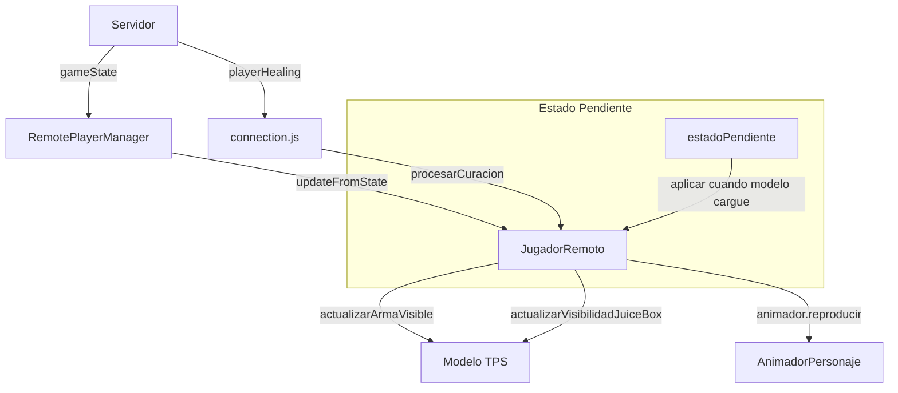

# Design Document: Fix TPS State Synchronization

## Overview

Este diseño aborda los bugs del sistema TPS (Third Person Shooter) relacionados con la sincronización del estado visual de los jugadores remotos. Los problemas principales son:

1. El arma mostrada no corresponde a la seleccionada por el jugador
2. Las animaciones se muestran cuando el juego no está activo
3. El arma no se oculta cuando se equipa el JuiceBox
4. La animación de curación (healt) no funciona correctamente
5. El estado del TPS no se actualiza correctamente cuando el modelo aún no está cargado

## Architecture



## Components and Interfaces

### 1. JugadorRemoto (Modificaciones)

```javascript
// Nuevo: Cola de estados pendientes para aplicar cuando el modelo cargue
this.estadoPendiente = {
  currentWeapon: null,
  isHealing: false,
  isAiming: false
};

// Nuevo: Flag para saber si hay estados pendientes
this.tieneEstadosPendientes = false;
```

**Métodos a modificar:**

- `loadCharacterModel()`: Aplicar estados pendientes después de cargar
- `updateFromState()`: Encolar estados si el modelo no está cargado
- `actualizarArmaVisible()`: Verificar que el modelo esté cargado
- `procesarCuracion()`: Manejar caso cuando modelo no está cargado
- `finalizarCuracion()`: Asegurar restauración correcta del arma

### 2. RemotePlayerManager (Sin cambios mayores)

El manager ya delega correctamente a JugadorRemoto, solo necesita asegurar que los eventos de curación lleguen correctamente.

### 3. main.js (Modificaciones menores)

Asegurar que el callback `onPlayerHealing` esté correctamente configurado y que los jugadores remotos se oculten cuando el menú de selección está activo.

## Data Models

### Estado Pendiente del Jugador Remoto

```javascript
{
  currentWeapon: string | null,  // Arma pendiente de mostrar
  isHealing: boolean,            // Si hay curación pendiente
  isAiming: boolean              // Si está apuntando
}
```

### Estado de Curación

```javascript
{
  curacionEnProgreso: boolean,   // Si hay curación activa
  armaPrevia: string,            // Arma a restaurar después de curación
  animacionCuracionCargada: boolean
}
```

## Correctness Properties

*A property is a characteristic or behavior that should hold true across all valid executions of a system-essentially, a formal statement about what the system should do. 
Properties serve as the bridge between human-readable specifications and machine-verifiable correctness guarantees.*

### Property 1: Arma visible coincide con estado del servidor
*For any* jugador remoto con modelo cargado, el arma visible debe coincidir con `currentWeapon` del estado del servidor (excepto durante curación).
**Validates: Requirements 1.1, 1.2, 5.1**

### Property 2: Estados pendientes se aplican al cargar modelo
*For any* jugador remoto que recibe actualizaciones de estado antes de que el modelo cargue, todos los estados pendientes deben aplicarse correctamente cuando `modeloCargado` sea true.
**Validates: Requirements 1.3, 5.3**

### Property 3: Curación oculta armas y muestra JuiceBox
*For any* jugador remoto con `curacionEnProgreso === true`, todas las armas deben estar ocultas y el JuiceBox debe estar visible.
**Validates: Requirements 3.1, 3.2**

### Property 4: Fin de curación restaura arma correcta
*For any* jugador remoto que finaliza curación, el JuiceBox debe estar oculto y el arma visible debe coincidir con `currentWeapon`.
**Validates: Requirements 3.3, 4.3**

### Property 5: Animación de curación se reproduce correctamente
*For any* jugador remoto que inicia curación con animación cargada, la animación actual del animador debe ser 'healt'.
**Validates: Requirements 4.1, 5.2**

## Error Handling

1. **Modelo no cargado**: Encolar estados y aplicar cuando el modelo esté listo
2. **Animación healt no disponible**: Usar animación idle como fallback
3. **JuiceBox no cargado**: Continuar sin mostrar el modelo, pero ocultar armas
4. **Hueso de mano no encontrado**: Log de advertencia, continuar sin JuiceBox

## Testing Strategy

### Unit Tests
- Verificar que `estadoPendiente` se inicializa correctamente
- Verificar que `aplicarEstadosPendientes()` aplica todos los estados
- Verificar que `actualizarArmaVisible()` oculta armas durante curación

### Property-Based Tests
Se usará la librería **fast-check** para JavaScript.

Cada test debe:
- Ejecutar mínimo 100 iteraciones
- Estar anotado con el formato: `**Feature: fix-tps-state, Property {number}: {property_text}**`

**Tests a implementar:**
1. Property 1: Generar estados aleatorios de jugador y verificar arma visible
2. Property 2: Simular carga de modelo con estados pendientes
3. Property 3: Verificar visibilidad durante curación
4. Property 4: Verificar restauración después de curación
5. Property 5: Verificar animación durante curación
