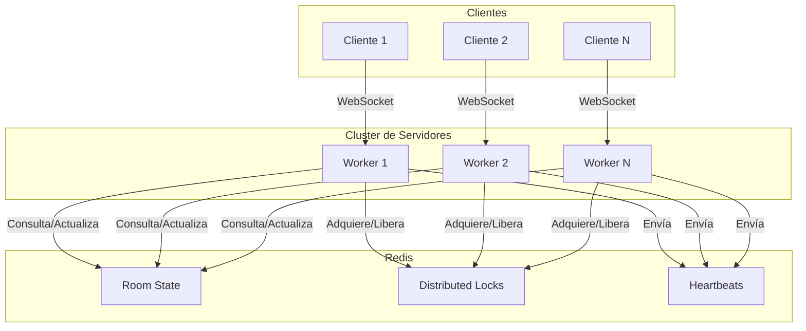

# Design Document: Matchmaking Centralizado con Redis

## Overview

Este diseño implementa un sistema de matchmaking centralizado usando Redis como fuente única de verdad para el estado de salas del cluster. Resuelve el problema actual donde jugadores conectados a diferentes workers nunca se encuentran porque cada worker mantiene su propio estado local de salas.

### Problema Actual
```
┌─────────┐     ┌─────────────┐     ┌──────────────────┐
│ Jugador │────▶│   Nginx     │────▶│ Worker 1         │
│    A    │     │ (balanceo)  │     │ RoomManager local│
└─────────┘     └─────────────┘     │ Sala X (1 player)│
                      │             └──────────────────┘
┌─────────┐           │             ┌──────────────────┐
│ Jugador │───────────┴────────────▶│ Worker 2         │
│    B    │                         │ RoomManager local│
└─────────┘                         │ Sala Y (1 player)│
                                    └──────────────────┘
```
Jugadores A y B nunca se ven porque están en salas diferentes de workers diferentes.

### Solución Propuesta
```
┌─────────┐     ┌─────────────┐     ┌──────────────────┐
│ Jugador │────▶│   Nginx     │────▶│ Worker 1         │
│    A    │     │ (balanceo)  │     │                  │
└─────────┘     └─────────────┘     └────────┬─────────┘
                      │                      │
┌─────────┐           │             ┌────────▼─────────┐
│ Jugador │───────────┴────────────▶│ Worker 2         │
│    B    │                         │                  │
└─────────┘                         └────────┬─────────┘
                                             │
                                    ┌────────▼─────────┐
                                    │     Redis        │
                                    │ Estado Central   │
                                    │ Sala X (2 players)│
                                    └──────────────────┘
```
Ambos jugadores son asignados a la misma sala porque Redis tiene el estado global.

## Architecture



## Components and Interfaces

### 1. RedisMatchmaking (Nuevo)

Módulo principal que maneja toda la interacción con Redis para matchmaking.

```javascript
/**
 * RedisMatchmaking - Matchmaking centralizado con Redis
 */
class RedisMatchmaking {
  constructor(config) // host, port, password, db
  
  // Conexión
  async connect()
  async disconnect()
  isConnected()
  
  // Operaciones de Sala
  async registerRoom(roomInfo)      // Registra sala en Redis
  async unregisterRoom(roomId)      // Elimina sala de Redis
  async updateRoomPlayers(roomId, playerCount)  // Actualiza contador
  async getRoomInfo(roomId)         // Obtiene info de sala
  
  // Matchmaking
  async findAvailableRooms()        // Lista salas públicas disponibles
  async findBestRoom()              // Encuentra sala óptima
  async findOrCreateRoom(workerId)  // Matchmaking completo
  
  // Locking
  async acquireLock(roomId)         // Adquiere lock distribuido
  async releaseLock(roomId, lockId) // Libera lock
  
  // Heartbeat
  async sendHeartbeat(roomId)       // Renueva TTL de sala
  
  // Utilidades
  serializeRoom(room)               // Serializa sala a JSON
  deserializeRoom(json)             // Deserializa JSON a sala
}
```

### 2. RedisConnection (Nuevo)

Wrapper para la conexión a Redis con reconexión automática.

```javascript
/**
 * RedisConnection - Gestiona conexión a Redis con resiliencia
 */
class RedisConnection {
  constructor(config)
  
  async connect()
  async disconnect()
  async reconnect()
  
  // Operaciones básicas con timeout
  async get(key)
  async set(key, value, options)
  async del(key)
  async exists(key)
  async expire(key, seconds)
  async incr(key)
  async decr(key)
  
  // Operaciones atómicas
  async multi()  // Inicia transacción
  async exec()   // Ejecuta transacción
  
  // Pub/Sub (para futuras extensiones)
  async publish(channel, message)
  async subscribe(channel, callback)
}
```

### 3. Modificaciones a WorkerServer

El WorkerServer existente se modificará para usar RedisMatchmaking:

```javascript
// Cambios en WorkerServer
class WorkerServer {
  constructor() {
    // ... existente ...
    this.redisMatchmaking = null;  // Nuevo
  }
  
  async start() {
    // Inicializar Redis antes de aceptar conexiones
    this.redisMatchmaking = new RedisMatchmaking(REDIS_CONFIG);
    await this.redisMatchmaking.connect();
    
    // ... resto del inicio ...
  }
  
  // Modificar _handleLobbyMessage para usar Redis
  async _handleLobbyMessage(ws, message) {
    // case 'matchmaking': usar this.redisMatchmaking.findOrCreateRoom()
  }
}
```

### 4. Estructura de Datos en Redis

```
# Sala individual
room:{roomId} = {
  "id": "room_123",
  "codigo": "ABC123",
  "tipo": "publica",
  "workerId": 1,
  "jugadores": 3,
  "maxJugadores": 8,
  "createdAt": 1704307200000,
  "lastHeartbeat": 1704307260000
}
TTL: 300 segundos (5 minutos)

# Índice de salas públicas (Set ordenado por jugadores)
rooms:public = ZSET {
  "room_123": 3,  // score = número de jugadores
  "room_456": 5,
  "room_789": 1
}

# Lock distribuido
lock:room:{roomId} = {
  "workerId": 1,
  "acquiredAt": 1704307200000
}
TTL: 5 segundos (auto-expire)

# Heartbeat de worker
worker:{workerId}:heartbeat = timestamp
TTL: 60 segundos
```

## Data Models

### RoomInfo (para Redis)

```javascript
/**
 * @typedef {Object} RoomInfo
 * @property {string} id - ID único de la sala
 * @property {string} codigo - Código de 6 caracteres
 * @property {'publica'|'privada'} tipo - Tipo de sala
 * @property {number} workerId - ID del worker que hospeda la sala
 * @property {number} jugadores - Número actual de jugadores
 * @property {number} maxJugadores - Máximo de jugadores permitidos
 * @property {number} createdAt - Timestamp de creación
 * @property {number} lastHeartbeat - Último heartbeat recibido
 */
```

### LockInfo

```javascript
/**
 * @typedef {Object} LockInfo
 * @property {string} lockId - ID único del lock
 * @property {number} workerId - Worker que tiene el lock
 * @property {number} acquiredAt - Timestamp de adquisición
 */
```

### RedisConfig

```javascript
/**
 * @typedef {Object} RedisConfig
 * @property {string} host - Host de Redis (default: localhost)
 * @property {number} port - Puerto de Redis (default: 6379)
 * @property {string} [password] - Contraseña opcional
 * @property {number} [db] - Base de datos (default: 0)
 * @property {number} [connectTimeout] - Timeout de conexión (default: 5000ms)
 * @property {number} [commandTimeout] - Timeout de comandos (default: 1000ms)
 * @property {number} [maxRetries] - Reintentos máximos (default: 10)
 * @property {number} [retryDelay] - Delay entre reintentos (default: 5000ms)
 */
```

## Correctness Properties

*A property is a characteristic or behavior that should hold true across all valid executions of a system-essentially, a formal statement about what the system should do. Properties serve as the bridge between human-readable specifications and machine-verifiable correctness guarantees.*

### Property 1: Selección de sala óptima

*For any* conjunto de salas públicas disponibles con diferentes cantidades de jugadores, el matchmaking SHALL seleccionar la sala con el mayor número de jugadores activos.

**Validates: Requirements 1.2**

### Property 2: Round-trip de serialización

*For any* objeto RoomInfo válido, serializar a JSON y luego deserializar SHALL producir un objeto equivalente al original.

**Validates: Requirements 1.5**

### Property 3: Actualización atómica de contador

*For any* sala existente en Redis, llamar updateRoomPlayers con un delta de +1 SHALL incrementar el contador exactamente en 1, y el valor retornado SHALL ser el nuevo contador.

**Validates: Requirements 1.4, 5.4**

### Property 4: Filtrado por heartbeat válido

*For any* conjunto de salas en Redis con diferentes timestamps de heartbeat, findAvailableRooms SHALL retornar solo las salas cuyo heartbeat sea de los últimos 60 segundos.

**Validates: Requirements 2.4**

### Property 5: Campos requeridos en almacenamiento

*For any* sala registrada en Redis, la información almacenada SHALL contener todos los campos: workerId, id, codigo, tipo, jugadores, maxJugadores.

**Validates: Requirements 2.5**

### Property 6: Verificación de espacio con lock

*For any* sala que está llena (jugadores >= maxJugadores), intentar asignar un jugador adicional SHALL fallar incluso si se adquiere el lock exitosamente.

**Validates: Requirements 3.5**

### Property 7: Retorno incluye workerId

*For any* llamada exitosa a findOrCreateRoom, el resultado SHALL incluir el workerId del worker que hospeda la sala.

**Validates: Requirements 5.2**

### Property 8: Eliminación efectiva

*For any* sala registrada en Redis, después de llamar removeRoom, la sala SHALL no existir en Redis.

**Validates: Requirements 5.5**

## Error Handling

### Errores de Conexión Redis

```javascript
class RedisConnectionError extends Error {
  constructor(message, cause) {
    super(message);
    this.name = 'RedisConnectionError';
    this.cause = cause;
  }
}
```

**Estrategia:**
1. Reintentar conexión con backoff exponencial
2. Después de 10 intentos fallidos, usar fallback local
3. Registrar todos los errores con contexto

### Errores de Lock

```javascript
class LockAcquisitionError extends Error {
  constructor(roomId, attempts) {
    super(`Failed to acquire lock for room ${roomId} after ${attempts} attempts`);
    this.name = 'LockAcquisitionError';
    this.roomId = roomId;
    this.attempts = attempts;
  }
}
```

**Estrategia:**
1. Reintentar hasta 3 veces con backoff exponencial (100ms, 200ms, 400ms)
2. Si falla, buscar otra sala disponible
3. Si no hay otras salas, crear nueva sala

### Errores de Timeout

```javascript
class RedisTimeoutError extends Error {
  constructor(operation, timeout) {
    super(`Redis operation '${operation}' timed out after ${timeout}ms`);
    this.name = 'RedisTimeoutError';
    this.operation = operation;
    this.timeout = timeout;
  }
}
```

**Estrategia:**
1. Timeout de 1 segundo para operaciones
2. En timeout, usar fallback local
3. Marcar Redis como "degraded" temporalmente

### Fallback Local

Cuando Redis no está disponible:
1. Usar el RoomManager local existente
2. Registrar que se está en modo degradado
3. Intentar reconectar a Redis en background
4. Cuando Redis vuelve, sincronizar salas locales

## Testing Strategy

### Enfoque Dual de Testing

Este proyecto usa tanto unit tests como property-based tests:

- **Unit tests**: Verifican ejemplos específicos, edge cases y condiciones de error
- **Property-based tests**: Verifican propiedades universales que deben cumplirse para cualquier input válido

### Librería de Property-Based Testing

Se usará **fast-check** para JavaScript:
```bash
npm install --save-dev fast-check
```

### Configuración de Tests

- Cada property-based test ejecutará mínimo **100 iteraciones**
- Los tests se etiquetarán con el formato: `**Feature: matchmaking-redis, Property {number}: {property_text}**`

### Unit Tests

1. **RedisConnection**
   - Conexión exitosa
   - Reconexión después de desconexión
   - Timeout en operaciones
   - Manejo de errores de red

2. **RedisMatchmaking**
   - Registro de sala
   - Búsqueda de salas disponibles
   - Matchmaking completo
   - Adquisición y liberación de locks
   - Heartbeat

3. **Integración**
   - Worker con Redis
   - Múltiples workers compartiendo estado
   - Fallback cuando Redis no disponible

### Property-Based Tests

Cada propiedad del documento de diseño tendrá su test correspondiente:

1. **Property 1**: Generar conjuntos aleatorios de salas, verificar selección óptima
2. **Property 2**: Generar RoomInfo aleatorios, verificar round-trip
3. **Property 3**: Generar operaciones de incremento/decremento, verificar atomicidad
4. **Property 4**: Generar salas con timestamps variados, verificar filtrado
5. **Property 5**: Generar salas, verificar campos requeridos
6. **Property 6**: Generar salas llenas, verificar rechazo
7. **Property 7**: Generar llamadas a findOrCreateRoom, verificar workerId
8. **Property 8**: Generar salas y eliminarlas, verificar no existencia

### Mocking de Redis

Para tests unitarios sin Redis real:
```javascript
import { createClient } from 'redis-mock';
// o usar ioredis-mock
```

Para tests de integración: usar Redis real en container Docker.
