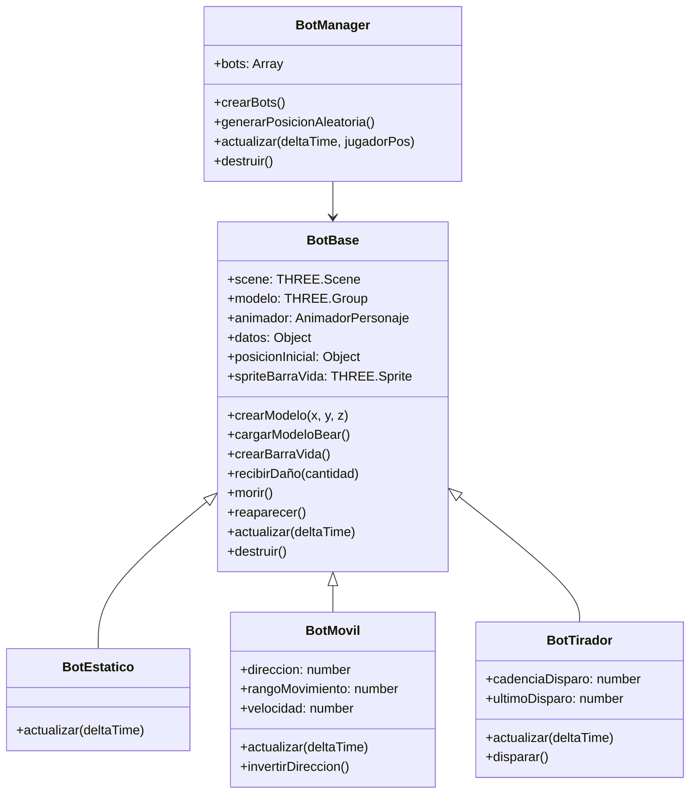

# Design Document: Mejora Sistema de Bots de Entrenamiento

## Overview

Este diseño describe la refactorización del sistema de bots de entrenamiento para:
1. Usar el modelo 3D del personaje (bear) en lugar de cubos
2. Eliminar el sistema de zonas de entrenamiento
3. Distribuir los bots por todo el mapa con comportamientos variados

El sistema mantendrá la arquitectura existente de clases (BotBase, BotEstatico, BotMovil, BotTirador) pero modificará la creación del mesh y la lógica de distribución.

## Architecture



## Components and Interfaces

### BotBase (Modificado)

La clase base será modificada para:
- Cargar el modelo GLB del personaje en lugar de crear un cubo
- Integrar el sistema de animaciones (AnimadorPersonaje)
- Mantener la barra de vida existente

```javascript
// Configuración del modelo
const BOT_MODEL_CONFIG = {
  modelPath: 'modelos/animaciones/idle_tps.glb',
  scale: 7.0,
  rotationOffset: Math.PI,
  heightOffset: 0
};
```

**Interfaz pública:**
- `crearModelo(x, y, z)` - Carga el modelo GLB y lo posiciona
- `cargarModeloBear()` - Carga asíncrona del modelo con GLTFLoader
- `reproducirAnimacion(nombre)` - Reproduce animación (idle, walk)
- `recibirDaño(cantidad)` - Aplica daño y actualiza barra de vida
- `morir()` - Ejecuta muerte con efecto visual
- `reaparecer()` - Restaura bot en posición inicial

### BotManager (Modificado)

El manager será simplificado para:
- Eliminar el sistema de zonas
- Distribuir bots aleatoriamente por el mapa
- No mostrar mensajes de zona

```javascript
// Configuración de distribución
const DISTRIBUCION_CONFIG = {
  cantidadEstaticos: 5,
  cantidadMoviles: 4,
  cantidadTiradores: 3,
  distanciaMinima: 5,  // Distancia mínima entre bots
  margenBorde: 10      // Margen desde los límites del mapa
};
```

**Interfaz pública:**
- `inicializar()` - Crea y distribuye todos los bots
- `crearBots()` - Genera bots de cada tipo
- `generarPosicionAleatoria()` - Genera posición válida en el mapa
- `actualizar(deltaTime, jugadorPos)` - Actualiza todos los bots
- `destruir()` - Limpia recursos

### BotTirador (Modificado)

El bot tirador será simplificado para:
- Disparar hacia adelante (dirección de su rotación)
- No requerir línea de visión al jugador

```javascript
// Configuración de disparo
const TIRADOR_CONFIG = {
  cadenciaDisparo: 2000,  // ms entre disparos
  velocidadBala: 30,
  dañoBala: 10
};
```

## Data Models

### Estado del Bot
```javascript
{
  vidaMaxima: number,      // Vida máxima (100-150)
  vidaActual: number,      // Vida actual
  estaVivo: boolean,       // Estado de vida
  tiempoRespawn: number,   // Tiempo para reaparecer (ms)
  tiempoMuerte: number     // Timestamp de muerte
}
```

### Configuración de Distribución
```javascript
// En CONFIG.botsEntrenamiento
{
  estatico: {
    vida: 100,
    tiempoRespawn: 3000,
    cantidad: 5
  },
  movil: {
    vida: 100,
    tiempoRespawn: 3000,
    velocidad: 2,
    rangoMovimiento: 8,
    cantidad: 4
  },
  tirador: {
    vida: 150,
    tiempoRespawn: 5000,
    cadenciaDisparo: 2000,
    cantidad: 3
  },
  distribucion: {
    distanciaMinima: 5,
    margenBorde: 10
  }
}
```

## Correctness Properties

*A property is a characteristic or behavior that should hold true across all valid executions of a system-essentially, a formal statement about what the system should do. Properties serve as the bridge between human-readable specifications and machine-verifiable correctness guarantees.*

### Property 1: Modelo correcto para bots
*For any* bot creado por el sistema, el modelo cargado debe ser el Modelo_Bear (`idle_tps.glb`) con escala 7.0, no una geometría BoxGeometry.
**Validates: Requirements 1.1, 1.2**

### Property 2: Posiciones dentro de límites del mapa
*For any* bot creado, su posición debe estar dentro de los límites del mapa: `minX + margen <= x <= maxX - margen` y `minZ + margen <= z <= maxZ - margen`.
**Validates: Requirements 2.1**

### Property 3: Distancia mínima entre bots
*For any* par de bots en el sistema, la distancia euclidiana entre ellos debe ser mayor o igual a la distancia mínima configurada.
**Validates: Requirements 2.3**

### Property 4: Inmovilidad de bots estáticos
*For any* bot estático, después de N actualizaciones (donde N > 0), su posición debe ser igual a su posición inicial.
**Validates: Requirements 3.1**

### Property 5: Restauración de posición al reaparecer
*For any* bot que muere y reaparece, su posición después de reaparecer debe ser igual a su posición inicial (round-trip).
**Validates: Requirements 3.3**

### Property 6: Dirección de disparo consistente con rotación
*For any* bot tirador que dispara, la dirección del proyectil debe corresponder a la dirección frontal del bot (basada en su rotación Y).
**Validates: Requirements 4.1**

### Property 7: Bots muertos no disparan
*For any* bot tirador con `estaVivo === false`, el método disparar no debe crear proyectiles.
**Validates: Requirements 4.4**

### Property 8: Movimiento lateral dentro de rango
*For any* bot móvil, su posición X debe estar siempre dentro del rango `[posicionInicial.x - rangoMovimiento, posicionInicial.x + rangoMovimiento]`.
**Validates: Requirements 5.3**

### Property 9: Sin lógica de zonas
*For any* actualización del sistema, no deben existir zonas de entrenamiento ni llamarse callbacks de entrada/salida de zona.
**Validates: Requirements 6.1, 6.2, 6.3**

### Property 10: Sincronización de barra de vida
*For any* bot, el valor mostrado en la barra de vida debe ser igual a `datos.vidaActual`, y después de reaparecer debe ser igual a `datos.vidaMaxima`.
**Validates: Requirements 7.2, 7.3**

## Error Handling

### Carga de Modelo Fallida
- Si el modelo GLB no carga después de 3 intentos, crear un mesh de fallback (cubo simple)
- Registrar error en consola pero permitir que el juego continúe

### Posición Inválida
- Si no se puede encontrar una posición válida después de 100 intentos, usar posición por defecto (0, 1, 0)
- Registrar advertencia en consola

### Colisiones Durante Movimiento
- Los bots móviles deben invertir dirección si detectan colisión con estructura
- Usar raycast simple para detección

## Testing Strategy

### Framework de Testing
- **Unit Tests**: Vitest para pruebas unitarias
- **Property-Based Testing**: fast-check para pruebas de propiedades

### Unit Tests
- Verificar carga correcta del modelo GLB
- Verificar cálculo de posiciones aleatorias
- Verificar lógica de movimiento de bots móviles
- Verificar lógica de disparo de bots tiradores

### Property-Based Tests
Cada propiedad de correctness será implementada como un test de propiedad usando fast-check:

1. **Property 1**: Generar N bots aleatorios, verificar que todos usen modelo correcto
2. **Property 2**: Generar posiciones aleatorias, verificar límites
3. **Property 3**: Generar conjunto de bots, verificar distancias mínimas
4. **Property 4**: Crear bot estático, ejecutar N actualizaciones, verificar posición
5. **Property 5**: Crear bot, matarlo, reaparecer, verificar posición
6. **Property 6**: Crear bot tirador con rotación aleatoria, verificar dirección disparo
7. **Property 7**: Crear bot tirador muerto, intentar disparar, verificar no proyectil
8. **Property 8**: Crear bot móvil, ejecutar N actualizaciones, verificar rango
9. **Property 9**: Inicializar sistema, verificar array zonas vacío
10. **Property 10**: Crear bot, aplicar daño aleatorio, verificar barra de vida

### Configuración de Tests
- Mínimo 100 iteraciones por test de propiedad
- Cada test debe referenciar la propiedad del diseño: `**Feature: mejora-bots-entrenamiento, Property N: descripción**`
