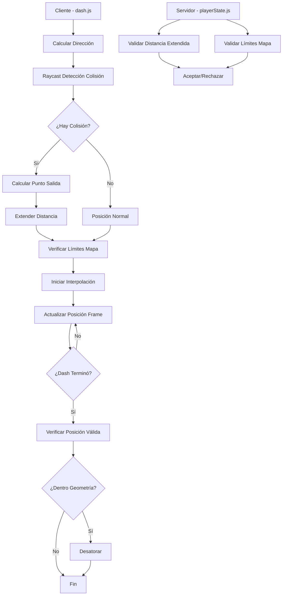

# Design Document: Mejora Sistema de Dash

## Overview

Este diseño describe las mejoras al sistema de dash para hacerlo más fluido y permitir que atraviese colisiones internas del mapa mientras respeta las paredes exteriores. El sistema actual tiene un dash instantáneo que se siente brusco en línea y se detiene en todas las colisiones. La mejora implementará interpolación suave y una mecánica de "dash fantasma" que ignora colisiones internas.

## Architecture

El sistema de dash mejorado se compone de tres capas con lógica de extensión automática:



### Flujo del Dash con Extensión Automática

1. **Inicio del Dash (Cliente)**:
   - Calcular dirección basada en teclas presionadas
   - Lanzar raycast en la dirección del dash
   - Si hay colisión: calcular punto de salida de la estructura
   - Extender distancia del dash hasta punto de salida + margen
   - Aplicar límites del mapa a posición final
   - Iniciar interpolación

2. **Detección de Estructura (Cliente)**:
   - Raycast desde posición actual en dirección del dash
   - Si colisiona: lanzar segundo raycast desde el otro lado hacia atrás
   - Calcular grosor de la estructura
   - Nueva posición = punto de salida + margen de seguridad (0.5 unidades)
   - Limitar extensión máxima a 3x distancia base

3. **Durante el Dash (Cliente)**:
   - Cada frame: calcular progreso = tiempo_transcurrido / duración
   - Interpolar posición = lerp(inicio, fin, progreso)
   - Enviar posición al servidor

4. **Fin del Dash (Cliente)**:
   - Establecer posición exacta final
   - Verificar si está dentro de geometría (doble check)
   - Si está atrapado, ejecutar desatorar en 8 direcciones

5. **Validación (Servidor)**:
   - Verificar distancia del dash <= máximo permitido (3x distancia base + 10%)
   - Verificar posición dentro de límites del mapa
   - Aceptar posición del cliente si es válida

## Components and Interfaces

### 1. Sistema de Dash Mejorado (Cliente)

**Archivo**: `src/sistemas/dash.js`

```javascript
// Estado extendido del dash
export const sistemaDash = {
  cargasActuales: CONFIG.dash.cargasMaximas,
  estaEnDash: false,
  cargasRecargando: [false, false, false],
  inicioRecarga: [0, 0, 0],
  // Campos para interpolación
  dashEnProgreso: false,
  posicionInicioDash: null,
  posicionFinDash: null,
  tiempoInicioDash: 0,
  duracionDash: CONFIG.dash.duracion,
  // Campos para extensión automática
  distanciaExtendida: 0,
  atravesoEstructura: false
};

// Nueva función para ejecutar dash con interpolación y extensión automática
export function ejecutarDashInterpolado(jugador, teclas, onDashEjecutado = null);

// Nueva función para actualizar interpolación cada frame
export function actualizarDashInterpolacion(jugador, deltaTime);

// Nueva función para calcular posición final con extensión automática
export function calcularPosicionFinalConExtension(posicionInicial, direccion, distanciaBase);

// Nueva función para detectar punto de salida de estructura
export function detectarPuntoSalidaEstructura(posicionInicial, direccion, distanciaBase);

// Nueva función para verificar y aplicar límites del mapa
export function aplicarLimitesMapa(posicion);
```

### 2. Sistema de Detección de Estructuras (Cliente)

**Archivo**: `src/sistemas/colisiones.js`

```javascript
// Nueva función para detectar colisión y punto de salida
export function detectarColisionYSalida(origen, direccion, distanciaMaxima);

// Función mejorada para desatorar después del dash
export function desatorarDespuesDash(posicion, direccionDash);

// Verificar si posición está dentro de geometría
export function estaDentroGeometria(posicion);

// Lanzar raycast y obtener punto de impacto
export function raycastColision(origen, direccion, distanciaMaxima);

// Lanzar raycast inverso para encontrar punto de salida
export function raycastInverso(puntoColision, direccion, distanciaMaxima);
```

### 3. Validación de Dash (Servidor)

**Archivo**: `server/playerState.js`

```javascript
// Método mejorado para validar dash con extensión
dash(direction, clientPosition = null) {
  // Validar distancia (máximo 3x distancia base + 10% margen)
  // Validar límites del mapa
  // Aceptar posición del cliente si es válida
}
```

### 4. Constantes de Configuración

**Archivo**: `src/config.js` y `server/config.js`

```javascript
// Configuración del dash
dash: {
  poder: 5,                    // Distancia base del dash
  duracion: 200,               // Duración en ms
  cargasMaximas: 3,
  tiempoRecarga: 3000,
  extensionMaxima: 3,          // Multiplicador máximo de extensión (3x)
  margenSalida: 0.5            // Margen después de salir de estructura
},

// Límites del mapa (paredes exteriores)
limitesMapa: {
  minX: -122,
  maxX: 122,
  minZ: -122,
  maxZ: 122,
  margenSeguridad: 0.5
}
```

## Data Models

### Estado del Dash Interpolado con Extensión

```javascript
{
  dashEnProgreso: boolean,      // true mientras el dash está interpolando
  posicionInicioDash: {         // Posición al iniciar el dash
    x: number,
    y: number,
    z: number
  },
  posicionFinDash: {            // Posición objetivo del dash (puede ser extendida)
    x: number,
    y: number,
    z: number
  },
  tiempoInicioDash: number,     // timestamp de inicio
  duracionDash: number,         // duración en ms (200)
  distanciaExtendida: number,   // distancia total del dash (puede ser > base)
  atravesoEstructura: boolean   // true si el dash atravesó una estructura
}
```

### Resultado de Detección de Estructura

```javascript
{
  hayColision: boolean,         // true si hay estructura en el camino
  puntoEntrada: {               // Punto donde el dash entra a la estructura
    x: number,
    y: number,
    z: number
  },
  puntoSalida: {                // Punto donde el dash sale de la estructura
    x: number,
    y: number,
    z: number
  },
  grosorEstructura: number,     // Distancia entre entrada y salida
  posicionFinalExtendida: {     // Posición final con extensión aplicada
    x: number,
    y: number,
    z: number
  }
}
```

### Mensaje de Dash al Servidor

```javascript
{
  type: 'dash',
  data: {
    direction: { x, y, z },     // Dirección normalizada
    startPosition: { x, y, z }, // Posición inicial
    endPosition: { x, y, z },   // Posición final calculada (puede ser extendida)
    wasExtended: boolean        // true si el dash fue extendido
  }
}
```

## Correctness Properties

*A property is a characteristic or behavior that should hold true across all valid executions of a system-essentially, a formal statement about what the system should do. Properties serve as the bridge between human-readable specifications and machine-verifiable correctness guarantees.*

### Property 1: Interpolación Lineal Correcta

*For any* posición inicial, posición final, y progreso p entre 0 y 1, la posición interpolada debe ser exactamente `inicio + (fin - inicio) * p`, y cuando p = 1, la posición debe ser exactamente la posición final.

**Validates: Requirements 1.1, 1.2, 1.4**

### Property 2: Extensión Automática Atraviesa Estructuras

*For any* dash que colisiona con una estructura interna, el sistema debe detectar el punto de salida de la estructura y extender la distancia del dash para posicionar al jugador al menos 0.5 unidades después del punto de salida.

**Validates: Requirements 2.1, 2.2, 6.1, 6.2**

### Property 3: Posición Final Siempre Válida

*For any* dash ejecutado, la posición final debe estar fuera de cualquier geometría de colisión. Si el dash atraviesa una estructura, la posición final debe estar en espacio libre.

**Validates: Requirements 2.3, 2.4**

### Property 4: Límites del Mapa Respetados

*For any* dash ejecutado, la posición final debe estar dentro de los límites del mapa (-122 a 122 en X y Z). Si el dash original cruzaría un límite, debe detenerse en el límite con un margen de seguridad de 0.5 unidades.

**Validates: Requirements 3.1, 3.2, 3.3**

### Property 5: Desatorar Encuentra Posición Válida

*For any* posición dentro de geometría de colisión que esté dentro de los límites del mapa, el sistema de desatorar debe encontrar una posición válida fuera de la geometría buscando primero en la dirección del dash y luego en 8 direcciones horizontales.

**Validates: Requirements 4.1, 4.2, 4.4**

### Property 6: Validación de Distancia del Servidor

*For any* dash recibido por el servidor, si la distancia entre posición inicial y final excede 3 veces la distancia base más 10% de margen (16.5 unidades), el servidor debe rechazar el dash o corregir la posición.

**Validates: Requirements 5.2, 5.3**

### Property 7: Tolerancia de Discrepancia Cliente-Servidor

*For any* discrepancia entre la posición del cliente y el servidor durante un dash, si la diferencia es menor a 1 unidad, el servidor debe aceptar la posición del cliente sin corrección.

**Validates: Requirements 1.3, 5.4**

### Property 8: Límite de Extensión Máxima

*For any* dash que se extiende para atravesar una estructura, la distancia total del dash no debe exceder 3 veces la distancia base del dash (15 unidades), independientemente del grosor de la estructura.

**Validates: Requirements 6.4**

## Error Handling

### Errores del Cliente

1. **Dash sin cargas**: Retornar false, no ejecutar dash
2. **Posición inicial inválida**: Usar posición actual del jugador
3. **Dirección cero**: Usar dirección forward del jugador
4. **Atrapado después del dash**: Ejecutar desatorar automáticamente
5. **Estructura muy gruesa**: Limitar extensión a 3x distancia base, luego desatorar
6. **Raycast no encuentra salida**: Usar posición máxima permitida y desatorar

### Errores del Servidor

1. **Distancia excesiva**: Limitar a distancia máxima permitida (3x base + 10%)
2. **Posición fuera de límites**: Clamp a límites del mapa
3. **Jugador muerto**: Ignorar dash, retornar error
4. **Dash extendido inválido**: Recalcular posición en servidor

### Recuperación de Errores

- Si el desatorar no encuentra posición válida en la dirección del dash, buscar en 8 direcciones horizontales
- Si después de buscar en 8 direcciones sigue atrapado, mover hacia arriba
- Si después de mover hacia arriba sigue atrapado, respawnear al jugador en punto de spawn

## Testing Strategy

### Framework de Testing

- **Unit Tests**: Vitest para tests unitarios
- **Property-Based Testing**: fast-check para tests de propiedades

### Configuración de Property Tests

Cada property test debe ejecutar mínimo 100 iteraciones para cubrir casos edge.

### Tests Unitarios

1. **Test de interpolación básica**: Verificar lerp con valores conocidos
2. **Test de límites del mapa**: Verificar clamp en cada borde
3. **Test de validación de distancia**: Verificar rechazo de dashes largos
4. **Test de detección de estructura**: Verificar raycast encuentra punto de salida
5. **Test de extensión automática**: Verificar que el dash se extiende correctamente

### Property-Based Tests

Cada test debe estar anotado con el formato:
`**Feature: mejora-dash, Property {number}: {property_text}**`

1. **Property 1**: Generar posiciones aleatorias y progresos, verificar interpolación
2. **Property 2**: Generar dashes hacia estructuras, verificar extensión y posición de salida
3. **Property 3**: Generar dashes que atraviesan estructuras, verificar posición final válida
4. **Property 4**: Generar dashes que cruzan límites, verificar clamp
5. **Property 5**: Generar posiciones dentro de geometría, verificar desatorar
6. **Property 6**: Generar dashes con diferentes distancias, verificar validación servidor
7. **Property 7**: Generar discrepancias de diferentes magnitudes, verificar tolerancia
8. **Property 8**: Generar estructuras muy gruesas, verificar límite de extensión

### Generadores para Property Tests

```javascript
// Generador de posiciones dentro del mapa
const posicionValida = fc.record({
  x: fc.float({ min: -120, max: 120 }),
  y: fc.float({ min: 1, max: 10 }),
  z: fc.float({ min: -120, max: 120 })
});

// Generador de direcciones normalizadas
const direccionNormalizada = fc.tuple(
  fc.float({ min: -1, max: 1 }),
  fc.constant(0),
  fc.float({ min: -1, max: 1 })
).map(([x, y, z]) => {
  const len = Math.sqrt(x*x + z*z) || 1;
  return { x: x/len, y: 0, z: z/len };
});

// Generador de progreso de interpolación
const progreso = fc.float({ min: 0, max: 1 });

// Generador de grosor de estructura
const grosorEstructura = fc.float({ min: 0.5, max: 20 });

// Generador de distancia de dash
const distanciaDash = fc.float({ min: 1, max: 20 });
```

