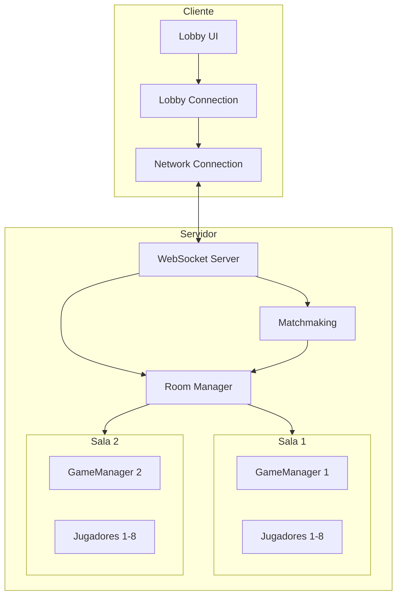

# Design Document: Mejora Sistema de Servidores

## Overview

Este diseño aborda la corrección de bugs críticos en el sistema de servidores del juego multijugador:
1. El matchmaking no conecta jugadores correctamente
2. El código de sala no se muestra en partidas privadas
3. Las partidas necesitan estar completamente separadas con máximo 8 jugadores

La solución se centra en corregir el flujo de datos entre servidor y cliente, asegurar el aislamiento de salas, y mejorar la comunicación de estado.

## Architecture



## Components and Interfaces

### 1. RoomManager (server/rooms/roomManager.js)

Responsable de gestionar todas las salas del servidor.

```javascript
interface RoomManager {
  // Crear nueva sala
  crearSala(opciones: {
    tipo: 'publica' | 'privada',
    password?: string,
    maxJugadores?: number
  }): GameRoom;
  
  // Obtener sala por ID o código
  obtenerSala(salaId: string): GameRoom | null;
  obtenerSalaPorCodigo(codigo: string): GameRoom | null;
  
  // Listar salas públicas disponibles (con espacio)
  obtenerSalasPublicasDisponibles(): GameRoom[];
  
  // Eliminar sala
  eliminarSala(salaId: string): boolean;
  
  // Limpieza de salas vacías
  limpiarSalasVacias(): number;
}
```

### 2. GameRoom (server/rooms/gameRoom.js)

Representa una sala de juego individual con su propio GameManager.

```javascript
interface GameRoom {
  id: string;
  codigo: string;  // 6 caracteres alfanuméricos
  tipo: 'publica' | 'privada';
  password: string;
  maxJugadores: number;  // Default: 8
  jugadores: Map<string, PlayerInfo>;
  gameManager: GameManager;  // Instancia independiente
  estado: 'esperando' | 'jugando';
  
  // Gestión de jugadores
  agregarJugador(playerId: string, nombre: string): boolean;
  removerJugador(playerId: string): boolean;
  tieneEspacio(): boolean;
  verificarPassword(password: string): boolean;
  
  // Estado
  obtenerEstado(): RoomState;
  getPlayerCount(): number;
}
```

### 3. Matchmaking (server/rooms/matchmaking.js)

Sistema de emparejamiento automático para partidas públicas.

```javascript
interface Matchmaking {
  // Calcular puntuación de sala (más jugadores = mejor)
  calcularPuntuacionSala(sala: GameRoom): number;
  
  // Encontrar mejor sala o crear una nueva
  encontrarMejorSala(roomManager: RoomManager): GameRoom;
}
```

### 4. LobbyConnection (src/lobby/lobbyConnection.js)

Maneja la comunicación del cliente con el servidor para operaciones del lobby.

```javascript
interface LobbyConnection {
  // Solicitar matchmaking
  solicitarMatchmaking(nombreJugador: string): Promise<RoomResponse>;
  
  // Crear partida privada
  crearPartidaPrivada(nombreJugador: string, password: string): Promise<RoomResponse>;
  
  // Unirse a partida privada
  unirsePartidaPrivada(nombreJugador: string, codigo: string, password: string): Promise<RoomResponse>;
  
  // Manejar respuestas del servidor
  manejarRespuestaLobby(response: LobbyResponse): void;
}

interface RoomResponse {
  roomId: string;
  roomCode: string;
  players: number;
  maxPlayers: number;
}
```

### 5. LobbyUI (src/lobby/lobbyUI.js)

Interfaz de usuario del lobby.

```javascript
interface LobbyUI {
  // Mostrar pantallas
  mostrarPantalla(pantalla: string): void;
  mostrarSalaCreada(codigo: string): void;
  
  // Actualizar estado
  actualizarListaJugadores(jugadores: PlayerInfo[]): void;
  actualizarEstadoMatchmaking(estado: string): void;
  
  // Errores
  mostrarError(mensaje: string): void;
  mostrarErrorCrear(mensaje: string): void;
  mostrarErrorUnirse(mensaje: string): void;
}
```

## Data Models

### RoomState
```javascript
{
  id: string,
  codigo: string,
  tipo: 'publica' | 'privada',
  jugadores: [{
    id: string,
    nombre: string,
    listo: boolean
  }],
  maxJugadores: number,
  estado: 'esperando' | 'jugando',
  creadaEn: string  // ISO timestamp
}
```

### LobbyResponse
```javascript
{
  action: 'matchmaking' | 'createPrivate' | 'joinPrivate' | 'listRooms',
  success: boolean,
  data: {
    roomId?: string,
    roomCode?: string,
    players?: number,
    maxPlayers?: number,
    error?: string
  }
}
```

### PlayerJoinedEvent
```javascript
{
  type: 'playerJoined',
  player: {
    id: string,
    nombre: string
  }
}
```

## Correctness Properties

*A property is a characteristic or behavior that should hold true across all valid executions of a system-essentially, a formal statement about what the system should do. Properties serve as the bridge between human-readable specifications and machine-verifiable correctness guarantees.*

### Property 1: Matchmaking selecciona sala con más jugadores
*For any* conjunto de salas públicas con espacio disponible, cuando un jugador solicita matchmaking, el sistema debe conectarlo a la sala que tenga el mayor número de jugadores activos.
**Validates: Requirements 1.1**

### Property 2: Respuesta de matchmaking contiene campos requeridos
*For any* conexión exitosa mediante matchmaking, la respuesta debe contener los campos roomId, roomCode, players y maxPlayers con valores válidos.
**Validates: Requirements 1.3**

### Property 3: Salas con un jugador permanecen disponibles
*For any* sala pública con exactamente un jugador, esa sala debe aparecer en la lista de salas públicas disponibles para matchmaking.
**Validates: Requirements 1.4**

### Property 4: Respuesta de creación de sala privada contiene roomCode
*For any* creación exitosa de sala privada, la respuesta debe incluir un roomCode de exactamente 6 caracteres alfanuméricos.
**Validates: Requirements 2.2**

### Property 5: Cada sala tiene GameManager independiente
*For any* dos salas diferentes, sus instancias de GameManager deben ser objetos distintos (no compartidos).
**Validates: Requirements 3.1**

### Property 6: Inputs se procesan solo en la sala del jugador
*For any* input de juego enviado por un jugador, el estado de otras salas debe permanecer sin cambios.
**Validates: Requirements 3.2**

### Property 7: Broadcast de estado solo a jugadores de la misma sala
*For any* actualización de estado de juego, solo los jugadores de esa sala específica deben recibir el mensaje.
**Validates: Requirements 3.3**

### Property 8: Sala llena rechaza nuevos jugadores
*For any* sala con 8 jugadores, cualquier intento de agregar un nuevo jugador debe fallar y retornar false.
**Validates: Requirements 4.1**

### Property 9: Matchmaking excluye salas llenas
*For any* búsqueda de salas disponibles, ninguna sala con 8 jugadores debe aparecer en los resultados.
**Validates: Requirements 4.2**

### Property 10: Estado de sala incluye conteo de jugadores
*For any* sala, el método obtenerEstado() debe retornar un objeto que incluya el conteo actual de jugadores y el máximo permitido.
**Validates: Requirements 4.4**

### Property 11: Notificación de cambios en jugadores
*For any* cambio en la lista de jugadores de una sala (entrada o salida), todos los demás jugadores de la sala deben ser notificados.
**Validates: Requirements 5.1, 5.2**

### Property 12: Nuevo jugador recibe lista de jugadores actuales
*For any* jugador que se une a una sala, la respuesta debe incluir información sobre los jugadores ya presentes en la sala.
**Validates: Requirements 5.3**

## Error Handling

### Errores del Servidor

| Código | Mensaje | Causa |
|--------|---------|-------|
| ROOM_NOT_FOUND | "Sala no encontrada" | Código de sala inválido |
| WRONG_PASSWORD | "Contraseña incorrecta" | Password no coincide |
| ROOM_FULL | "Partida llena" | Sala tiene 8 jugadores |
| MATCHMAKING_FAILED | "No se pudo encontrar partida" | Error interno |
| NOT_CONNECTED | "No hay conexión con el servidor" | WebSocket desconectado |

### Manejo en Cliente

1. Errores de matchmaking: Mostrar mensaje y permitir reintentar
2. Errores de sala privada: Mostrar mensaje específico en el formulario
3. Errores de conexión: Mostrar mensaje y volver a pantalla inicial

## Testing Strategy

### Property-Based Testing

Se utilizará **fast-check** como biblioteca de property-based testing para JavaScript/Node.js.

Cada property-based test debe:
- Ejecutar mínimo 100 iteraciones
- Estar anotado con el formato: `**Feature: mejora-sistema-servidores, Property {number}: {property_text}**`
- Implementar exactamente una propiedad de correctitud del diseño

### Unit Tests

Tests unitarios para casos específicos:
- Creación de sala con valores por defecto
- Generación de códigos únicos
- Validación de contraseñas
- Limpieza de salas vacías

### Integration Tests

Tests de integración para flujos completos:
- Flujo completo de matchmaking
- Flujo de creación y unión a sala privada
- Desconexión y reconexión de jugadores

