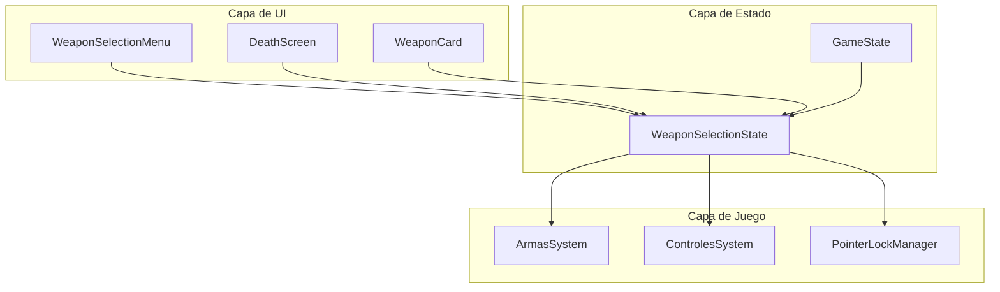

# Documento de Diseño - Sistema de Menú de Selección de Armas

## Visión General

El sistema de menú de selección de armas proporciona una interfaz para que los jugadores elijan su arma antes de entrar a la partida y al reaparecer después de morir. El sistema gestiona el estado de selección, controla el pointer lock según el contexto, y asegura que el jugador solo pueda usar el arma seleccionada durante la partida.

## Arquitectura



El sistema sigue una arquitectura de tres capas:
- **Capa de UI**: Componentes visuales del menú de selección
- **Capa de Estado**: Gestión del estado de selección y transiciones
- **Capa de Juego**: Integración con sistemas existentes de armas y controles

## Componentes e Interfaces

### 1. WeaponSelectionState (src/sistemas/seleccionArmas.js)

Módulo que gestiona el estado de selección de armas.

```javascript
/**
 * Estado de selección de armas
 */
export const estadoSeleccion = {
  armaSeleccionada: null,      // Tipo de arma seleccionada
  menuVisible: false,          // Si el menú está visible
  enPantallaMuerte: false,     // Si estamos en pantalla de muerte
  tiempoMuerte: 0,             // Timestamp de muerte para timer de respawn
  puedeReaparecer: false       // Si el botón reaparecer está disponible
};

/**
 * Selecciona un arma
 * @param {string} tipoArma - Tipo de arma a seleccionar
 */
export function seleccionarArma(tipoArma);

/**
 * Muestra el menú de selección
 * @param {boolean} esMuerte - Si se muestra por muerte del jugador
 */
export function mostrarMenuSeleccion(esMuerte = false);

/**
 * Oculta el menú y comienza el juego
 */
export function iniciarJuego();

/**
 * Reaparece el jugador con el arma actual
 */
export function reaparecer();

/**
 * Verifica si el cambio de arma está permitido
 * @returns {boolean}
 */
export function cambioArmaPermitido();

/**
 * Obtiene las armas disponibles para selección
 * @returns {Array<{tipo: string, nombre: string, icono: string}>}
 */
export function obtenerArmasDisponibles();
```

### 2. WeaponSelectionUI (src/lobby/seleccionArmasUI.js)

Componente de UI para el menú de selección de armas.

```javascript
/**
 * Inicializa la UI de selección de armas
 * @param {Object} callbacks - Callbacks para eventos
 */
export function inicializarSeleccionArmasUI(callbacks);

/**
 * Muestra el menú de selección de armas
 * @param {Object} opciones - Opciones de visualización
 */
export function mostrarMenuArmas(opciones);

/**
 * Oculta el menú de selección de armas
 */
export function ocultarMenuArmas();

/**
 * Actualiza la selección visual
 * @param {string} tipoArma - Arma seleccionada
 */
export function actualizarSeleccionVisual(tipoArma);

/**
 * Muestra/oculta el botón de reaparecer
 * @param {boolean} visible
 */
export function mostrarBotonReaparecer(visible);
```

### 3. Integración con Controles (modificación de src/sistemas/controles.js)

```javascript
/**
 * Verifica si el cambio de arma está habilitado
 * Integración con sistema de selección de armas
 */
function procesarCambioArma(evento) {
  if (!cambioArmaPermitido()) {
    return; // Ignorar cambio de arma
  }
  // ... lógica existente
}
```

### 4. Integración con PointerLock (modificación de src/sistemas/controles.js)

```javascript
/**
 * Gestiona el pointer lock según el contexto
 * No activar si el menú de selección está visible
 */
function manejarPointerLock() {
  if (estadoSeleccion.menuVisible) {
    return; // No activar pointer lock
  }
  // ... lógica existente
}
```

## Modelos de Datos

### Estado de Selección

```javascript
{
  armaSeleccionada: "M4A1",     // string - tipo de arma de CONFIG.armas
  menuVisible: true,            // boolean
  enPantallaMuerte: false,      // boolean
  tiempoMuerte: 0,              // number - timestamp
  puedeReaparecer: false        // boolean
}
```

### Configuración de Arma para UI

```javascript
{
  tipo: "M4A1",
  nombre: "M4A1",
  descripcion: "Rifle versátil y equilibrado",
  icono: "🔫",  // O ruta a imagen
  stats: {
    daño: 33,
    cadencia: 666,
    precision: 0.98
  }
}
```

## Propiedades de Correctitud

*Una propiedad es una característica o comportamiento que debe mantenerse verdadero en todas las ejecuciones válidas del sistema - esencialmente, una declaración formal sobre lo que el sistema debe hacer. Las propiedades sirven como puente entre especificaciones legibles por humanos y garantías de correctitud verificables por máquinas.*

### Property 1: Pointer lock desactivado durante menús
*Para cualquier* estado donde el menú de selección de armas está visible (ya sea al entrar a partida o en pantalla de muerte), el pointer lock debe estar desactivado (document.pointerLockElement === null)
**Validates: Requirements 1.3, 3.2, 5.1, 5.2**

### Property 2: Selección de arma no activa pointer lock
*Para cualquier* arma disponible en el menú, al hacer click en su tarjeta, el arma debe quedar seleccionada en el estado Y el pointer lock debe permanecer desactivado
**Validates: Requirements 1.4**

### Property 3: Transición al juego activa pointer lock
*Para cualquier* arma seleccionada, al presionar el botón "Jugar" o "Reaparecer", el menú debe ocultarse, el arma debe equiparse en el inventario, y el pointer lock debe activarse
**Validates: Requirements 2.1, 4.1, 4.2, 5.3**

### Property 4: Inventario contiene solo arma seleccionada
*Para cualquier* arma seleccionada al iniciar partida, el inventario del jugador debe contener únicamente esa arma (inventarioArmas.armasDisponibles.length === 1)
**Validates: Requirements 2.2**

### Property 5: Cambio de arma deshabilitado en partida
*Para cualquier* input de cambio de arma (teclas 1-6, rueda del mouse) mientras el jugador está en partida, el arma equipada debe permanecer sin cambios
**Validates: Requirements 2.3**

### Property 6: Menú muestra todas las armas configuradas
*Para cualquier* configuración de armas en CONFIG.armas, el menú de selección debe mostrar exactamente todas las armas configuradas con su nombre y tipo
**Validates: Requirements 1.1, 1.2**

### Property 7: Arma por defecto se mantiene sin interacción
*Para cualquier* estado de pantalla de muerte, si el jugador no selecciona una nueva arma, el arma previamente equipada debe permanecer como selección por defecto
**Validates: Requirements 4.3**

## Manejo de Errores

| Escenario | Comportamiento |
|-----------|----------------|
| No hay arma seleccionada al presionar Jugar | Seleccionar M4A1 por defecto |
| Arma configurada no existe en CONFIG | Omitir del menú, log de advertencia |
| Error al cargar modelo de arma | Mostrar placeholder, permitir selección |
| Pointer lock no soportado | Mostrar mensaje de error, continuar sin lock |

## Estrategia de Testing

### Testing Unitario

- Verificar que `seleccionarArma()` actualiza el estado correctamente
- Verificar que `cambioArmaPermitido()` retorna false durante partida
- Verificar que `obtenerArmasDisponibles()` retorna todas las armas de CONFIG

### Testing Basado en Propiedades

Se utilizará **fast-check** como librería de property-based testing.

Cada test de propiedad debe:
- Ejecutar mínimo 100 iteraciones
- Estar etiquetado con el formato: `**Feature: menu-seleccion-armas, Property {number}: {property_text}**`
- Referenciar el requisito que valida

**Propiedades a implementar:**

1. **Property 1**: Generar estados aleatorios con menuVisible=true, verificar pointer lock desactivado
2. **Property 2**: Generar selecciones aleatorias de armas, verificar estado actualizado y pointer lock inactivo
3. **Property 3**: Generar transiciones aleatorias (Jugar/Reaparecer), verificar menú oculto, arma equipada, pointer lock activo
4. **Property 4**: Generar armas aleatorias, iniciar partida, verificar inventario contiene solo esa arma
5. **Property 5**: Generar inputs de cambio de arma durante partida, verificar arma no cambia
6. **Property 6**: Generar configuraciones de armas, verificar menú muestra todas
7. **Property 7**: Generar estados de muerte sin interacción, verificar arma previa se mantiene

### Testing de Integración

- Flujo completo: Lobby → Selección → Juego → Muerte → Selección → Respawn
- Verificar sincronización con servidor en modo online
- Verificar que el arma seleccionada se envía al servidor correctamente
