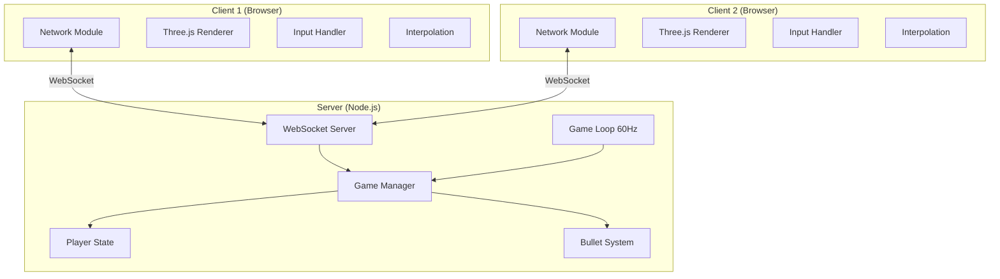
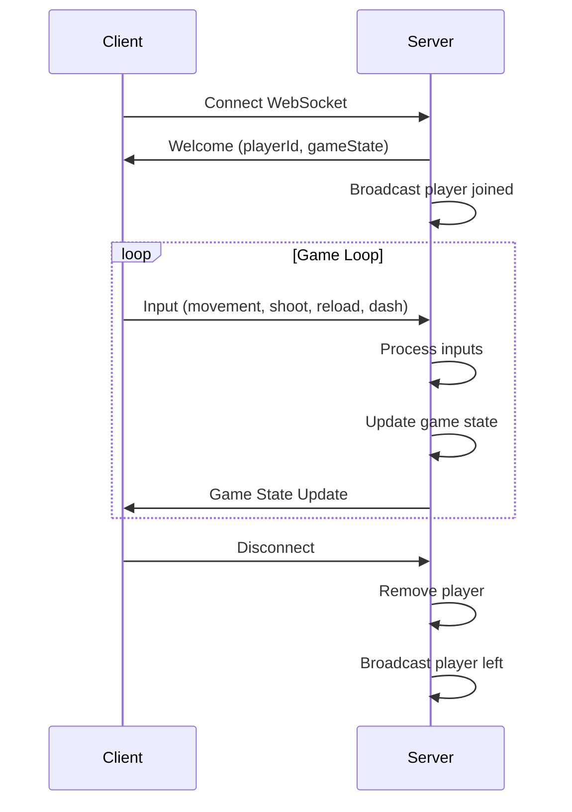

# Design Document: Multiplayer FPS Game

## Overview

Este diseño transforma el juego FPS single-player existente en un juego multijugador utilizando una arquitectura cliente-servidor con WebSockets. El servidor Node.js actúa como autoridad del juego, procesando inputs de los clientes, manteniendo el estado del juego y sincronizando a todos los jugadores conectados. Los clientes renderizan el juego usando Three.js y envían inputs al servidor.

## Architecture



### Communication Flow



## Components and Interfaces

### Server Components

#### 1. WebSocket Server (`server/index.js`)
```javascript
// Main entry point for the server
// - Creates HTTP server to serve static files
// - Creates WebSocket server for real-time communication
// - Handles connection/disconnection events
```

#### 2. Game Manager (`server/gameManager.js`)
```javascript
interface GameManager {
  players: Map<string, PlayerState>;
  bullets: Bullet[];
  
  addPlayer(id: string): PlayerState;
  removePlayer(id: string): void;
  processInput(playerId: string, input: PlayerInput): void;
  update(deltaTime: number): void;
  getState(): GameState;
}
```

#### 3. Player State (`server/playerState.js`)
```javascript
interface PlayerState {
  id: string;
  position: { x: number, y: number, z: number };
  rotation: { x: number, y: number, z: number };
  velocity: { x: number, y: number, z: number };
  health: number;
  maxHealth: number;
  isAlive: boolean;
  ammo: number;
  maxAmmo: number;
  totalAmmo: number;
  isReloading: boolean;
  dashCharges: number;
  maxDashCharges: number;
  lastDashTime: number;
}
```

#### 4. Bullet System (`server/bulletSystem.js`)
```javascript
interface Bullet {
  id: string;
  ownerId: string;
  position: { x: number, y: number, z: number };
  direction: { x: number, y: number, z: number };
  speed: number;
  damage: number;
  createdAt: number;
}

interface BulletSystem {
  createBullet(ownerId: string, position: Vector3, direction: Vector3): Bullet;
  update(deltaTime: number, players: Map<string, PlayerState>): CollisionResult[];
  removeBullet(id: string): void;
}
```

### Client Components

#### 1. Network Module (`src/network/connection.js`)
```javascript
interface NetworkConnection {
  socket: WebSocket;
  playerId: string;
  
  connect(serverUrl: string): Promise<void>;
  disconnect(): void;
  sendInput(input: PlayerInput): void;
  onGameState(callback: (state: GameState) => void): void;
  onPlayerJoined(callback: (player: PlayerState) => void): void;
  onPlayerLeft(callback: (playerId: string) => void): void;
}
```

#### 2. Remote Player Manager (`src/network/remotePlayers.js`)
```javascript
interface RemotePlayerManager {
  players: Map<string, RemotePlayer>;
  
  addPlayer(state: PlayerState): void;
  removePlayer(id: string): void;
  updatePlayer(state: PlayerState): void;
  interpolate(deltaTime: number): void;
}
```

#### 3. Input Sender (`src/network/inputSender.js`)
```javascript
interface InputSender {
  sendMovement(keys: Object, rotation: Euler): void;
  sendShoot(position: Vector3, direction: Vector3): void;
  sendReload(): void;
  sendDash(direction: Vector3): void;
}
```

### Message Protocol

```javascript
// Client -> Server Messages
interface ClientMessage {
  type: 'input' | 'shoot' | 'reload' | 'dash';
  data: InputData | ShootData | DashData;
  timestamp: number;
}

interface InputData {
  keys: { w: boolean, a: boolean, s: boolean, d: boolean, space: boolean };
  rotation: { x: number, y: number };
}

interface ShootData {
  position: { x: number, y: number, z: number };
  direction: { x: number, y: number, z: number };
}

interface DashData {
  direction: { x: number, y: number, z: number };
}

// Server -> Client Messages
interface ServerMessage {
  type: 'welcome' | 'state' | 'playerJoined' | 'playerLeft' | 'hit' | 'death' | 'respawn';
  data: any;
  timestamp: number;
}

interface WelcomeData {
  playerId: string;
  gameState: GameState;
}

interface GameState {
  players: PlayerState[];
  bullets: Bullet[];
}
```

## Data Models

### Player Configuration
```javascript
const PLAYER_CONFIG = {
  maxHealth: 200,
  speed: 0.15,
  jumpPower: 0.25,
  eyeHeight: 1.7,
  gravity: 0.015,
  respawnTime: 5000, // 5 seconds
  spawnPoints: [
    { x: -10, z: -10 },
    { x: 10, z: -10 },
    { x: -10, z: 10 },
    { x: 10, z: 10 }
  ]
};
```

### Weapon Configuration
```javascript
const WEAPON_CONFIG = {
  damage: 20,
  fireRate: 400, // ms between shots
  magazineSize: 30,
  totalAmmo: 120,
  reloadTime: 2000, // 2 seconds
  bulletSpeed: 30
};
```

### Dash Configuration
```javascript
const DASH_CONFIG = {
  maxCharges: 3,
  rechargeTime: 3000, // 3 seconds
  power: 5,
  duration: 200 // ms
};
```


## Correctness Properties

*A property is a characteristic or behavior that should hold true across all valid executions of a system-essentially, a formal statement about what the system should do. Properties serve as the bridge between human-readable specifications and machine-verifiable correctness guarantees.*

### Property 1: Unique Player ID Assignment
*For any* sequence of client connections, each connected client SHALL receive a unique player ID that does not match any other currently connected player's ID.
**Validates: Requirements 1.2, 2.2**

### Property 2: Player Removal on Disconnect
*For any* connected player that disconnects, the player SHALL be removed from the game state, and the game state player count SHALL decrease by exactly one.
**Validates: Requirements 1.3**

### Property 3: Game State Serialization Round-Trip
*For any* valid game state object, serializing to JSON and then deserializing back SHALL produce an object equivalent to the original game state.
**Validates: Requirements 1.5, 9.1, 9.2, 9.3**

### Property 4: Movement Input Processing
*For any* valid movement input received by the server, the server SHALL update the player's position in the game state and broadcast the updated position to all connected clients.
**Validates: Requirements 3.2, 3.3, 4.1, 4.2, 4.3**

### Property 5: Gravity and Ground Collision
*For any* player that jumps, the server SHALL apply gravity causing the player to eventually return to ground level (y = eyeHeight).
**Validates: Requirements 4.5**

### Property 6: Bullet Creation on Shoot
*For any* shoot input received by the server from a player with available ammunition, the server SHALL create exactly one bullet entity with the specified position and direction.
**Validates: Requirements 5.1, 5.2**

### Property 7: Damage Application
*For any* bullet that collides with a player, the target player's health SHALL decrease by exactly 20 points (weapon damage).
**Validates: Requirements 5.3**

### Property 8: Death State Transition
*For any* player whose health reaches zero or below, the server SHALL mark that player as dead (isAlive = false).
**Validates: Requirements 5.4**

### Property 9: Respawn Health Restoration
*For any* dead player that respawns, the player's health SHALL be restored to exactly 200 points and isAlive SHALL be true.
**Validates: Requirements 5.5**

### Property 10: Reload Prevents Firing
*For any* player that is currently reloading, shoot inputs from that player SHALL be rejected and no bullet SHALL be created.
**Validates: Requirements 6.2, 6.3**

### Property 11: Reload Restores Ammunition
*For any* player that completes a reload, the player's current ammunition SHALL be set to 30 rounds (magazine size).
**Validates: Requirements 6.4**

### Property 12: Dash Charge Validation
*For any* dash input received by the server, if the player has zero dash charges, the dash SHALL be rejected and the player's position SHALL remain unchanged.
**Validates: Requirements 7.2**

### Property 13: Dash Position Change
*For any* valid dash execution (player has charges), the player's position SHALL change in the specified direction by the dash power amount.
**Validates: Requirements 7.3**

### Property 14: Dash Charge Consumption
*For any* valid dash execution, the player's dash charges SHALL decrease by exactly one.
**Validates: Requirements 7.2, 7.3**

### Property 15: Malformed Data Handling
*For any* malformed JSON message received, the receiver SHALL not crash and SHALL continue processing subsequent valid messages.
**Validates: Requirements 9.5**

## Error Handling

### Server-Side Errors

1. **Connection Errors**
   - Log connection failures with client IP
   - Clean up partial player state on failed connections
   - Notify remaining clients if a player disconnects unexpectedly

2. **Input Validation Errors**
   - Reject inputs with invalid player IDs
   - Reject inputs with out-of-bounds positions
   - Log suspicious activity (potential cheating)

3. **Game Logic Errors**
   - Handle division by zero in calculations
   - Clamp values to valid ranges (health 0-200, ammo 0-30)
   - Recover gracefully from NaN positions

### Client-Side Errors

1. **Network Errors**
   - Display reconnection UI on disconnect
   - Queue inputs during brief disconnections
   - Clear game state on connection timeout

2. **Rendering Errors**
   - Handle missing player meshes gracefully
   - Skip rendering for invalid positions
   - Log Three.js errors without crashing

3. **Input Errors**
   - Ignore inputs when not connected
   - Throttle input sending to prevent spam

## Testing Strategy

### Unit Testing

Unit tests will verify specific examples and edge cases:

1. **Server Unit Tests**
   - Player state initialization with correct defaults
   - Bullet collision detection with known positions
   - Damage calculation edge cases (overkill, already dead)
   - Reload timer completion
   - Dash charge regeneration timing

2. **Client Unit Tests**
   - Message serialization format
   - Input state to message conversion
   - Interpolation calculation accuracy

### Property-Based Testing

Property-based tests will use **fast-check** library for JavaScript to verify universal properties across random inputs. Each test will run a minimum of 100 iterations.

**Testing Configuration:**
```javascript
import fc from 'fast-check';

// Configure minimum runs
const testConfig = { numRuns: 100 };
```

**Property Test Categories:**

1. **Serialization Properties**
   - Round-trip serialization (Property 3)
   - Malformed data handling (Property 15)

2. **Game State Properties**
   - Unique ID assignment (Property 1)
   - Player removal (Property 2)
   - Movement processing (Property 4)

3. **Combat Properties**
   - Damage application (Property 7)
   - Death transition (Property 8)
   - Respawn restoration (Property 9)

4. **Weapon Properties**
   - Reload blocking (Property 10)
   - Ammo restoration (Property 11)
   - Bullet creation (Property 6)

5. **Dash Properties**
   - Charge validation (Property 12)
   - Position change (Property 13)
   - Charge consumption (Property 14)

**Test Annotation Format:**
Each property-based test will be tagged with:
```javascript
// **Feature: multiplayer, Property {number}: {property_text}**
```

### Integration Testing

Integration tests will verify end-to-end flows:

1. **Connection Flow**
   - Client connects → receives welcome → appears in game state

2. **Combat Flow**
   - Player shoots → bullet created → hits target → damage applied → death if health zero

3. **Respawn Flow**
   - Player dies → waits 5 seconds → respawns with full health

