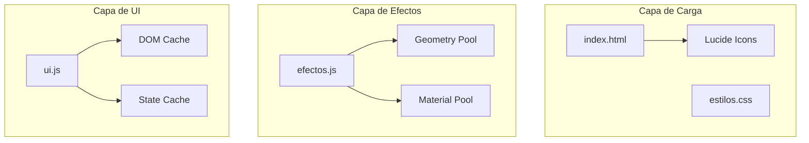

# Design Document: Optimización de Rendimiento

## Overview

Este documento describe las optimizaciones de rendimiento para BearStrike FPS. El objetivo es mejorar el frame rate, reducir el uso de memoria y acelerar los tiempos de carga eliminando código duplicado, optimizando efectos visuales y limpiando estilos CSS innecesarios.

## Architecture



## Components and Interfaces

### 1. Lucide Icons Manager

**Problema actual:** Lucide se carga 2 veces en index.html y createIcons() se llama múltiples veces.

**Solución:**
- Eliminar script duplicado de Lucide
- Crear función debounced para reinicializar iconos
- Llamar createIcons() solo una vez al cargar

```javascript
// Debounced icon reinitializer
let iconReinitTimeout = null;
function reinicializarIconosDebounced() {
  if (iconReinitTimeout) clearTimeout(iconReinitTimeout);
  iconReinitTimeout = setTimeout(() => {
    if (typeof lucide !== 'undefined') {
      lucide.createIcons();
    }
  }, 100);
}
```

### 2. Particle Effect Optimizer

**Problema actual:** Cada efecto crea nuevas geometrías y materiales.

**Solución:**
- Pool de geometrías compartidas
- Reutilización de materiales con colores predefinidos
- Limpieza apropiada con dispose()

```javascript
// Shared resources
const sharedGeometry = new THREE.SphereGeometry(0.08, 4, 4);
const materialPool = {
  impact: new THREE.MeshBasicMaterial({ color: 0xff4444, transparent: true }),
  dash: new THREE.MeshBasicMaterial({ color: 0x00ffff, transparent: true }),
  respawn: new THREE.MeshBasicMaterial({ color: 0x00ff00, transparent: true })
};
```

### 3. CSS Optimizer

**Problema actual:** CSS de 6736 líneas con animaciones pesadas y estilos duplicados.

**Optimizaciones:**
- Eliminar backdrop-filter (ya hecho parcialmente)
- Simplificar animación floatBubbles
- Pausar animaciones cuando lobby está oculto
- Usar will-change solo donde es necesario
- Consolidar animaciones similares

### 4. DOM Update Optimizer

**Problema actual:** Queries DOM frecuentes y actualizaciones innecesarias.

**Solución:**
- Cache de referencias DOM al inicio
- Comparación de estado antes de actualizar
- Batch updates para reducir reflows

## Data Models

### IconManager State
```typescript
interface IconManagerState {
  initialized: boolean;
  pendingReinit: boolean;
  lastReinitTime: number;
}
```

### ParticlePool State
```typescript
interface ParticlePoolState {
  sharedGeometry: THREE.SphereGeometry;
  activeMaterials: Set<THREE.Material>;
  particleCount: number;
}
```

### DOMCache State
```typescript
interface DOMCacheState {
  healthBar: HTMLElement | null;
  healthText: HTMLElement | null;
  dashBox: HTMLElement | null;
  ammoDiv: HTMLElement | null;
  killFeed: HTMLElement | null;
}
```

## Correctness Properties

*A property is a characteristic or behavior that should hold true across all valid executions of a system-essentially, a formal statement about what the system should do. Properties serve as the bridge between human-readable specifications and machine-verifiable correctness guarantees.*

### Property 1: Debounced Icon Reinitialization
*For any* sequence of rapid reinitialize calls within 100ms, only one actual lucide.createIcons() execution should occur after the debounce period.
**Validates: Requirements 1.3**

### Property 2: Shared Geometry Reuse
*For any* particle effect creation (impact, dash, respawn), the same shared geometry instance should be used across all particles.
**Validates: Requirements 2.1**

### Property 3: Material Disposal on Effect Completion
*For any* particle effect that completes its animation, the material's dispose() method should be called before the particle is removed from the scene.
**Validates: Requirements 2.2**

### Property 4: Animation Pause on Lobby Hide
*For any* CSS animation in the lobby, when the lobby is hidden, the animation-play-state should be set to 'paused'.
**Validates: Requirements 3.4**

### Property 5: DOM Cache Consistency
*For any* UI update function (health, dash, ammo), the function should use cached DOM references instead of calling getElementById on each invocation.
**Validates: Requirements 5.1**

### Property 6: Conditional DOM Updates
*For any* state update (dash charges, health, ammo), DOM manipulation should only occur when the new value differs from the cached previous value.
**Validates: Requirements 5.2**

### Property 7: Kill Feed Entry Limit
*For any* state of the kill feed, the number of entries should never exceed 5.
**Validates: Requirements 5.4**

### Property 8: Interval Cleanup
*For any* setInterval created for particle effects, a corresponding clearInterval should be called when the effect completes.
**Validates: Requirements 6.2**

## Error Handling

1. **Lucide not loaded:** Retry initialization after 100ms delay
2. **DOM element not found:** Cache null and skip updates gracefully
3. **Three.js dispose errors:** Wrap in try-catch to prevent crashes
4. **Animation state errors:** Default to running state if paused fails

## Testing Strategy

### Unit Tests
- Verify Lucide script appears only once in HTML
- Verify particle counts match limits (3, 5, 6)
- Verify CSS file size reduction

### Property-Based Tests
- Use fast-check library for JavaScript property testing
- Test debounce behavior with rapid call sequences
- Test DOM cache consistency across multiple updates
- Test kill feed never exceeds 5 entries
- Test material disposal is called for all completed effects

### Integration Tests
- Measure frame rate before and after optimizations
- Measure memory usage during extended gameplay
- Verify lobby animations pause when hidden
