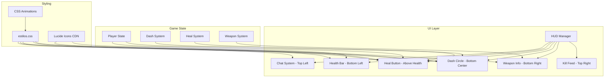

# Design Document: Rediseño UI FPS

## Overview

Este documento describe el diseño técnico para el rediseño de la interfaz de usuario del jugador en primera persona. El objetivo principal es crear una UI moderna y limpia con elementos distintivos como una circunferencia de dash y botones de acción con iconos profesionales.

### Objetivos Principales
- Barra de vida más grande y prominente, sin contenedor negro
- Circunferencia de dash en la parte inferior central dividida en tercios
- Botón de curación circular con icono y tecla "C"
- Iconos profesionales usando Lucide Icons (sin emojis)
- Chat en esquina superior izquierda
- Panel de arma en esquina inferior derecha

## Architecture



## Components and Interfaces

### 1. Lucide Icons Integration

**CDN:** Se usará Lucide Icons via CDN para iconos SVG profesionales.

```html
<!-- En index.html -->
<script src="https://unpkg.com/lucide@latest/dist/umd/lucide.min.js"></script>
```

**Iconos a usar:**
- `zap` o `move` - Para el icono de correr/dash
- `heart` o `plus` - Para el icono de curación

### 2. Health Bar (Barra de Vida)

**Ubicación:** Esquina inferior izquierda, sin contenedor negro

**Estructura HTML:**
```html
<div id="health-bar-container">
  <div id="health-bar"></div>
  <span id="health-text">200</span>
</div>
```

**Estilos:**
```css
#health-bar-container {
  position: fixed;
  bottom: 20px;
  left: 20px;
  width: 200px;
  height: 20px;
  background: rgba(0, 0, 0, 0.3);
  border-radius: 10px;
  border: 2px solid rgba(255, 255, 255, 0.3);
  overflow: hidden;
}

#health-bar {
  height: 100%;
  background: linear-gradient(90deg, #4ade80, #22c55e);
  transition: width 150ms ease-out;
  border-radius: 8px;
}

#health-bar.medium {
  background: linear-gradient(90deg, #fbbf24, #f59e0b);
}

#health-bar.low {
  background: linear-gradient(90deg, #ef4444, #dc2626);
  animation: pulse 0.5s ease-in-out infinite;
}
```

### 3. Heal Button (Botón de Curación)

**Ubicación:** Arriba y a la izquierda de la barra de vida

**Estructura HTML:**
```html
<div id="heal-button">
  <div id="heal-cooldown-ring"></div>
  <i data-lucide="heart"></i>
  <span class="key-hint">C</span>
</div>
```

**Estilos:**
```css
#heal-button {
  position: fixed;
  bottom: 50px;
  left: 20px;
  width: 40px;
  height: 40px;
  border-radius: 50%;
  background: rgba(0, 0, 0, 0.5);
  border: 2px solid rgba(255, 255, 255, 0.3);
  display: flex;
  align-items: center;
  justify-content: center;
  flex-direction: column;
}

#heal-button svg {
  width: 18px;
  height: 18px;
  color: #4ade80;
}

#heal-button.disabled svg {
  color: #6b7280;
}

#heal-button .key-hint {
  font-size: 10px;
  color: rgba(255, 255, 255, 0.7);
  margin-top: 2px;
}

#heal-cooldown-ring {
  position: absolute;
  width: 100%;
  height: 100%;
  border-radius: 50%;
  /* SVG circular progress */
}
```

### 4. Dash Circle (Circunferencia de Dash)

**Ubicación:** Parte inferior central de la pantalla

**Estructura HTML:**
```html
<div id="dash-circle-container">
  <svg id="dash-circle" viewBox="0 0 100 100">
    <!-- Segmento 1 (tercio superior derecho) -->
    <path class="dash-segment" data-index="0" d="..." />
    <!-- Segmento 2 (tercio inferior) -->
    <path class="dash-segment" data-index="1" d="..." />
    <!-- Segmento 3 (tercio superior izquierdo) -->
    <path class="dash-segment" data-index="2" d="..." />
  </svg>
  <div id="dash-center">
    <i data-lucide="zap"></i>
    <span class="key-hint">E</span>
  </div>
</div>
```

**Estilos:**
```css
#dash-circle-container {
  position: fixed;
  bottom: 20px;
  left: 50%;
  transform: translateX(-50%);
  width: 80px;
  height: 80px;
}

#dash-circle {
  width: 100%;
  height: 100%;
}

.dash-segment {
  fill: none;
  stroke: #6b7280;
  stroke-width: 8;
  transition: stroke 0.2s ease;
}

.dash-segment.available {
  stroke: #4ade80;
  filter: drop-shadow(0 0 4px #4ade80);
}

.dash-segment.recharging {
  stroke: #fbbf24;
  animation: recharge-pulse 1s ease-in-out infinite;
}

#dash-center {
  position: absolute;
  top: 50%;
  left: 50%;
  transform: translate(-50%, -50%);
  display: flex;
  flex-direction: column;
  align-items: center;
  justify-content: center;
}

#dash-center svg {
  width: 20px;
  height: 20px;
  color: rgba(255, 255, 255, 0.8);
}

#dash-center .key-hint {
  font-size: 12px;
  color: rgba(255, 255, 255, 0.6);
  font-weight: bold;
}
```

**Cálculo de segmentos SVG (tercios):**
```javascript
// Cada segmento cubre 120 grados (360/3)
// Radio exterior: 45, Radio interior: 30 (para crear el área vacía)
function createDashSegmentPath(index) {
  const startAngle = index * 120 - 90; // Empezar desde arriba
  const endAngle = startAngle + 115; // 115 para dejar gap de 5 grados
  // ... cálculo de arco SVG
}
```

### 5. Chat System (Sin cambios mayores)

**Ubicación:** Esquina superior izquierda (ya implementado)

### 6. Weapon Info Panel

**Ubicación:** Esquina inferior derecha (ya implementado, mantener estilos)

## Data Models

### Estado del Dash Circle
```typescript
interface DashCircleState {
  charges: DashChargeState[];
  maxCharges: 3;
}

interface DashChargeState {
  available: boolean;
  recharging: boolean;
  rechargeProgress: number; // 0-1
}
```

### Estado del Heal Button
```typescript
interface HealButtonState {
  canHeal: boolean;
  onCooldown: boolean;
  cooldownProgress: number; // 0-1
}
```

### Estado de la Health Bar
```typescript
interface HealthBarState {
  current: number;
  max: number;
  percentage: number; // 0-100
  colorState: 'normal' | 'medium' | 'low';
}
```

## Correctness Properties

*A property is a characteristic or behavior that should hold true across all valid executions of a system-essentially, a formal statement about what the system should do. Properties serve as the bridge between human-readable specifications and machine-verifiable correctness guarantees.*

### Property 1: Posicionamiento del Chat
*For any* estado de inicialización del juego, el Chat_Container debe estar posicionado con `top: 20px` y `left: 20px`.
**Validates: Requirements 1.1**

### Property 2: Posicionamiento de la Barra de Vida
*For any* estado de inicialización del juego, la Health_Bar debe estar posicionada con `bottom: 20px` y `left: 20px`, sin fondo negro contenedor.
**Validates: Requirements 2.1**

### Property 3: Color de la Barra de Vida según Porcentaje
*For any* valor de vida del jugador entre 0 y maxHealth, la Health_Bar debe mostrar:
- Clase 'low' (rojo) cuando vida < 25%
- Clase 'medium' (amarillo) cuando 25% <= vida <= 50%
- Sin clase adicional (verde) cuando vida > 50%
**Validates: Requirements 2.3, 2.4, 2.5**

### Property 4: Ancho de la Barra de Vida proporcional
*For any* valor de vida del jugador, el ancho de la Health_Bar debe ser proporcional al porcentaje de vida (width = percentage%).
**Validates: Requirements 2.2**

### Property 5: Posicionamiento del Dash Circle
*For any* estado de inicialización del juego, el Dash_Circle debe estar posicionado en `bottom: 20px` y centrado horizontalmente (`left: 50%; transform: translateX(-50%)`).
**Validates: Requirements 3.1**

### Property 6: Estado Visual de Segmentos de Dash
*For any* estado del sistema de dash con N cargas disponibles (0 <= N <= 3), exactamente N segmentos del Dash_Circle deben tener la clase 'available'.
**Validates: Requirements 3.3, 3.4, 3.5**

### Property 7: Posicionamiento del Heal Button
*For any* estado de inicialización del juego, el Heal_Button debe estar posicionado arriba de la Health_Bar (bottom > health_bar.bottom).
**Validates: Requirements 4.1**

### Property 8: Estado Visual del Heal Button
*For any* estado del sistema de curación:
- Si canHeal es true, el icono debe tener color brillante (no gris)
- Si canHeal es false, el icono debe tener clase 'disabled' (gris)
**Validates: Requirements 4.3, 4.4, 4.5**

### Property 9: Posicionamiento del Weapon Info
*For any* estado de inicialización del juego, el Weapon_Info debe estar posicionado con `bottom: 20px` y `right: 20px`.
**Validates: Requirements 6.1**

### Property 10: Información del Arma según Estado
*For any* estado del sistema de armas:
- Si hay arma equipada (no cuchillo), debe mostrar nombre, munición actual y reserva
- Si munición <= 5, el contador debe tener clase de color rojo
- Si está recargando, debe mostrar "RECARGANDO..." en amarillo
**Validates: Requirements 6.2, 6.4, 6.5**

## Error Handling

### Elementos DOM No Encontrados
- Si un elemento de UI no existe en el DOM, las funciones de actualización deben fallar silenciosamente
- Usar verificación `if (!element) return;` al inicio de cada función

### Lucide Icons No Cargado
- Si la librería Lucide no está disponible, mostrar texto alternativo ("E", "C") sin icono
- Verificar `window.lucide` antes de llamar a `lucide.createIcons()`

### Valores Inválidos
- Los valores de vida deben estar limitados entre 0 y maxHealth
- Los valores de munición deben ser >= 0
- Los índices de segmentos de dash deben estar entre 0 y 2

## Testing Strategy

### Enfoque Dual de Testing

Se utilizará un enfoque combinado de unit tests y property-based tests:

1. **Unit Tests**: Para verificar ejemplos específicos y casos edge
2. **Property-Based Tests**: Para verificar propiedades universales

### Librería de Property-Based Testing

Se utilizará **fast-check** para JavaScript.

```bash
npm install --save-dev fast-check
```

### Configuración de Tests

- Cada property-based test debe ejecutar un mínimo de 100 iteraciones
- Los tests deben estar anotados con el formato: `**Feature: rediseno-ui-fps, Property {number}: {property_text}**`

### Tests a Implementar

#### Unit Tests
- Verificar estructura del Dash Circle SVG (3 segmentos)
- Verificar presencia de iconos Lucide
- Verificar dimensiones de la barra de vida

#### Property-Based Tests
1. **Property 1**: Posicionamiento del chat
2. **Property 2**: Posicionamiento de la barra de vida
3. **Property 3**: Color de la barra según porcentaje
4. **Property 4**: Ancho proporcional de la barra
5. **Property 5**: Posicionamiento del dash circle
6. **Property 6**: Estado de segmentos de dash
7. **Property 7**: Posicionamiento del heal button
8. **Property 8**: Estado visual del heal button
9. **Property 9**: Posicionamiento del weapon info
10. **Property 10**: Información del arma

### Estructura de Archivos de Test

```
src/ui/__tests__/
  ├── healthBar.test.js
  ├── dashCircle.test.js
  ├── healButton.test.js
  └── ui.property.test.js
```
