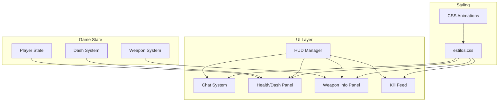

# Design Document: Rediseño UI FPS

## Overview

Este documento describe el diseño técnico para el rediseño de la interfaz de usuario del jugador en primera persona. El objetivo principal es modernizar la apariencia visual, reposicionar elementos clave (chat, barra de vida, dash) y crear una experiencia consistente entre modo local y online.

### Objetivos Principales
- Mover el chat a la esquina superior izquierda
- Integrar la barra de vida y las cargas de dash en la esquina inferior izquierda
- Aplicar un diseño moderno con efectos visuales atractivos
- Mantener consistencia entre modo local y online

## Architecture



## Components and Interfaces

### 1. Chat System (Modificado)

**Archivo:** `src/ui/chatSystem.js`

**Cambios:**
- Reposicionar de `bottom: 20px; left: 20px` a `top: 20px; left: 20px`
- Aplicar nuevos estilos modernos con blur y bordes redondeados

```javascript
// Nuevos estilos del contenedor
const chatContainerStyles = {
  position: 'fixed',
  top: '20px',
  left: '20px',
  width: '320px',
  maxHeight: '250px',
  background: 'rgba(0, 0, 0, 0.6)',
  backdropFilter: 'blur(10px)',
  border: '1px solid rgba(255, 255, 255, 0.1)',
  borderRadius: '12px',
  fontFamily: "'Segoe UI', sans-serif",
  fontSize: '13px',
  zIndex: 1000
};
```

### 2. Health/Dash Integrated Panel (Nuevo)

**Archivo:** `src/ui/healthDashPanel.js` (nuevo) o modificación en `css/estilos.css`

**Estructura HTML:**
```html
<div id="player-status-panel">
  <div id="health-section">
    <div id="health-bar-container">
      <div id="health-bar"></div>
      <span id="health-text">200 / 200</span>
    </div>
  </div>
  <div id="dash-section">
    <div class="dash-charge" data-index="0"></div>
    <div class="dash-charge" data-index="1"></div>
    <div class="dash-charge" data-index="2"></div>
  </div>
</div>
```

**Estilos:**
```css
#player-status-panel {
  position: fixed;
  bottom: 20px;
  left: 20px;
  display: flex;
  flex-direction: column;
  gap: 8px;
  background: rgba(0, 0, 0, 0.6);
  backdrop-filter: blur(10px);
  border: 1px solid rgba(255, 255, 255, 0.1);
  border-radius: 12px;
  padding: 12px 16px;
}
```

### 3. Weapon Info Panel (Modificado)

**Archivo:** `css/estilos.css`

**Cambios:**
- Mantener posición en esquina inferior derecha
- Aplicar nuevos estilos modernos consistentes

### 4. Funciones de Actualización

**Archivo:** `src/utils/ui.js`

Las funciones existentes se mantienen pero se actualizan los selectores y estilos:
- `actualizarBarraVida()` - Sin cambios funcionales, solo visuales
- `actualizarCargasDash()` - Actualizar para nuevo diseño de indicadores
- `actualizarMunicion()` - Sin cambios funcionales

## Data Models

### Estado del Panel de Jugador
```typescript
interface PlayerStatusState {
  health: number;
  maxHealth: number;
  dashCharges: DashChargeState[];
}

interface DashChargeState {
  available: boolean;
  recharging: boolean;
  rechargeProgress: number; // 0-1
}
```

### Estado del Chat
```typescript
interface ChatState {
  isExpanded: boolean;
  isMinimized: boolean;
  opacity: number;
  messages: ChatMessage[];
}
```

## Correctness Properties

*A property is a characteristic or behavior that should hold true across all valid executions of a system-essentially, a formal statement about what the system should do. Properties serve as the bridge between human-readable specifications and machine-verifiable correctness guarantees.*

### Property 1: Posicionamiento del Chat
*For any* estado de inicialización del juego, el Chat_Container debe estar posicionado en la esquina superior izquierda con `top: 20px` y `left: 20px`.
**Validates: Requirements 1.1**

### Property 2: Color de la Barra de Vida según Porcentaje
*For any* valor de vida del jugador, la Health_Bar debe mostrar:
- Clase 'low' (rojo) cuando vida < 25%
- Clase 'medium' (amarillo) cuando 25% <= vida <= 50%
- Sin clase adicional (verde) cuando vida > 50%
**Validates: Requirements 2.3, 2.4, 2.5**

### Property 3: Estado Visual de Cargas de Dash
*For any* estado del sistema de dash, cada indicador de Dash_Charge debe mostrar:
- Estado 'available' (verde) cuando la carga está disponible
- Estado 'recharging' (animación) cuando se está recargando
- Estado 'empty' (gris) cuando no está disponible ni recargando
**Validates: Requirements 2.6, 2.7, 2.8**

### Property 4: Información del Arma según Estado
*For any* estado del sistema de armas, el Weapon_Info debe:
- Mostrar nombre, munición actual y reserva cuando hay arma equipada
- Ocultar munición cuando el cuchillo está equipado
- Mostrar "RECARGANDO..." en amarillo cuando está recargando
- Mostrar munición en rojo cuando munición <= 5
**Validates: Requirements 4.2, 4.3, 4.4, 4.5**

### Property 5: Posicionamiento del Panel de Estado
*For any* estado de inicialización del juego, el player-status-panel debe estar posicionado en la esquina inferior izquierda con `bottom: 20px` y `left: 20px`.
**Validates: Requirements 2.1**

### Property 6: Posicionamiento del Panel de Arma
*For any* estado de inicialización del juego, el Weapon_Info debe estar posicionado en la esquina inferior derecha con `bottom: 20px` y `right: 20px`.
**Validates: Requirements 4.1**

## Error Handling

### Elementos DOM No Encontrados
- Si un elemento de UI no existe en el DOM, las funciones de actualización deben fallar silenciosamente sin lanzar errores
- Se debe usar verificación `if (!element) return;` al inicio de cada función

### Valores Inválidos
- Los valores de vida deben estar limitados entre 0 y maxHealth
- Los valores de munición deben ser >= 0
- Los porcentajes de recarga de dash deben estar entre 0 y 1

## Testing Strategy

### Enfoque Dual de Testing

Se utilizará un enfoque combinado de unit tests y property-based tests:

1. **Unit Tests**: Para verificar ejemplos específicos y casos edge
2. **Property-Based Tests**: Para verificar propiedades universales que deben cumplirse para cualquier entrada válida

### Librería de Property-Based Testing

Se utilizará **fast-check** para JavaScript, que es la librería más popular y mantenida para property-based testing en el ecosistema JS.

```bash
npm install --save-dev fast-check
```

### Configuración de Tests

- Cada property-based test debe ejecutar un mínimo de 100 iteraciones
- Los tests deben estar anotados con el formato: `**Feature: rediseno-ui-fps, Property {number}: {property_text}**`

### Tests a Implementar

#### Unit Tests
- Verificar que el chat se posiciona correctamente al inicializar
- Verificar que la barra de vida cambia de color en los umbrales correctos
- Verificar que los indicadores de dash reflejan el estado correcto

#### Property-Based Tests
1. **Property 1**: Para cualquier inicialización, el chat está en la posición correcta
2. **Property 2**: Para cualquier valor de vida, el color de la barra es correcto
3. **Property 3**: Para cualquier estado de dash, los indicadores son correctos
4. **Property 4**: Para cualquier estado de arma, la información mostrada es correcta
5. **Property 5**: Para cualquier inicialización, el panel de estado está en la posición correcta
6. **Property 6**: Para cualquier inicialización, el panel de arma está en la posición correcta

### Estructura de Archivos de Test

```
src/ui/__tests__/
  ├── healthDashPanel.test.js      # Unit tests
  ├── healthDashPanel.property.test.js  # Property-based tests
  ├── chatSystem.test.js           # Unit tests
  └── weaponInfo.test.js           # Unit tests
```
