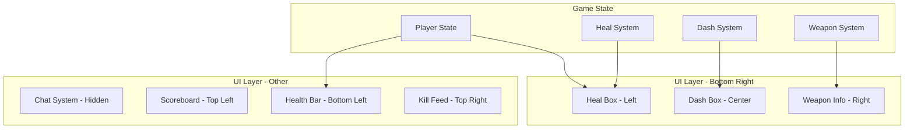

# Design Document: Rediseño UI FPS

## Overview

Este documento describe el diseño técnico para el rediseño de la interfaz de usuario del jugador en primera persona. El objetivo principal es crear una UI moderna y limpia con:

- Chat oculto por defecto (disponible con tecla T)
- Scoreboard en esquina superior izquierda
- Barra de vida más grande y prominente, sin contenedor negro
- Nuevo sistema de indicadores: Dash_Box y Heal_Box con iconos profesionales (Lucide Icons)
- Distribución optimizada: Heal_Box | Dash_Box | Weapon_Info en esquina inferior derecha

## Architecture



## Components and Interfaces

### 1. Lucide Icons Integration

**CDN:** Se usará Lucide Icons via CDN para iconos SVG profesionales.

```html
<script src="https://unpkg.com/lucide@latest/dist/umd/lucide.min.js"></script>
```

**Iconos a usar:**
- `zap` - Para el icono de dash/correr
- `heart` - Para el icono de curación

### 2. Chat System (Oculto por defecto)

- Oculto al iniciar el juego con `display: none`
- Se muestra al presionar T
- Se oculta al enviar mensaje o presionar Escape

### 3. Scoreboard (Esquina Superior Izquierda)

**Ubicación:** `top: 20px; left: 20px;`

### 4. Health Bar (Barra de Vida Grande)

**Ubicación:** Esquina inferior izquierda, sin contenedor negro
**Dimensiones:** 250px x 25px

### 5. Bottom Right Panel (Heal_Box | Dash_Box | Weapon_Info)

Contenedor flex con gap de 10px entre elementos.

### 6. Dash Box

Cuadro con:
- Circunferencia arriba con número de cargas (0-3)
- Icono de zap (Lucide)
- Tecla "E" abajo

### 7. Heal Box

Cuadro con:
- Icono de corazón (Lucide)
- Tecla "C" abajo

## Data Models

### DashCircleState
- charges: number (0-3)
- isRecharging: boolean
- rechargeProgress: number (0-1)

### HealBoxState
- canHeal: boolean
- onCooldown: boolean

### HealthBarState
- current: number
- max: number
- colorState: 'normal' | 'medium' | 'low'

## Correctness Properties

*A property is a characteristic or behavior that should hold true across all valid executions of a system.*

### Property 1: Chat oculto al inicio
*For any* estado de inicialización del juego, el Chat_Container debe tener display: none.
**Validates: Requirements 1.1, 1.4**

### Property 2: Posicionamiento del Scoreboard
*For any* estado de inicialización, el Scoreboard debe estar en top: 20px, left: 20px.
**Validates: Requirements 2.1**

### Property 3: Dimensiones de la Barra de Vida
*For any* estado de inicialización, la Health_Bar debe tener ancho >= 250px y altura >= 25px.
**Validates: Requirements 3.1, 3.2**

### Property 4: Color de la Barra de Vida según Porcentaje
*For any* valor de vida entre 0 y maxHealth:
- Clase 'low' cuando vida < 25%
- Clase 'medium' cuando 25% <= vida <= 50%
- Sin clase adicional cuando vida > 50%
**Validates: Requirements 3.4, 3.5, 3.6**

### Property 5: Ancho de la Barra de Vida proporcional
*For any* valor de vida, el ancho debe ser proporcional al porcentaje.
**Validates: Requirements 3.3**

### Property 6: Estado Visual del Dash Circle
*For any* estado del dash con N cargas (0-3):
- El número mostrado debe ser N
- Si N > 0, borde verde
- Si recargando, borde gris con progreso
**Validates: Requirements 4.5, 4.6, 4.7, 4.8**

### Property 7: Estado Visual del Heal Box
*For any* estado de curación:
- Si canHeal true, icono verde
- Si canHeal false, icono gris
**Validates: Requirements 5.4, 5.5**

### Property 8: Distribución de Elementos
*For any* estado de inicialización, orden: Heal_Box, Dash_Box, Weapon_Info con gap 10px.
**Validates: Requirements 9.1, 9.2**

### Property 9: Posicionamiento del Weapon Info
*For any* estado de inicialización, Weapon_Info en bottom: 20px, right: 20px.
**Validates: Requirements 7.1**

### Property 10: Información del Arma
*For any* estado de armas:
- Mostrar nombre, munición actual y reserva
- Si munición <= 5, color rojo
**Validates: Requirements 7.2, 7.5**

## Error Handling

- Verificar existencia de elementos DOM antes de manipular
- Verificar window.lucide antes de crear iconos
- Limitar valores de vida entre 0 y maxHealth
- Limitar cargas de dash entre 0 y 3

## Testing Strategy

### Librería: fast-check

```bash
npm install --save-dev fast-check
```

### Configuración
- Mínimo 100 iteraciones por property test
- Formato de anotación: `**Feature: rediseno-ui-fps, Property {number}**`

### Estructura de Tests
```
src/ui/__tests__/
  ├── healthBar.test.js
  ├── dashBox.test.js
  ├── healBox.test.js
  └── ui.property.test.js
```
