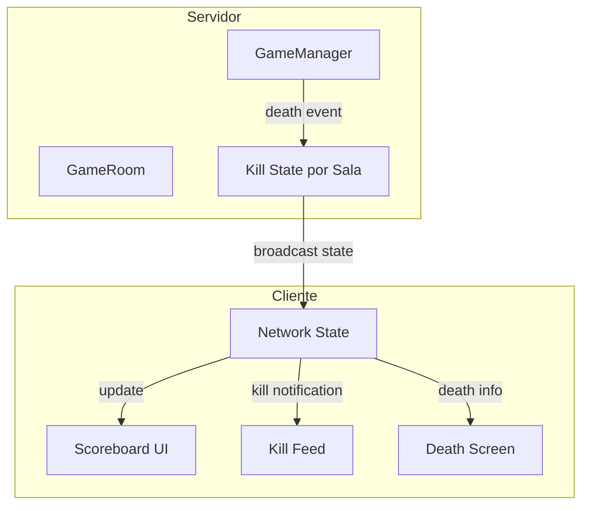

# Design Document: Sistema de Scoreboard de Jugadores

## Overview

Este documento describe el diseño técnico para implementar un sistema de scoreboard en el modo multijugador online. El sistema mostrará una lista de jugadores conectados con sus nombres de lobby y kills, incluyendo un indicador de corona para el líder. La implementación requiere cambios tanto en el servidor (para trackear kills por jugador) como en el cliente (para mostrar la UI del scoreboard).

## Architecture

El sistema sigue una arquitectura cliente-servidor donde:

1. **Servidor**: Mantiene el estado autoritativo de kills por jugador en cada sala
2. **Cliente**: Recibe actualizaciones y renderiza el scoreboard



## Components and Interfaces

### Server Components

#### 1. GameRoom (Modificación)

Agregar tracking de kills por jugador en la sala:

```javascript
// server/rooms/gameRoom.js
class GameRoom {
  constructor() {
    // ... existing code ...
    
    /** @type {Map<string, number>} - Kills por jugador en esta sala */
    this.killsPorJugador = new Map();
  }
  
  /**
   * Registra una kill para un jugador
   * @param {string} killerId - ID del jugador que realizó la kill
   */
  registrarKill(killerId) {
    const killsActuales = this.killsPorJugador.get(killerId) || 0;
    this.killsPorJugador.set(killerId, killsActuales + 1);
  }
  
  /**
   * Obtiene el estado del scoreboard
   * @returns {Array<{id: string, nombre: string, kills: number}>}
   */
  obtenerScoreboard() {
    const scoreboard = [];
    for (const [id, jugador] of this.jugadores) {
      scoreboard.push({
        id: jugador.id,
        nombre: jugador.nombre,
        kills: this.killsPorJugador.get(id) || 0
      });
    }
    // Ordenar por kills desc, luego por nombre asc
    return scoreboard.sort((a, b) => {
      if (b.kills !== a.kills) return b.kills - a.kills;
      return a.nombre.localeCompare(b.nombre);
    });
  }
}
```

#### 2. Server Index (Modificación)

Modificar el manejo de eventos de muerte para incluir nombres y actualizar kills:

```javascript
// server/index.js - en gameLoop()
if (events.deaths.length > 0) {
  for (const death of events.deaths) {
    // Registrar kill
    sala.registrarKill(death.killerId);
    
    // Obtener nombres de lobby
    const killer = sala.jugadores.get(death.killerId);
    const victim = sala.jugadores.get(death.playerId);
    
    broadcastToRoom(roomId, serializeMessage('death', {
      ...death,
      killerName: killer?.nombre || death.killerId,
      victimName: victim?.nombre || death.playerId,
      scoreboard: sala.obtenerScoreboard()
    }));
  }
}
```

### Client Components

#### 1. ScoreboardUI (Nuevo módulo)

```javascript
// src/ui/scoreboardUI.js

/**
 * Estado del scoreboard
 * @type {{jugadores: Array<{id: string, nombre: string, kills: number}>, visible: boolean}}
 */
const estadoScoreboard = {
  jugadores: [],
  visible: true
};

/**
 * Actualiza el estado del scoreboard
 * @param {Array<{id: string, nombre: string, kills: number}>} jugadores
 */
export function actualizarScoreboard(jugadores);

/**
 * Renderiza el scoreboard en el DOM
 */
export function renderizarScoreboard();

/**
 * Obtiene el máximo de kills para determinar líderes
 * @returns {number}
 */
export function obtenerMaxKills();

/**
 * Verifica si un jugador es líder (tiene corona)
 * @param {number} kills - Kills del jugador
 * @returns {boolean}
 */
export function esLider(kills);
```

#### 2. Modificaciones a ui.js

Actualizar `agregarEntradaKillFeed` para usar nombres de lobby:

```javascript
/**
 * Add entry to kill feed with lobby names
 * @param {string} killerName - Nombre de lobby del asesino
 * @param {string} victimName - Nombre de lobby de la víctima
 * @param {string} localPlayerName - Nombre del jugador local
 */
export function agregarEntradaKillFeed(killerName, victimName, localPlayerName);
```

## Data Models

### ScoreboardEntry

```typescript
interface ScoreboardEntry {
  id: string;        // ID único del jugador
  nombre: string;    // Nombre elegido en el lobby
  kills: number;     // Número de kills en la sala actual
}
```

### DeathEvent (Modificado)

```typescript
interface DeathEvent {
  playerId: string;      // ID de la víctima
  killerId: string;      // ID del asesino
  killerName: string;    // Nombre de lobby del asesino
  victimName: string;    // Nombre de lobby de la víctima
  scoreboard: ScoreboardEntry[];  // Estado actualizado del scoreboard
}
```

### ScoreboardState

```typescript
interface ScoreboardState {
  jugadores: ScoreboardEntry[];
  visible: boolean;
}
```

## Correctness Properties

*A property is a characteristic or behavior that should hold true across all valid executions of a system-essentially, a formal statement about what the system should do. Properties serve as the bridge between human-readable specifications and machine-verifiable correctness guarantees.*

### Property 1: Scoreboard refleja jugadores en sala
*For any* sala con jugadores, el scoreboard debe contener exactamente los mismos jugadores que están en la sala, ni más ni menos.
**Validates: Requirements 1.1, 1.2, 1.3**

### Property 2: Entradas del scoreboard contienen datos completos
*For any* jugador en el scoreboard, la entrada debe contener su nombre de lobby y su contador de kills.
**Validates: Requirements 1.4, 2.1**

### Property 3: Incremento de kills es correcto
*For any* evento de kill, el contador de kills del asesino debe incrementar exactamente en 1, y los demás contadores deben permanecer sin cambios.
**Validates: Requirements 2.2, 2.4**

### Property 4: Jugadores nuevos inician con cero kills
*For any* jugador que se une a una sala, su contador de kills debe ser exactamente 0.
**Validates: Requirements 2.3**

### Property 5: Corona para todos los líderes
*For any* estado del scoreboard, todos los jugadores que tienen el número máximo de kills (y ese máximo es mayor que 0) deben tener el indicador de corona.
**Validates: Requirements 3.1, 3.3, 3.4**

### Property 6: Notificaciones usan nombres de lobby
*For any* evento de muerte, el kill feed y la pantalla de muerte deben mostrar los nombres de lobby del asesino y la víctima, no sus IDs.
**Validates: Requirements 4.1, 4.2, 4.3**

### Property 7: Scoreboard ordenado correctamente
*For any* lista de jugadores en el scoreboard, debe estar ordenada de mayor a menor kills, y en caso de empate, alfabéticamente por nombre.
**Validates: Requirements 6.1, 6.2**

## Error Handling

| Escenario | Manejo |
|-----------|--------|
| Jugador no encontrado al registrar kill | Log warning, no incrementar kills |
| Scoreboard vacío | Mostrar mensaje "Sin jugadores" |
| Nombre de lobby vacío | Usar ID del jugador como fallback |
| Desconexión durante actualización | Mantener último estado conocido |
| Datos de scoreboard malformados | Ignorar actualización, mantener estado anterior |

## Testing Strategy

### Dual Testing Approach

Se utilizarán tanto pruebas unitarias como pruebas basadas en propiedades (PBT):

#### Unit Tests
- Verificar que el scoreboard se renderiza correctamente con datos de ejemplo
- Verificar que la corona aparece en el jugador correcto
- Verificar que el kill feed muestra nombres correctos
- Verificar ordenamiento con casos específicos

#### Property-Based Tests

Se utilizará **fast-check** como biblioteca de PBT para JavaScript.

Cada test de propiedad debe:
1. Ejecutar mínimo 100 iteraciones
2. Estar etiquetado con el formato: `**Feature: scoreboard-jugadores, Property {number}: {property_text}**`
3. Implementar exactamente una propiedad del diseño

**Generadores necesarios:**
- `arbitraryPlayer`: Genera jugadores con id, nombre y kills aleatorios
- `arbitraryScoreboard`: Genera listas de jugadores válidas
- `arbitraryKillEvent`: Genera eventos de kill válidos

**Propiedades a implementar:**
1. Property 1: Scoreboard refleja jugadores en sala
2. Property 3: Incremento de kills es correcto
3. Property 4: Jugadores nuevos inician con cero kills
4. Property 5: Corona para todos los líderes
5. Property 7: Scoreboard ordenado correctamente

