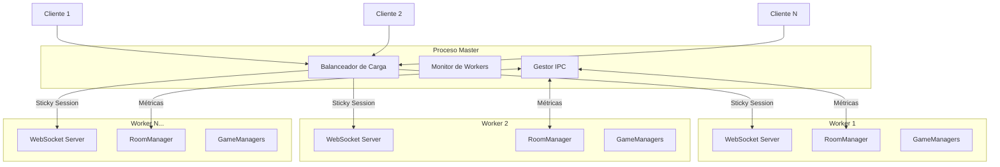
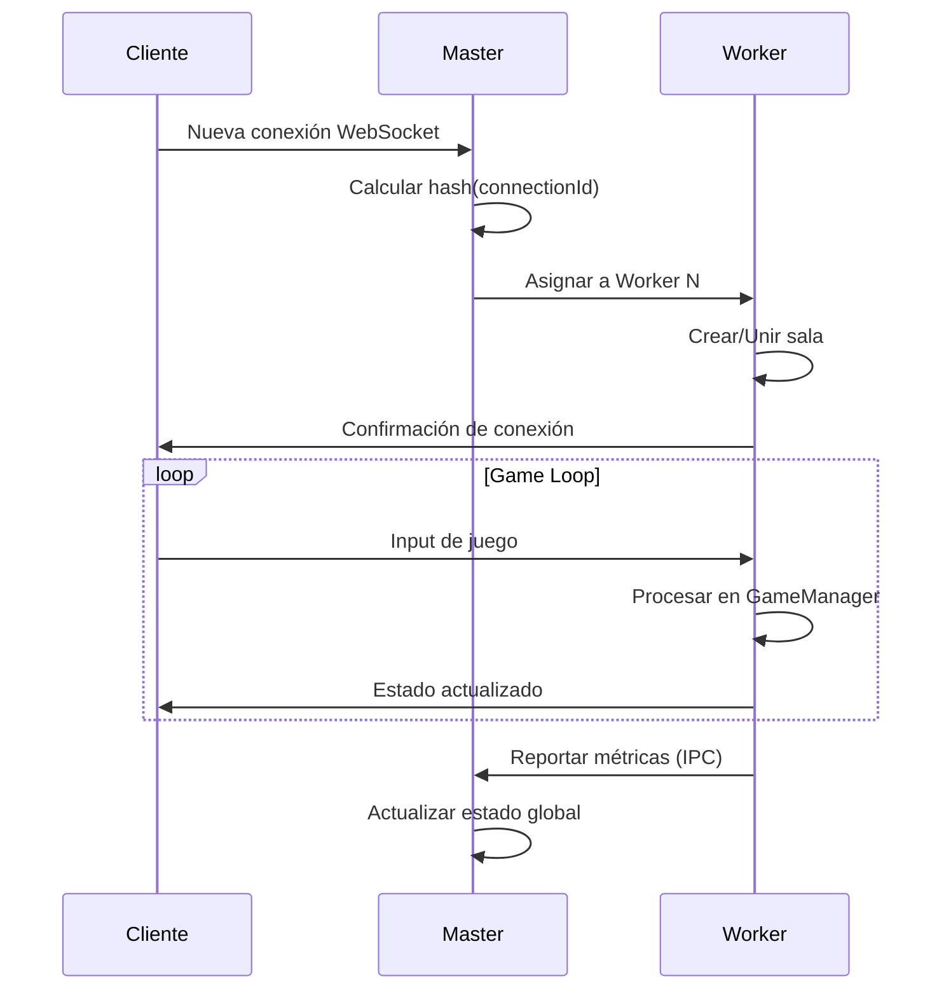

# Design Document: Sistema de Clustering Multi-Núcleo

## Overview

Este diseño implementa un sistema de clustering para el servidor del juego FPS multijugador utilizando el módulo nativo `cluster` de Node.js. El objetivo es distribuir la carga de trabajo entre 7 procesos worker (reservando 1 núcleo para el master) para aprovechar los 8 núcleos de CPU disponibles en el servidor de producción.

La arquitectura sigue el patrón master-worker donde:
- El **proceso master** maneja el balanceo de carga, monitoreo y coordinación
- Los **procesos worker** ejecutan instancias independientes del servidor de juego con sus propias salas

## Architecture



### Flujo de Conexión



## Components and Interfaces

### 1. ClusterManager (Master)

Componente principal que gestiona el ciclo de vida de los workers.

```javascript
// server/cluster/clusterManager.js
interface ClusterManager {
  // Configuración
  numWorkers: number;           // 7 workers por defecto
  maxRoomsPerWorker: number;    // 15 salas máximo
  maxPlayersPerWorker: number;  // 120 jugadores máximo
  
  // Estado
  workers: Map<number, WorkerInfo>;
  
  // Métodos
  initialize(): void;
  createWorker(): Worker;
  handleWorkerExit(worker: Worker, code: number): void;
  getWorkerStats(): ClusterStats;
  broadcastToWorkers(message: IPCMessage): void;
  shutdown(): Promise<void>;
}

interface WorkerInfo {
  id: number;
  pid: number;
  status: 'active' | 'draining' | 'dead';
  rooms: number;
  players: number;
  lastHeartbeat: number;
  memoryUsage: number;
}

interface ClusterStats {
  totalWorkers: number;
  activeWorkers: number;
  totalRooms: number;
  totalPlayers: number;
  workersStats: WorkerInfo[];
}
```

### 2. LoadBalancer

Distribuye conexiones entre workers usando sticky sessions.

```javascript
// server/cluster/loadBalancer.js
interface LoadBalancer {
  // Métodos
  getWorkerForConnection(connectionId: string): number;
  getWorkerWithLeastRooms(): number;
  isWorkerAvailable(workerId: number): boolean;
  updateWorkerLoad(workerId: number, rooms: number, players: number): void;
}
```

### 3. IPCHandler

Maneja la comunicación entre master y workers.

```javascript
// server/cluster/ipcHandler.js
interface IPCMessage {
  type: 'metrics' | 'roomCreated' | 'roomDeleted' | 'playerJoined' | 'playerLeft' | 'shutdown' | 'status';
  workerId: number;
  data: any;
  timestamp: number;
}

interface IPCHandler {
  sendToMaster(message: IPCMessage): void;
  sendToWorker(workerId: number, message: IPCMessage): void;
  onMessage(callback: (message: IPCMessage) => void): void;
}
```

### 4. WorkerServer

Servidor de juego que corre en cada worker.

```javascript
// server/cluster/workerServer.js
interface WorkerServer {
  workerId: number;
  roomManager: RoomManager;
  connections: Map<string, WebSocket>;
  
  // Métodos
  start(): void;
  reportMetrics(): void;
  handleShutdown(): Promise<void>;
}
```

## Data Models

### Configuración del Cluster

```javascript
// server/cluster/config.js
const CLUSTER_CONFIG = {
  // Número de workers (núcleos - 1 para el master)
  numWorkers: parseInt(process.env.CLUSTER_WORKERS) || 7,
  
  // Límites por worker
  maxRoomsPerWorker: parseInt(process.env.MAX_ROOMS_PER_WORKER) || 15,
  maxPlayersPerWorker: parseInt(process.env.MAX_PLAYERS_PER_WORKER) || 120,
  
  // Intervalos
  metricsInterval: 30000,      // 30 segundos
  heartbeatInterval: 5000,     // 5 segundos
  workerRestartDelay: 1000,    // 1 segundo
  
  // Umbrales de alerta
  memoryWarningThreshold: 0.8, // 80% de memoria
  
  // Timeouts
  shutdownTimeout: 10000,      // 10 segundos para shutdown graceful
  ipcTimeout: 100              // 100ms para respuestas IPC
};
```

### Estado del Worker

```javascript
interface WorkerState {
  workerId: number;
  pid: number;
  startTime: number;
  rooms: {
    total: number;
    public: number;
    private: number;
    ids: string[];
  };
  players: {
    total: number;
    byRoom: Map<string, number>;
  };
  memory: {
    heapUsed: number;
    heapTotal: number;
    external: number;
    rss: number;
  };
}
```

## Correctness Properties

*A property is a characteristic or behavior that should hold true across all valid executions of a system-essentially, a formal statement about what the system should do. Properties serve as the bridge between human-readable specifications and machine-verifiable correctness guarantees.*

### Property 1: Inicialización correcta del cluster
*For any* inicialización del cluster, el número de workers activos debe ser igual al número configurado (7 por defecto).
**Validates: Requirements 1.1**

### Property 2: Reinicio de workers fallidos
*For any* worker que falle, el master debe crear un worker de reemplazo y el número total de workers activos debe mantenerse constante.
**Validates: Requirements 1.2**

### Property 3: Balanceo de carga por salas
*For any* creación de sala, la sala debe asignarse al worker con menos salas activas, siempre que ese worker no haya alcanzado el límite de 15 salas.
**Validates: Requirements 2.1, 2.2**

### Property 4: Consistencia de métricas
*For any* consulta de estado del cluster, la suma de salas reportadas por todos los workers debe ser igual al total de salas reportado por el cluster.
**Validates: Requirements 2.3, 5.4**

### Property 5: Formato JSON de mensajes IPC
*For any* mensaje IPC enviado entre master y workers, el mensaje debe ser JSON válido y contener los campos requeridos (type, workerId, data, timestamp).
**Validates: Requirements 3.4**

### Property 6: Sticky sessions consistentes
*For any* ID de conexión, el hash debe producir siempre el mismo worker destino, garantizando que todas las solicitudes de un cliente vayan al mismo worker.
**Validates: Requirements 4.1, 4.4**

### Property 7: Límite de jugadores por worker
*For any* worker con 120 o más jugadores conectados, el balanceador debe rechazar nuevas conexiones a ese worker.
**Validates: Requirements 6.2**

## Error Handling

### Fallo de Worker

```javascript
// Cuando un worker muere inesperadamente
cluster.on('exit', (worker, code, signal) => {
  logger.error(`Worker ${worker.id} died (code: ${code}, signal: ${signal})`);
  
  // Crear worker de reemplazo
  setTimeout(() => {
    const newWorker = cluster.fork();
    logger.info(`Replacement worker ${newWorker.id} created`);
  }, CLUSTER_CONFIG.workerRestartDelay);
});
```

### Timeout de IPC

```javascript
// Si un worker no responde en 100ms
async function requestWorkerStatus(workerId) {
  return new Promise((resolve, reject) => {
    const timeout = setTimeout(() => {
      reject(new Error(`Worker ${workerId} IPC timeout`));
    }, CLUSTER_CONFIG.ipcTimeout);
    
    workers.get(workerId).send({ type: 'status' });
    // ... handle response
  });
}
```

### Shutdown Graceful

```javascript
// Proceso de cierre ordenado
async function gracefulShutdown() {
  logger.info('Initiating graceful shutdown...');
  
  // 1. Dejar de aceptar nuevas conexiones
  // 2. Notificar a todos los workers
  for (const [id, worker] of workers) {
    worker.send({ type: 'shutdown' });
  }
  
  // 3. Esperar a que los workers terminen (máximo 10s)
  await Promise.race([
    waitForWorkersToExit(),
    sleep(CLUSTER_CONFIG.shutdownTimeout)
  ]);
  
  // 4. Forzar cierre si es necesario
  process.exit(0);
}
```

## Testing Strategy

### Property-Based Testing

Se utilizará **fast-check** (ya instalado en el proyecto) para implementar los tests de propiedades.

Cada property-based test debe:
1. Ejecutar mínimo 100 iteraciones
2. Estar anotado con el formato: `**Feature: servidor-cluster, Property {number}: {property_text}**`
3. Implementar una única propiedad de correctness

### Unit Tests

Tests unitarios para:
- Función de hash para sticky sessions
- Serialización/deserialización de mensajes IPC
- Lógica de selección de worker con menos carga
- Validación de límites de recursos

### Integration Tests

Tests de integración para:
- Ciclo de vida completo del cluster (inicio, operación, cierre)
- Comunicación IPC entre master y workers
- Reconexión de clientes después de fallo de worker
- Balanceo de carga bajo diferentes escenarios

### Test Configuration

```javascript
// jest.config.js additions
{
  testMatch: ['**/cluster/__tests__/**/*.test.js'],
  testTimeout: 30000, // Tests de cluster pueden ser lentos
}
```
