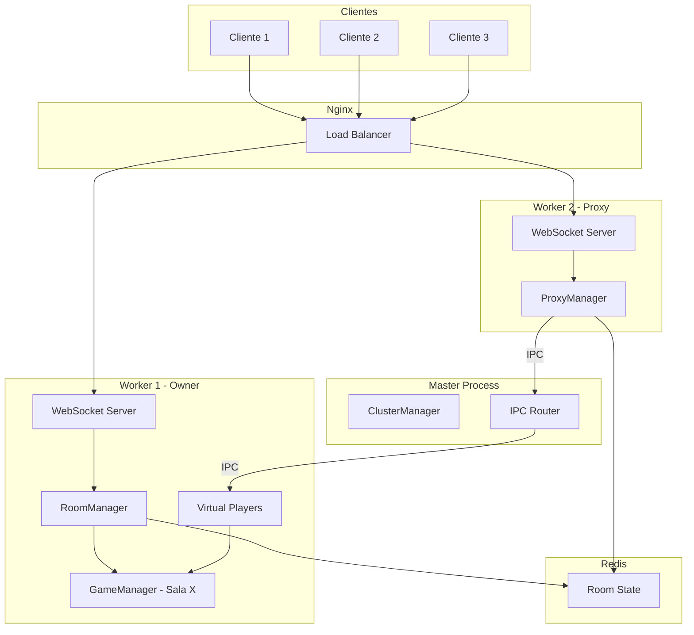
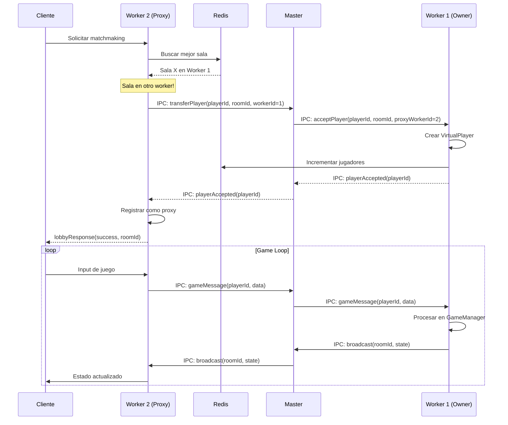

# Design Document: Sincronización Completa entre Workers

## Overview

Este diseño implementa la sincronización completa entre workers del cluster para que el matchmaking funcione correctamente con los 8 núcleos del servidor. El problema actual es que cuando nginx balancea un jugador a un worker diferente al que hospeda la sala, el jugador no puede unirse porque cada worker mantiene sus propias salas locales.

La solución implementa un sistema de **proxy de jugadores** donde:
- **Worker_Owner**: El worker que hospeda físicamente la sala y ejecuta el GameManager
- **Worker_Proxy**: El worker que recibe la conexión WebSocket del jugador pero reenvía mensajes al Worker_Owner

### Problema Actual

```
┌─────────┐     ┌─────────────┐     ┌──────────────────┐
│ Jugador │────▶│   Nginx     │────▶│ Worker 1         │
│    A    │     │ (balanceo)  │     │ Sala X (1 player)│
└─────────┘     └─────────────┘     └──────────────────┘
                      │             
┌─────────┐           │             ┌──────────────────┐
│ Jugador │───────────┴────────────▶│ Worker 2         │
│    B    │                         │ Sala Y (1 player)│ ← Crea nueva sala!
└─────────┘                         └──────────────────┘
```

### Solución Propuesta

```
┌─────────┐     ┌─────────────┐     ┌──────────────────┐
│ Jugador │────▶│   Nginx     │────▶│ Worker 1 (Owner) │
│    A    │     │ (balanceo)  │     │ Sala X (2 players)│
└─────────┘     └─────────────┘     └────────▲─────────┘
                      │                      │ IPC
┌─────────┐           │             ┌────────┴─────────┐
│ Jugador │───────────┴────────────▶│ Worker 2 (Proxy) │
│    B    │                         │ Proxy → Worker 1 │
└─────────┘                         └──────────────────┘
```

## Architecture



### Flujo de Matchmaking con Proxy



## Components and Interfaces

### 1. ProxyManager (Nuevo)

Gestiona las conexiones proxy en cada worker.

```javascript
// server/cluster/proxyManager.js
class ProxyManager {
  constructor(workerId, ipcHandler) {
    this.workerId = workerId;
    this.ipcHandler = ipcHandler;
    // Map<playerId, ProxyConnection>
    this.proxiedPlayers = new Map();
  }
  
  // Registra un jugador como proxy hacia otro worker
  registerProxy(playerId, targetWorkerId, roomId, ws) {
    this.proxiedPlayers.set(playerId, {
      playerId,
      targetWorkerId,
      roomId,
      ws,
      createdAt: Date.now()
    });
  }
  
  // Reenvía mensaje de juego al worker owner
  forwardGameMessage(playerId, message) {
    const proxy = this.proxiedPlayers.get(playerId);
    if (!proxy) return false;
    
    this.ipcHandler.sendToMaster({
      type: 'proxyGameMessage',
      data: {
        playerId,
        targetWorkerId: proxy.targetWorkerId,
        roomId: proxy.roomId,
        message
      }
    });
    return true;
  }
  
  // Recibe mensaje de broadcast del worker owner
  handleBroadcast(playerId, message) {
    const proxy = this.proxiedPlayers.get(playerId);
    if (proxy && proxy.ws.readyState === WebSocket.OPEN) {
      proxy.ws.send(message);
    }
  }
  
  // Limpia proxy cuando el jugador se desconecta
  removeProxy(playerId) {
    const proxy = this.proxiedPlayers.get(playerId);
    if (proxy) {
      this.ipcHandler.sendToMaster({
        type: 'proxyDisconnect',
        data: {
          playerId,
          targetWorkerId: proxy.targetWorkerId,
          roomId: proxy.roomId
        }
      });
      this.proxiedPlayers.delete(playerId);
    }
  }
  
  isProxied(playerId) {
    return this.proxiedPlayers.has(playerId);
  }
}
```

### 2. VirtualPlayerManager (Nuevo)

Gestiona jugadores virtuales en el worker owner (jugadores cuya conexión WebSocket está en otro worker).

```javascript
// server/cluster/virtualPlayerManager.js
class VirtualPlayerManager {
  constructor(workerId, ipcHandler) {
    this.workerId = workerId;
    this.ipcHandler = ipcHandler;
    // Map<playerId, VirtualPlayer>
    this.virtualPlayers = new Map();
  }
  
  // Acepta un jugador transferido desde otro worker
  acceptPlayer(playerId, playerName, roomId, proxyWorkerId) {
    this.virtualPlayers.set(playerId, {
      playerId,
      playerName,
      roomId,
      proxyWorkerId,
      createdAt: Date.now()
    });
    return true;
  }
  
  // Procesa mensaje de juego de un jugador virtual
  handleGameMessage(playerId, message, gameManager) {
    const virtual = this.virtualPlayers.get(playerId);
    if (!virtual) return false;
    
    // Procesar como si fuera un jugador local
    return gameManager.processInput(playerId, message);
  }
  
  // Envía mensaje a un jugador virtual (vía su proxy)
  sendToPlayer(playerId, message) {
    const virtual = this.virtualPlayers.get(playerId);
    if (!virtual) return false;
    
    this.ipcHandler.sendToMaster({
      type: 'proxyBroadcast',
      data: {
        playerId,
        targetWorkerId: virtual.proxyWorkerId,
        message
      }
    });
    return true;
  }
  
  // Broadcast a todos los jugadores virtuales de una sala
  broadcastToRoom(roomId, message, excludePlayerId = null) {
    for (const [playerId, virtual] of this.virtualPlayers) {
      if (virtual.roomId === roomId && playerId !== excludePlayerId) {
        this.sendToPlayer(playerId, message);
      }
    }
  }
  
  // Remueve jugador virtual cuando se desconecta
  removePlayer(playerId) {
    return this.virtualPlayers.delete(playerId);
  }
  
  isVirtual(playerId) {
    return this.virtualPlayers.has(playerId);
  }
  
  getVirtualPlayersInRoom(roomId) {
    const players = [];
    for (const [playerId, virtual] of this.virtualPlayers) {
      if (virtual.roomId === roomId) {
        players.push(virtual);
      }
    }
    return players;
  }
}
```

### 3. Nuevos Tipos de Mensajes IPC

```javascript
// Extensión de server/cluster/ipcHandler.js
const IPCMessageType = {
  // ... existentes ...
  
  // Transferencia de jugadores
  TRANSFER_PLAYER: 'transferPlayer',      // Proxy -> Master -> Owner
  ACCEPT_PLAYER: 'acceptPlayer',          // Owner -> Master -> Proxy
  PLAYER_ACCEPTED: 'playerAccepted',      // Confirmación
  PLAYER_REJECTED: 'playerRejected',      // Rechazo
  
  // Proxy de mensajes de juego
  PROXY_GAME_MESSAGE: 'proxyGameMessage', // Proxy -> Master -> Owner
  PROXY_BROADCAST: 'proxyBroadcast',      // Owner -> Master -> Proxy
  
  // Desconexión
  PROXY_DISCONNECT: 'proxyDisconnect',    // Proxy -> Master -> Owner
};
```

### 4. Modificaciones a ClusterManager

```javascript
// Extensión de server/cluster/clusterManager.js
class ClusterManager {
  // ... existente ...
  
  _handleWorkerMessage(workerId, message) {
    // ... existente ...
    
    switch (message.type) {
      // ... casos existentes ...
      
      case IPCMessageType.TRANSFER_PLAYER:
        this._handleTransferPlayer(workerId, message);
        break;
        
      case IPCMessageType.PLAYER_ACCEPTED:
      case IPCMessageType.PLAYER_REJECTED:
        this._forwardToWorker(message.data.proxyWorkerId, message);
        break;
        
      case IPCMessageType.PROXY_GAME_MESSAGE:
        this._forwardToWorker(message.data.targetWorkerId, message);
        break;
        
      case IPCMessageType.PROXY_BROADCAST:
        this._forwardToWorker(message.data.targetWorkerId, message);
        break;
        
      case IPCMessageType.PROXY_DISCONNECT:
        this._forwardToWorker(message.data.targetWorkerId, message);
        break;
    }
  }
  
  _handleTransferPlayer(proxyWorkerId, message) {
    const { playerId, playerName, roomId, targetWorkerId } = message.data;
    
    // Reenviar al worker owner
    this.sendToWorker(targetWorkerId, {
      type: IPCMessageType.ACCEPT_PLAYER,
      data: {
        playerId,
        playerName,
        roomId,
        proxyWorkerId
      }
    });
  }
  
  _forwardToWorker(targetWorkerId, message) {
    this.sendToWorker(targetWorkerId, message);
  }
}
```

### 5. Modificaciones a WorkerServer

```javascript
// Extensión de server/cluster/workerServer.js
class WorkerServer {
  constructor() {
    // ... existente ...
    this.proxyManager = null;
    this.virtualPlayerManager = null;
  }
  
  async start() {
    // ... existente ...
    
    // Inicializar managers de proxy
    this.proxyManager = new ProxyManager(this.workerId, this.ipcHandler);
    this.virtualPlayerManager = new VirtualPlayerManager(this.workerId, this.ipcHandler);
    
    // Configurar handlers IPC adicionales
    this._setupProxyIPCListeners();
  }
  
  _setupProxyIPCListeners() {
    // Recibir solicitud de aceptar jugador transferido
    this.ipcHandler.onMessage(IPCMessageType.ACCEPT_PLAYER, (message) => {
      this._handleAcceptPlayer(message);
    });
    
    // Recibir mensaje de juego de jugador proxy
    this.ipcHandler.onMessage(IPCMessageType.PROXY_GAME_MESSAGE, (message) => {
      this._handleProxyGameMessage(message);
    });
    
    // Recibir broadcast para enviar a jugador proxy
    this.ipcHandler.onMessage(IPCMessageType.PROXY_BROADCAST, (message) => {
      this._handleProxyBroadcast(message);
    });
    
    // Recibir notificación de desconexión de proxy
    this.ipcHandler.onMessage(IPCMessageType.PROXY_DISCONNECT, (message) => {
      this._handleProxyDisconnect(message);
    });
    
    // Recibir confirmación de transferencia
    this.ipcHandler.onMessage(IPCMessageType.PLAYER_ACCEPTED, (message) => {
      this._handlePlayerAccepted(message);
    });
  }
  
  async _handleMatchmaking(ws, playerId, data) {
    // ... buscar sala en Redis ...
    
    if (roomInfo.workerId !== this.workerId) {
      // Sala en otro worker - iniciar transferencia
      await this._initiateTransfer(ws, playerId, data.playerName, roomInfo);
    } else {
      // Sala local - unir directamente
      // ... código existente ...
    }
  }
  
  async _initiateTransfer(ws, playerId, playerName, roomInfo) {
    // Enviar solicitud de transferencia al master
    this.ipcHandler.sendToMaster({
      type: IPCMessageType.TRANSFER_PLAYER,
      data: {
        playerId,
        playerName,
        roomId: roomInfo.id,
        roomCode: roomInfo.codigo,
        targetWorkerId: roomInfo.workerId,
        proxyWorkerId: this.workerId
      }
    });
    
    // Guardar referencia temporal mientras esperamos confirmación
    ws.pendingTransfer = {
      roomInfo,
      playerName,
      timestamp: Date.now()
    };
  }
}
```

## Data Models

### ProxyConnection

```javascript
/**
 * @typedef {Object} ProxyConnection
 * @property {string} playerId - ID del jugador
 * @property {number} targetWorkerId - Worker que hospeda la sala
 * @property {string} roomId - ID de la sala
 * @property {WebSocket} ws - Conexión WebSocket del cliente
 * @property {number} createdAt - Timestamp de creación
 */
```

### VirtualPlayer

```javascript
/**
 * @typedef {Object} VirtualPlayer
 * @property {string} playerId - ID del jugador
 * @property {string} playerName - Nombre del jugador
 * @property {string} roomId - ID de la sala
 * @property {number} proxyWorkerId - Worker que tiene la conexión WebSocket
 * @property {number} createdAt - Timestamp de creación
 */
```

### TransferRequest

```javascript
/**
 * @typedef {Object} TransferRequest
 * @property {string} playerId - ID del jugador
 * @property {string} playerName - Nombre del jugador
 * @property {string} roomId - ID de la sala destino
 * @property {string} roomCode - Código de la sala
 * @property {number} targetWorkerId - Worker owner de la sala
 * @property {number} proxyWorkerId - Worker con la conexión WebSocket
 */
```

## Correctness Properties

*A property is a characteristic or behavior that should hold true across all valid executions of a system-essentially, a formal statement about what the system should do. Properties serve as the bridge between human-readable specifications and machine-verifiable correctness guarantees.*

### Property 1: Selección de sala óptima

*For any* conjunto de salas públicas en Redis con diferentes cantidades de jugadores, el matchmaking SHALL seleccionar la sala con el mayor número de jugadores activos.

**Validates: Requirements 1.1, 1.2**

### Property 2: Round-trip de serialización

*For any* objeto RoomInfo válido, serializar a JSON y luego deserializar SHALL producir un objeto equivalente al original.

**Validates: Requirements 1.5**

### Property 3: Redirección a worker correcto

*For any* solicitud de matchmaking donde la sala óptima está en un worker diferente, el sistema SHALL generar un mensaje IPC de transferencia con el workerId correcto del owner.

**Validates: Requirements 1.3, 2.1**

### Property 4: Routing de mensajes IPC

*For any* mensaje de transferencia recibido por el Master, el mensaje SHALL ser reenviado al Worker_Owner especificado en targetWorkerId.

**Validates: Requirements 2.2**

### Property 5: Integridad de mensajes proxy

*For any* mensaje de juego recibido por el Worker_Proxy, el mensaje reenviado al Worker_Owner SHALL ser idéntico al mensaje original.

**Validates: Requirements 2.5, 4.1**

### Property 6: Campos requeridos en Redis

*For any* sala registrada en Redis, la información almacenada SHALL contener todos los campos: workerId, id, codigo, jugadores, maxJugadores.

**Validates: Requirements 3.1**

### Property 7: Actualización atómica de contador

*For any* operación de join/leave de jugador, el contador de jugadores en Redis SHALL ser actualizado atómicamente (+1 para join, -1 para leave).

**Validates: Requirements 3.2, 3.3**

### Property 8: Broadcast a todos los proxies

*For any* mensaje de broadcast generado por el Worker_Owner, el mensaje SHALL ser enviado a todos los Worker_Proxy que tienen jugadores en esa sala.

**Validates: Requirements 4.2**

### Property 9: Notificación de desconexión

*For any* desconexión de cliente en el Worker_Proxy, el Worker_Proxy SHALL enviar notificación al Worker_Owner para remover al jugador.

**Validates: Requirements 4.4**

## Error Handling

### Timeout de Transferencia

```javascript
// Si la transferencia no se confirma en 5 segundos
const TRANSFER_TIMEOUT = 5000;

async _initiateTransfer(ws, playerId, playerName, roomInfo) {
  // ... enviar solicitud ...
  
  setTimeout(() => {
    if (ws.pendingTransfer) {
      // Transferencia falló - crear sala local como fallback
      delete ws.pendingTransfer;
      this._createLocalRoom(ws, playerId, playerName);
    }
  }, TRANSFER_TIMEOUT);
}
```

### Worker Owner No Disponible

```javascript
_handleTransferPlayer(proxyWorkerId, message) {
  const { targetWorkerId } = message.data;
  
  const workerInfo = this.workers.get(targetWorkerId);
  if (!workerInfo || workerInfo.status !== 'active') {
    // Worker no disponible - notificar al proxy
    this.sendToWorker(proxyWorkerId, {
      type: IPCMessageType.PLAYER_REJECTED,
      data: {
        playerId: message.data.playerId,
        reason: 'Worker owner not available'
      }
    });
    return;
  }
  
  // ... continuar con transferencia ...
}
```

### Desconexión Durante Transferencia

```javascript
_handleDisconnection(ws) {
  const playerId = ws.playerId;
  
  // Si había transferencia pendiente, cancelarla
  if (ws.pendingTransfer) {
    delete ws.pendingTransfer;
  }
  
  // Si es un jugador proxy, notificar al owner
  if (this.proxyManager.isProxied(playerId)) {
    this.proxyManager.removeProxy(playerId);
  }
  
  // ... resto del manejo de desconexión ...
}
```

## Testing Strategy

### Librería de Property-Based Testing

Se usará **fast-check** para JavaScript (ya instalado en el proyecto).

### Configuración de Tests

- Cada property-based test ejecutará mínimo **100 iteraciones**
- Los tests se etiquetarán con el formato: `**Feature: sincronizacion-workers, Property {number}: {property_text}**`

### Unit Tests

1. **ProxyManager**
   - Registro de proxy
   - Reenvío de mensajes
   - Limpieza al desconectar

2. **VirtualPlayerManager**
   - Aceptación de jugadores
   - Procesamiento de mensajes
   - Broadcast a jugadores virtuales

3. **IPC Routing**
   - Routing de mensajes de transferencia
   - Routing de mensajes de juego
   - Manejo de errores

### Integration Tests

1. **Flujo completo de transferencia**
   - Jugador se conecta a Worker 2
   - Matchmaking encuentra sala en Worker 1
   - Transferencia exitosa
   - Mensajes de juego funcionan

2. **Múltiples jugadores en diferentes workers**
   - 3 jugadores en 3 workers diferentes
   - Todos en la misma sala
   - Broadcast llega a todos

3. **Fallback cuando falla transferencia**
   - Worker owner no disponible
   - Timeout de transferencia
   - Creación de sala local

