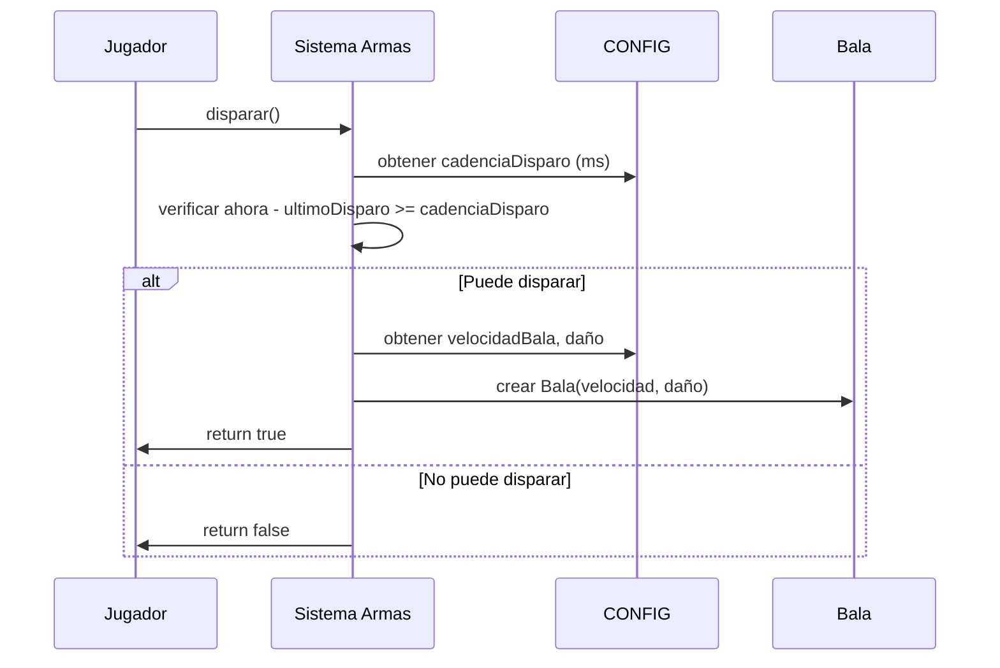

# Documento de Diseño: Sincronización de Armas

## Overview

Este diseño aborda la sincronización del comportamiento de las armas entre el modo local (entrenamiento) y el modo online (multijugador). El problema principal es que actualmente existen dos fuentes de configuración separadas:

1. **Cliente** (`src/config.js`): Usa `cadenciaDisparo` en RPM y convierte a milisegundos
2. **Servidor** (`server/config.js`): Usa `fireRate` directamente en milisegundos

Esta discrepancia causa que las armas disparen a diferentes velocidades, tengan diferentes tamaños de cargador y apliquen diferentes daños según el modo de juego.

### Discrepancias Identificadas

| Arma | Propiedad | Cliente | Servidor | Acción |
|------|-----------|---------|----------|--------|
| SNIPER | daño | 150 | 150 | Cambiar a 200 |
| SNIPER | cargador | 5 | 1 | Sincronizar a 1 |
| SNIPER | munición | 30 | 10 | Sincronizar a 10 |
| ESCOPETA | cargador | 8 | 3 | Sincronizar a 3 |
| M4A1 | cadencia | 666 RPM (90ms) | 75ms (800 RPM) | Sincronizar a 75ms |
| AK47 | cadencia | 600 RPM (100ms) | 109ms (550 RPM) | Sincronizar a 109ms |
| MP5 | cadencia | 850 RPM (71ms) | 71ms (845 RPM) | Ya sincronizado |
| PISTOLA | cadencia | 267 RPM (225ms) | 150ms (400 RPM) | Sincronizar a 150ms |

## Architecture

### Solución: Unificar Configuración

La solución es modificar el cliente para usar los mismos valores que el servidor, cambiando el sistema de cadencia de RPM a milisegundos directamente.

```
┌─────────────────────────────────────────────────────────────┐
│                    ANTES (Problema)                         │
├─────────────────────────────────────────────────────────────┤
│  Cliente (src/config.js)     │  Servidor (server/config.js) │
│  cadenciaDisparo: 666 (RPM)  │  fireRate: 75 (ms)           │
│  Cálculo: (60/666)*1000=90ms │  Directo: 75ms               │
│  ❌ Diferentes valores        │                              │
└─────────────────────────────────────────────────────────────┘

┌─────────────────────────────────────────────────────────────┐
│                   DESPUÉS (Solución)                        │
├─────────────────────────────────────────────────────────────┤
│  Cliente (src/config.js)     │  Servidor (server/config.js) │
│  cadenciaDisparo: 75 (ms)    │  fireRate: 75 (ms)           │
│  Directo: 75ms               │  Directo: 75ms               │
│  ✅ Valores idénticos         │                              │
└─────────────────────────────────────────────────────────────┘
```

### Flujo de Disparo Actualizado



## Components and Interfaces

### Componentes Afectados

1. **src/config.js** - Configuración del cliente
   - Cambiar `cadenciaDisparo` de RPM a milisegundos
   - Actualizar valores de cargador y munición
   - Actualizar daño del sniper a 200

2. **src/sistemas/armas.js** - Sistema de disparo
   - Modificar cálculo de tiempo entre disparos
   - Eliminar conversión RPM → ms

3. **server/config.js** - Configuración del servidor
   - Actualizar daño del sniper a 200

### Interfaz de Configuración de Arma

```javascript
// Estructura unificada (valores en las mismas unidades)
{
  nombre: string,
  tipo: string,
  cadenciaDisparo: number,    // Milisegundos entre disparos (antes era RPM)
  daño: number,               // Puntos de daño por impacto
  tamañoCargador: number,     // Balas por cargador
  municionTotal: number,      // Munición de reserva
  tiempoRecarga: number,      // Segundos para recargar
  velocidadBala: number,      // Unidades por segundo
  proyectiles?: number,       // Número de proyectiles (escopetas)
  dispersion?: number,        // Dispersión de proyectiles
  multiplicadorHeadshot: number
}
```

## Data Models

### Valores Finales de Configuración

#### SNIPER (AWP)
```javascript
{
  cadenciaDisparo: 1333,      // ms (45 RPM)
  daño: 200,                  // One-shot kill
  tamañoCargador: 1,          // 1 bala por cargador
  municionTotal: 10,          // 10 balas de reserva
  tiempoRecarga: 3.7,         // 3.7 segundos
  velocidadBala: 120.0,
  multiplicadorHeadshot: 2.5
}
```

#### ESCOPETA
```javascript
{
  cadenciaDisparo: 857,       // ms (70 RPM)
  daño: 24,                   // Por perdigón
  tamañoCargador: 3,          // 3 cartuchos
  municionTotal: 28,
  tiempoRecarga: 3.0,
  velocidadBala: 38.0,
  proyectiles: 8,             // 8 perdigones
  dispersion: 0.45,
  multiplicadorHeadshot: 1.5
}
```

#### M4A1
```javascript
{
  cadenciaDisparo: 75,        // ms (800 RPM)
  daño: 30,
  tamañoCargador: 30,
  municionTotal: 210,
  tiempoRecarga: 2.0,
  velocidadBala: 60.0,
  multiplicadorHeadshot: 2.0
}
```

#### AK47
```javascript
{
  cadenciaDisparo: 109,       // ms (550 RPM)
  daño: 45,
  tamañoCargador: 30,
  municionTotal: 210,
  tiempoRecarga: 2.5,
  velocidadBala: 63.0,
  multiplicadorHeadshot: 2.0
}
```

#### MP5
```javascript
{
  cadenciaDisparo: 71,        // ms (845 RPM)
  daño: 24,
  tamañoCargador: 30,
  municionTotal: 240,
  tiempoRecarga: 2.0,
  velocidadBala: 48.0,
  multiplicadorHeadshot: 2.0
}
```

#### PISTOLA
```javascript
{
  cadenciaDisparo: 150,       // ms (400 RPM)
  daño: 20,
  tamañoCargador: 7,
  municionTotal: 35,
  tiempoRecarga: 1.5,
  velocidadBala: 45.0,
  multiplicadorHeadshot: 2.0
}
```

## Correctness Properties

*A property is a characteristic or behavior that should hold true across all valid executions of a system-essentially, a formal statement about what the system should do. Properties serve as the bridge between human-readable specifications and machine-verifiable correctness guarantees.*

### Property 1: Sincronización de Configuración Cliente-Servidor

*For any* arma en el sistema, los valores de configuración del cliente (cadenciaDisparo, daño, tamañoCargador, municionTotal, velocidadBala) deben ser idénticos a los valores correspondientes del servidor (fireRate, damage, magazineSize, totalAmmo, bulletSpeed).

**Validates: Requirements 1.1, 1.3, 8.1, 8.2, 8.3, 8.4, 8.5, 9.1, 9.2, 10.1**

### Property 2: Cálculo Correcto de Tiempo Entre Disparos

*For any* valor de cadenciaDisparo en milisegundos, el tiempo entre disparos calculado debe ser exactamente igual al valor de cadenciaDisparo sin ninguna conversión adicional.

**Validates: Requirements 7.1, 8.5**

### Property 3: Conversión RPM-Milisegundos

*For any* valor de fireRate en milisegundos, la conversión a RPM debe seguir la fórmula: RPM = 60000 / fireRate_ms, y viceversa.

**Validates: Requirements 7.2**

## Error Handling

### Casos de Error

1. **Configuración faltante**: Si un arma no tiene configuración, usar valores por defecto del servidor
2. **Valores inválidos**: Validar que cadenciaDisparo > 0, daño >= 0, cargador > 0
3. **Discrepancia detectada**: Log de advertencia en consola para debugging

### Estrategia de Fallback

```javascript
function obtenerConfigArma(tipoArma) {
  const config = CONFIG.armas[tipoArma];
  if (!config) {
    console.warn(`⚠️ Arma no encontrada: ${tipoArma}, usando valores por defecto`);
    return CONFIG.armas['M4A1']; // Fallback a M4A1
  }
  return config;
}
```

## Testing Strategy

### Unit Tests

Los unit tests verificarán casos específicos de configuración:

1. **Test de valores del Sniper**: Verificar daño=200, cargador=1, munición=10
2. **Test de valores de la Escopeta**: Verificar cargador=3, perdigones=8
3. **Test de cadencia de rifles**: Verificar M4A1=75ms, AK47=109ms
4. **Test de cadencia de otras armas**: Verificar MP5=71ms, PISTOLA=150ms

### Property-Based Testing

Se utilizará **fast-check** como biblioteca de property-based testing para JavaScript.

Cada property-based test debe:
- Ejecutar un mínimo de 100 iteraciones
- Estar etiquetado con el formato: `**Feature: sincronizar-armas, Property {number}: {property_text}**`
- Referenciar la propiedad de correctness que implementa

#### Tests de Propiedades

1. **Property 1 Test**: Generar nombres de armas aleatorios del conjunto válido y verificar que todos los valores del cliente coincidan con el servidor.

2. **Property 2 Test**: Generar valores de cadenciaDisparo aleatorios y verificar que el cálculo de tiempo entre disparos sea directo (sin conversión).

3. **Property 3 Test**: Generar valores de fireRate aleatorios y verificar que la conversión RPM ↔ ms sea correcta y reversible.
