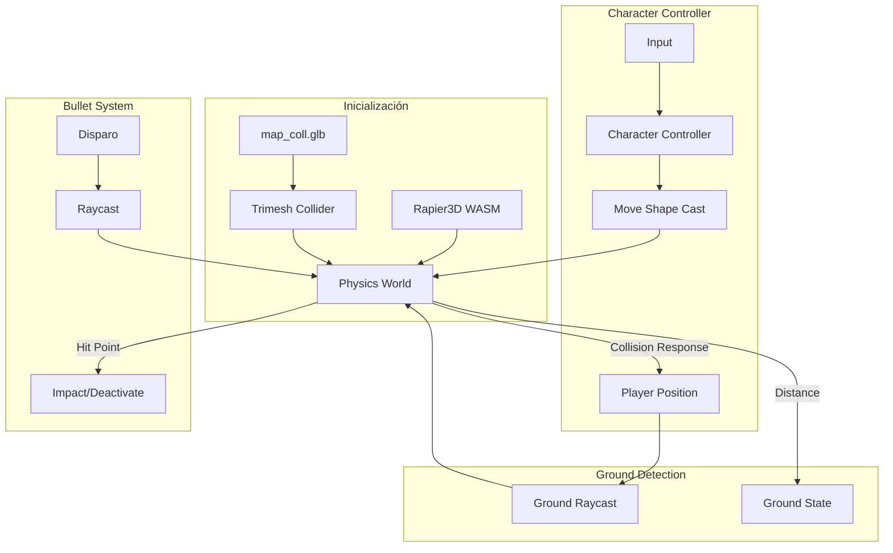

# Design Document: Sistema de Colisiones con Rapier3D

## Overview

Este diseño describe la implementación de un sistema de colisiones robusto usando Rapier3D, una librería de física en WebAssembly. El sistema resuelve los problemas actuales: balas atravesando paredes, bugs en superficies irregulares, y problemas con el dash. Se mantiene la separación entre mapa visual (`map_visual.glb`) y geometría de colisiones (`map_coll.glb`).

## Architecture



## Components and Interfaces

### 1. Módulo de Física Rapier (`src/sistemas/fisica.js`)

```javascript
/**
 * Sistema de física con Rapier3D
 */

// Estado del sistema
let RAPIER = null;
let world = null;
let mapCollider = null;
let characterController = null;

/**
 * Inicializa Rapier3D y el mundo de física
 * @returns {Promise<void>}
 */
export async function inicializarFisica();

/**
 * Carga la geometría de colisiones y crea el trimesh collider
 * @param {THREE.BufferGeometry} geometry - Geometría del mapa
 * @returns {void}
 */
export function crearColliderMapa(geometry);

/**
 * Crea el character controller para el jugador
 * @param {Object} config - Configuración del jugador
 * @returns {void}
 */
export function crearCharacterController(config);

/**
 * Mueve al jugador usando el character controller
 * @param {THREE.Vector3} posicionActual - Posición actual
 * @param {THREE.Vector3} desplazamiento - Desplazamiento deseado
 * @param {number} deltaTime - Tiempo desde último frame
 * @returns {{posicion: THREE.Vector3, enSuelo: boolean}}
 */
export function moverJugador(posicionActual, desplazamiento, deltaTime);

/**
 * Realiza un raycast para balas
 * @param {THREE.Vector3} origen - Origen del rayo
 * @param {THREE.Vector3} direccion - Dirección normalizada
 * @param {number} distanciaMax - Distancia máxima
 * @returns {{hit: boolean, punto: THREE.Vector3, distancia: number} | null}
 */
export function raycastBala(origen, direccion, distanciaMax);

/**
 * Verifica si una posición está en el suelo
 * @param {THREE.Vector3} posicion - Posición a verificar
 * @returns {{enSuelo: boolean, altura: number, normal: THREE.Vector3}}
 */
export function verificarSuelo(posicion);
```

### 2. Modificaciones al Sistema de Colisiones (`src/sistemas/colisiones.js`)

El módulo existente se refactorizará para usar Rapier3D internamente:

```javascript
/**
 * Wrapper que mantiene la API existente pero usa Rapier3D
 */

import * as Fisica from './fisica.js';

export async function inicializarColisiones(scene, onProgress) {
  await Fisica.inicializarFisica();
  // Cargar map_coll.glb y crear collider
}

export function resolverColision(posicionActual, posicionDeseada, radio) {
  const desplazamiento = posicionDeseada.clone().sub(posicionActual);
  const resultado = Fisica.moverJugador(posicionActual, desplazamiento, 1/30);
  return resultado.posicion;
}

export function verificarSuelo(posicion) {
  return Fisica.verificarSuelo(posicion);
}

// Nueva función para balas
export function raycastBala(origen, direccion, distanciaMax) {
  return Fisica.raycastBala(origen, direccion, distanciaMax);
}
```

### 3. Modificaciones al Sistema de Balas (`server/bulletSystem.js`)

```javascript
/**
 * Actualización del sistema de balas para usar raycast contra el mapa
 */

// Importar geometría de colisiones (servidor)
import { raycastContraMapa } from './mapCollisions.js';

update(deltaTime, players) {
  for (const bullet of this.bullets) {
    const prevPosition = { ...bullet.position };
    bullet.update(deltaTime);
    
    // Primero verificar colisión con mapa
    const hitMapa = raycastContraMapa(prevPosition, bullet.position);
    if (hitMapa) {
      bullet.deactivate();
      continue;
    }
    
    // Luego verificar colisión con jugadores
    // ... código existente
  }
}
```

### 4. Colisiones del Mapa en Servidor (`server/mapCollisions.js`)

```javascript
/**
 * Sistema de colisiones del mapa para el servidor
 * Usa una representación simplificada del mapa para raycasts
 */

let mapBounds = null;
let mapWalls = [];

/**
 * Inicializa las colisiones del mapa en el servidor
 * @param {Object} mapData - Datos simplificados del mapa (AABB de paredes)
 */
export function inicializarMapaServidor(mapData);

/**
 * Raycast contra la geometría del mapa
 * @param {Object} from - Posición inicial {x, y, z}
 * @param {Object} to - Posición final {x, y, z}
 * @returns {{hit: boolean, point: Object, distance: number} | null}
 */
export function raycastContraMapa(from, to);
```

## Data Models

### Configuración de Física

```javascript
fisica: {
  gravedad: -9.81,           // Gravedad del mundo
  alturaMaxEscalon: 0.5,     // Altura máxima de escalón automático
  anguloMaxRampa: 45,        // Ángulo máximo de rampa caminable (grados)
  offsetSuelo: 0.01,         // Offset para detección de suelo
  radioJugador: 0.4,         // Radio de la cápsula del jugador
  alturaJugador: 1.8,        // Altura de la cápsula del jugador
  margenColision: 0.02       // Margen de separación de superficies
}
```

### Estado del Character Controller

```javascript
{
  posicion: THREE.Vector3,
  velocidad: THREE.Vector3,
  enSuelo: boolean,
  enRampa: boolean,
  normalSuelo: THREE.Vector3,
  tiempoEnAire: number
}
```

### Resultado de Raycast

```javascript
{
  hit: boolean,
  punto: THREE.Vector3,      // Punto de impacto
  normal: THREE.Vector3,     // Normal de la superficie
  distancia: number,         // Distancia al impacto
  colliderId: number         // ID del collider impactado
}
```

## Correctness Properties

*A property is a characteristic or behavior that should hold true across all valid executions of a system-essentially, a formal statement about what the system should do. Properties serve as the bridge between human-readable specifications and machine-verifiable correctness guarantees.*

### Property 1: Bullet-Wall Occlusion
*For any* bullet trajectory and wall geometry, if a wall exists between the bullet origin and a target, the bullet SHALL NOT hit the target.
**Validates: Requirements 1.4**

### Property 2: Player Never Inside Geometry
*For any* player movement (walk, jump, dash), the resulting player position SHALL be outside all collision geometry with at least the configured margin distance.
**Validates: Requirements 4.4, 6.3**

### Property 3: Terrain Traversal Consistency
*For any* walkable surface (slope ≤ 45°, step ≤ 0.5 units), the player SHALL be able to traverse it without getting stuck or floating.
**Validates: Requirements 2.1, 2.2, 2.3, 2.4**

### Property 4: Landing Height Correctness
*For any* landing event on a surface, the player's Y position SHALL equal the surface height plus the player's configured height.
**Validates: Requirements 3.2, 3.3**

### Property 5: Wall Sliding Preserves Parallel Movement
*For any* collision with a wall at an angle, the resulting movement SHALL have a component parallel to the wall surface (sliding behavior).
**Validates: Requirements 6.1**

### Property 6: Dash Collision Safety
*For any* dash movement toward or through geometry, the final position SHALL be at the wall surface or the nearest valid position outside geometry.
**Validates: Requirements 4.1, 4.2**

## Error Handling

| Error | Handling |
|-------|----------|
| Rapier3D WASM no carga | Fallback al sistema de colisiones actual basado en raycasting |
| `map_coll.glb` no carga | Usar límites fijos del mapa como fallback |
| Trimesh inválido | Log error, usar bounding box del mapa |
| Character controller falla | Usar movimiento sin colisiones temporalmente |
| Raycast sin resultados | Permitir movimiento/bala (asumir área libre) |

## Testing Strategy

### Unit Tests
- Verificar inicialización de Rapier3D
- Verificar creación de trimesh collider
- Verificar creación de character controller
- Verificar fallbacks cuando Rapier no está disponible

### Property-Based Tests
Se utilizará la librería **fast-check** para JavaScript para implementar los tests de propiedades.

Cada test de propiedad debe:
- Ejecutar mínimo 100 iteraciones
- Usar generadores que produzcan posiciones y movimientos válidos
- Incluir comentario referenciando la propiedad: `**Feature: sistema-colisiones-mapa, Property {N}: {descripción}**`

### Integration Tests
- Verificar que balas no atraviesan paredes en escenarios reales
- Verificar movimiento fluido en rampas y escalones del mapa
- Verificar que el dash funciona correctamente cerca de paredes
- Verificar sincronización cliente-servidor de colisiones

