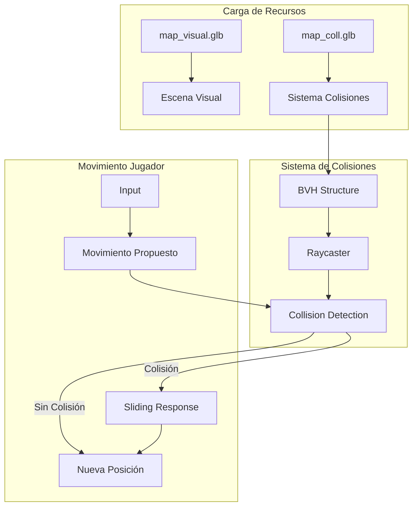

# Design Document: Sistema de Colisiones Optimizado

## Overview

Este diseño describe la implementación de un sistema de colisiones optimizado para el juego FPS. El sistema utiliza dos modelos separados: uno visual (`map_visual.glb`) para renderizado y otro simplificado (`map_coll.glb`) para detección de colisiones. Se implementará usando Three.js con una estructura BVH (Bounding Volume Hierarchy) para optimizar las consultas de colisión.

## Architecture



## Components and Interfaces

### 1. Módulo de Colisiones (`src/sistemas/colisiones.js`)

```javascript
/**
 * Sistema de colisiones optimizado con BVH
 */

// Estado del sistema
let collisionMesh = null;
let bvh = null;
let raycaster = null;

/**
 * Inicializa el sistema de colisiones
 * @param {Function} onProgress - Callback de progreso
 * @returns {Promise<void>}
 */
export async function inicializarColisiones(onProgress);

/**
 * Verifica colisión y retorna posición corregida
 * @param {THREE.Vector3} posicionActual - Posición actual del jugador
 * @param {THREE.Vector3} posicionDeseada - Posición a la que quiere moverse
 * @param {number} radio - Radio del jugador para colisiones
 * @returns {THREE.Vector3} - Posición final después de resolver colisiones
 */
export function resolverColision(posicionActual, posicionDeseada, radio);

/**
 * Verifica si una posición está en el suelo
 * @param {THREE.Vector3} posicion - Posición a verificar
 * @returns {{enSuelo: boolean, altura: number}}
 */
export function verificarSuelo(posicion);
```

### 2. Modificaciones a Escena (`src/escena.js`)

- Cambiar carga de mapa de `lowpoly__fps__tdm__game__map_by_resoforge.glb` a `map_visual.glb`
- Eliminar el mapa antiguo de la escena
- Integrar inicialización del sistema de colisiones

### 3. Modificaciones a Jugador (`src/entidades/Jugador.js`)

- Eliminar límites fijos de posición (`CONFIG.jugador.limites`)
- Integrar llamadas al sistema de colisiones en `actualizarMovimiento()`
- Usar `verificarSuelo()` para detección de suelo

### 4. Modificaciones a Config (`src/config.js`)

- Eliminar `jugador.limites` (ya no se necesitan límites fijos)
- Agregar configuración de colisiones:
  - `colisiones.radioJugador`: Radio para detección de colisiones
  - `colisiones.margenPared`: Margen de separación de paredes

## Data Models

### Configuración de Colisiones

```javascript
colisiones: {
  radioJugador: 0.5,      // Radio del jugador para colisiones horizontales
  alturaJugador: 1.7,     // Altura del jugador
  margenPared: 0.1,       // Margen de separación de paredes
  rayosHorizontales: 8,   // Número de rayos para detección horizontal
  distanciaRayo: 0.6      // Distancia máxima de detección
}
```

### Estado de Colisión

```javascript
{
  colisionDetectada: boolean,
  normal: THREE.Vector3,      // Normal de la superficie de colisión
  punto: THREE.Vector3,       // Punto de colisión
  distancia: number           // Distancia al punto de colisión
}
```

## Correctness Properties

*A property is a characteristic or behavior that should hold true across all valid executions of a system-essentially, a formal statement about what the system should do. Properties serve as the bridge between human-readable specifications and machine-verifiable correctness guarantees.*

### Property 1: Collision Prevention
*For any* player position and movement direction, if the resulting position would be inside collision geometry, the collision system SHALL return a position that is outside the collision geometry.
**Validates: Requirements 2.4**

### Property 2: Free Movement in Open Areas
*For any* player position that is not inside collision geometry, and any movement that does not intersect collision geometry, the collision system SHALL allow the full movement without modification.
**Validates: Requirements 3.3**

### Property 3: Wall Sliding Preserves Parallel Movement
*For any* collision with a wall at an angle, the resulting movement SHALL preserve the component of velocity parallel to the wall surface (sliding behavior).
**Validates: Requirements 5.1**

### Property 4: Ground Height Consistency
*For any* player position on the ground, the player's Y coordinate SHALL equal the floor height plus the configured eye height.
**Validates: Requirements 5.3**

## Error Handling

| Error | Handling |
|-------|----------|
| `map_visual.glb` no carga | Crear suelo fallback, mostrar error en consola |
| `map_coll.glb` no carga | Desactivar colisiones, usar límites fijos como fallback |
| BVH falla al construir | Log error, usar detección de colisiones sin optimizar |
| Raycast sin resultados | Permitir movimiento (asumir área libre) |

## Testing Strategy

### Unit Tests
- Verificar carga correcta de `map_visual.glb`
- Verificar carga correcta de `map_coll.glb`
- Verificar construcción de BVH
- Verificar fallback cuando los modelos no cargan

### Property-Based Tests
Se utilizará la librería **fast-check** para JavaScript para implementar los tests de propiedades.

Cada test de propiedad debe:
- Ejecutar mínimo 100 iteraciones
- Usar generadores que produzcan posiciones válidas dentro del espacio del mapa (50x50)
- Incluir comentario referenciando la propiedad del diseño: `**Feature: sistema-colisiones-mapa, Property {N}: {descripción}**`

### Integration Tests
- Verificar que el jugador no atraviesa paredes durante movimiento normal
- Verificar que el deslizamiento en paredes funciona correctamente
- Verificar que la detección de suelo mantiene al jugador a la altura correcta

