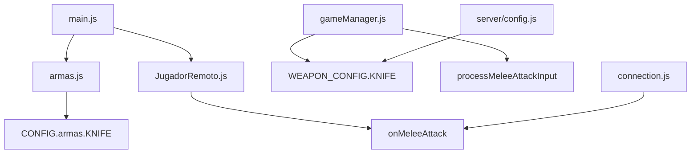

# Design Document: Corrección de Bugs del Sistema de Cuchillo

## Overview

Este diseño describe las correcciones necesarias para los bugs del sistema de cuchillo del juego FPS. Las correcciones incluyen: ajuste del daño de 50 a 30, prevención de crashes con manejo de errores robusto, corrección de la animación TPS para que sea visible a otros jugadores, implementación del indicador de daño visual, y bloqueo del sistema de apuntado cuando el cuchillo está equipado.

## Architecture

El sistema de cuchillo interactúa con múltiples módulos:



### Componentes Afectados

1. **src/config.js**: Configuración del daño del cuchillo (cliente)
2. **server/config.js**: Configuración del daño del cuchillo (servidor)
3. **src/sistemas/armas.js**: Lógica de ataque y bloqueo de apuntado
4. **src/entidades/JugadorRemoto.js**: Animación TPS para otros jugadores
5. **src/main.js**: Manejo de apuntado y feedback visual
6. **server/gameManager.js**: Procesamiento de ataques melee

## Components and Interfaces

### 1. Corrección de Daño (config.js y server/config.js)

```javascript
// src/config.js - Cliente
"KNIFE": {
  daño: 30,  // Cambiado de 50 a 30
  // ... resto de configuración
}

// server/config.js - Servidor
KNIFE: {
  damage: 30,  // Cambiado de 50 a 30
  // ... resto de configuración
}
```

### 2. Bloqueo de Apuntado (armas.js)

```javascript
// Modificar alternarApuntado para bloquear con cuchillo
export function alternarApuntado(apuntar = null) {
  // NUEVO: Bloquear apuntado si el cuchillo está equipado
  if (arma.tipoActual === 'KNIFE') {
    return; // No permitir apuntado con cuchillo
  }
  // ... resto de la función
}
```

### 3. Manejo de Errores en Ataque (armas.js)

```javascript
export function atacarConCuchillo(camera, enemigos, scene, onImpacto = null) {
  // NUEVO: Validación de entrada
  if (!enemigos || !Array.isArray(enemigos)) {
    enemigos = [];
  }
  
  // NUEVO: Validación de posición de enemigo
  for (const enemigo of enemigos) {
    if (!enemigo) continue;
    
    let posicionEnemigo = null;
    try {
      // Intentar obtener posición con manejo de errores
      posicionEnemigo = obtenerPosicionEnemigo(enemigo);
    } catch (error) {
      console.warn('Error obteniendo posición de enemigo:', error);
      continue;
    }
    // ...
  }
}
```

### 4. Animación TPS (JugadorRemoto.js)

```javascript
// Asegurar que procesarAtaqueCuchillo se llame correctamente
procesarAtaqueCuchillo() {
  // Verificar que el modelo y animador existen
  if (!this.animador) {
    console.warn('Animador no disponible para ataque de cuchillo');
    return;
  }
  
  // Reproducir animación
  this.reproducirAnimacionAtaqueTPS();
}
```

## Data Models

### Configuración del Cuchillo Corregida

```javascript
// Cliente (src/config.js)
{
  "KNIFE": {
    nombre: "Knife",
    tipo: "melee",
    daño: 30,                    // CORREGIDO: de 50 a 30
    rangoAtaque: 3.0,
    cadenciaAtaque: 350,
    modelo: "modelos/valorants_knife_low_poly.glb",
    animacionAtaque: "modelos/animaciones/knife_attack_tps.glb",
    posicion: { x: 0.35, y: -0.4, z: -0.5 },
    rotacion: { x: -0.2, y: Math.PI * 0.7, z: 0.15 },
    escala: { x: 0.6, y: 0.6, z: 0.6 }
  }
}

// Servidor (server/config.js)
{
  KNIFE: {
    damage: 30,              // CORREGIDO: de 50 a 30
    fireRate: 350,
    magazineSize: 0,
    totalAmmo: 0,
    reloadTime: 0,
    bulletSpeed: 0,
    headshotMultiplier: 1.0,
    type: 'melee',
    attackRange: 3
  }
}
```

## Correctness Properties

*A property is a characteristic or behavior that should hold true across all valid executions of a system-essentially, a formal statement about what the system should do. Properties serve as the bridge between human-readable specifications and machine-verifiable correctness guarantees.*

### Property 1: Knife damage consistency
*For any* knife attack that hits a target, the damage applied SHALL be exactly 30 points, both on client and server.
**Validates: Requirements 1.1, 1.2, 1.3, 1.4**

### Property 2: Aim blocking when knife equipped
*For any* attempt to aim (ADS) while the knife is equipped, the system SHALL ignore the input and maintain default FOV.
**Validates: Requirements 5.1, 5.2, 5.4**

### Property 3: Aim restoration after weapon switch
*For any* weapon switch from knife to main weapon, the aiming functionality SHALL be fully restored.
**Validates: Requirements 5.3**

### Property 4: Damage indicator consistency
*For any* knife attack, the damage indicator SHALL be displayed if and only if at least one enemy was hit.
**Validates: Requirements 4.1, 4.4**

### Property 5: Melee attack broadcast
*For any* successful melee attack, the server SHALL broadcast the attack event to all other players in the room.
**Validates: Requirements 3.1, 6.4**

### Property 6: Weapon state synchronization
*For any* weapon change (including knife), the server state SHALL match the client state after the change event is processed.
**Validates: Requirements 6.1, 6.3**

### Property 7: Server weapon validation
*For any* melee attack received by the server, the attack SHALL be rejected if the player does not have KNIFE equipped.
**Validates: Requirements 6.2**

## Error Handling

1. **Array de enemigos null/undefined**: Convertir a array vacío y continuar
2. **Enemigo sin posición válida**: Saltar enemigo y continuar con los demás
3. **Modelo de cuchillo no cargado**: Log warning, continuar sin visual
4. **Animación no cargada**: Usar animación procedural de fallback
5. **Animador no inicializado**: Log warning, no reproducir animación

## Testing Strategy

### Unit Tests
- Verificar que CONFIG.armas.KNIFE.daño === 30
- Verificar que WEAPON_CONFIG.KNIFE.damage === 30
- Verificar que alternarApuntado() retorna temprano con cuchillo equipado
- Verificar que atacarConCuchillo() no crashea con null/undefined

### Property-Based Tests
Se utilizará **fast-check** como librería de property-based testing para JavaScript.

Cada test de propiedad debe:
- Ejecutar mínimo 100 iteraciones
- Estar anotado con el formato: `**Feature: sistema-cuchillo, Property {number}: {property_text}**`
- Referenciar el criterio de aceptación que valida

**Tests de Propiedad a Implementar:**

1. **Property 1**: Generar ataques aleatorios y verificar daño = 30
2. **Property 2**: Generar estados con cuchillo equipado y verificar bloqueo de apuntado
3. **Property 3**: Generar secuencias de cambio de arma y verificar restauración de apuntado
4. **Property 4**: Generar ataques con/sin impactos y verificar indicador de daño
5. **Property 5**: Generar ataques exitosos y verificar broadcast
6. **Property 6**: Generar cambios de arma y verificar sincronización
7. **Property 7**: Generar ataques melee sin cuchillo equipado y verificar rechazo
