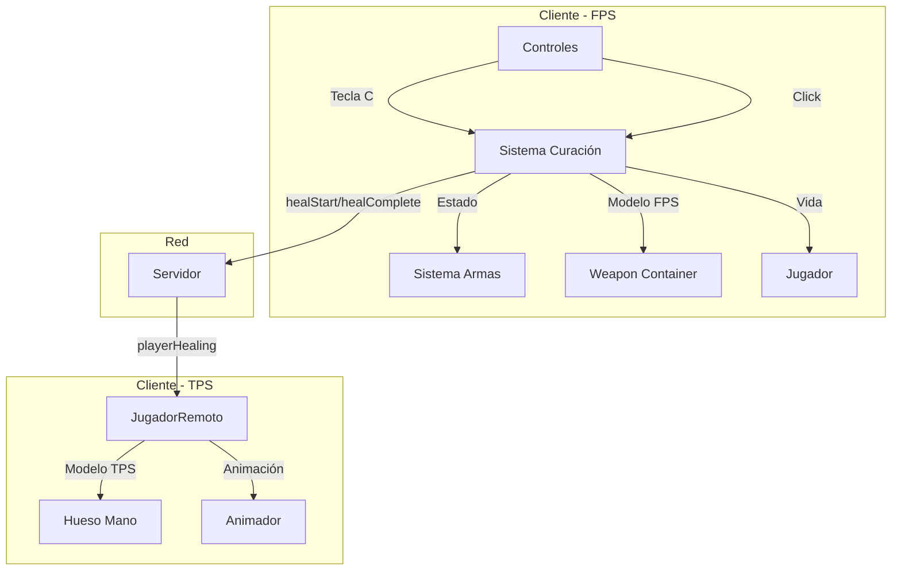

# Design Document - Sistema de Curación

## Overview

El Sistema de Curación permite a los jugadores recuperar vida usando un item de curación (JuiceBox) que se equipa con la tecla C. El sistema se integra con el sistema de armas existente, siendo mutuamente excluyente con armas y cuchillo. La curación toma 2 segundos y restaura 50 HP al completarse. Durante la curación, el jugador no puede atacar ni apuntar.

El sistema incluye sincronización multiplayer para que los jugadores remotos vean el JuiceBox y la animación de curación (healt_tps).

## Architecture



## Components and Interfaces

### 1. Estado de Curación (en armas.js)

```javascript
/**
 * Estado del sistema de curación
 * Requirements: 1.1, 2.1, 3.1, 4.1
 */
const estadoCuracion = {
  juiceBoxEquipado: false,      // Si el JuiceBox está equipado actualmente
  armaPreviaACuracion: null,    // Arma a restaurar al desequipar JuiceBox
  curacionEnProgreso: false,    // Si hay una curación activa
  tiempoInicioCuracion: 0,      // Timestamp de inicio de curación
  modeloJuiceBox: null,         // Referencia al modelo cargado
  modeloCargado: false          // Si el modelo ya fue cargado
};
```

### 2. Funciones Principales

```javascript
/**
 * Alterna el equipamiento del JuiceBox con tecla C
 * Requirements: 1.1, 1.2, 1.3, 2.1, 2.2, 2.3
 * @param {THREE.Object3D} weaponContainer - Contenedor del arma FPS
 * @returns {Promise<boolean>} - true si se realizó el cambio
 */
export async function alternarJuiceBox(weaponContainer);

/**
 * Inicia el proceso de curación al hacer clic
 * Requirements: 3.1, 3.2, 3.4, 3.5
 * @returns {boolean} - true si se inició la curación
 */
export function iniciarCuracion();

/**
 * Cancela la curación en progreso
 * Requirements: 3.3
 */
export function cancelarCuracion();

/**
 * Actualiza el estado de curación (llamar cada frame)
 * Requirements: 3.2
 * @param {number} deltaTime - Tiempo desde último frame
 * @returns {Object} - { completada: boolean, vidaCurada: number }
 */
export function actualizarCuracion(deltaTime);

/**
 * Verifica si el JuiceBox está equipado
 * Requirements: 4.1
 * @returns {boolean}
 */
export function esJuiceBoxEquipado();

/**
 * Verifica si hay curación en progreso
 * Requirements: 3.4
 * @returns {boolean}
 */
export function estaCurando();
```

### 3. Integración con Controles (controles.js)

```javascript
// Nuevo callback para tecla C
callbacks.onAlternarJuiceBox = null;

// En manejarTeclaPresionada:
if (evento.code === 'KeyC' && callbacks.onAlternarJuiceBox) {
  callbacks.onAlternarJuiceBox();
}
```

### 4. Integración con JugadorRemoto (JugadorRemoto.js)

```javascript
/**
 * Configuración del JuiceBox TPS
 * Requirements: 5.1, 6.1, 6.2
 */
const JUICEBOX_TPS_CONFIG = {
  modelPath: 'modelos/stylized_juicebox.glb',
  scale: 0.15,
  positionOffset: { x: 0.02, y: 0.01, z: 0.03 },
  rotationOffset: { x: 0, y: Math.PI * 0.5, z: 0 },
  handBoneNames: ['hand_r', 'Hand_R', 'RightHand', 'mixamorigRightHand', 'hand.R']
};

/**
 * Procesa evento de curación de jugador remoto
 * Requirements: 5.1, 5.2, 5.3, 5.4
 */
procesarCuracion(iniciando);
```

## Data Models

### Configuración del JuiceBox (config.js)

```javascript
CONFIG.curacion = {
  modelo: "modelos/stylized_juicebox.glb",
  vidaCurada: 50,
  tiempoCuracion: 2000,  // 2 segundos en ms
  // Posición FPS
  posicion: { x: 0.25, y: -0.35, z: -0.4 },
  rotacion: { x: 0, y: Math.PI * 0.3, z: 0.1 },
  escala: { x: 0.15, y: 0.15, z: 0.15 }
};
```

### Mensajes de Red

```javascript
// Cliente -> Servidor
socket.emit('healStart');      // Inicia curación
socket.emit('healCancel');     // Cancela curación
socket.emit('healComplete');   // Curación completada

// Servidor -> Clientes
socket.broadcast.emit('playerHealing', {
  playerId: string,
  healing: boolean
});
```

## Correctness Properties

*A property is a characteristic or behavior that should hold true across all valid executions of a system-essentially, a formal statement about what the system should do. Properties serve as the bridge between human-readable specifications and machine-verifiable correctness guarantees.*

### Property 1: Toggle de Equipamiento JuiceBox
*For any* estado de equipamiento (arma, cuchillo, o JuiceBox), al presionar la tecla C, el JuiceBox debe alternar su estado de equipamiento correctamente: si no estaba equipado, debe equiparse y ocultar el item anterior; si estaba equipado, debe desequiparse y restaurar el item anterior.
**Validates: Requirements 1.1, 1.2, 1.3**

### Property 2: Exclusividad Mutua de Equipamiento
*For any* estado del sistema, exactamente uno de los siguientes debe ser visible: un arma, el cuchillo, o el JuiceBox. Nunca pueden estar visibles dos items simultáneamente.
**Validates: Requirements 2.1, 2.2, 2.3**

### Property 3: Cambio de Arma Desequipa JuiceBox
*For any* cambio de arma (teclas numéricas o rueda del mouse) mientras el JuiceBox está equipado, el JuiceBox debe desequiparse automáticamente y el arma seleccionada debe equiparse.
**Validates: Requirements 2.4**

### Property 4: Curación Respeta Límites de Vida
*For any* curación completada, la vida resultante debe ser igual a min(vidaActual + 50, vidaMaxima). La curación nunca debe exceder la vida máxima ni resultar en vida negativa.
**Validates: Requirements 3.2, 3.5**

### Property 5: Interrupción Cancela Curación Sin Efecto
*For any* curación interrumpida antes de completar los 2 segundos, la vida del jugador debe permanecer exactamente igual que antes de iniciar la curación.
**Validates: Requirements 3.3**

### Property 6: Bloqueo de Apuntado con JuiceBox
*For any* intento de apuntar (clic derecho) mientras el JuiceBox está equipado, el estado de apuntado debe permanecer en false y el FOV de la cámara no debe cambiar.
**Validates: Requirements 4.1**

### Property 7: Bloqueo Durante Curación
*For any* intento de cambiar arma o apuntar mientras la curación está en progreso, el sistema debe ignorar estos inputs y mantener el estado de curación activo.
**Validates: Requirements 3.4**

## Error Handling

1. **Modelo no carga**: Si el modelo del JuiceBox no carga, mostrar warning en consola y usar un placeholder invisible. El sistema de curación sigue funcionando.

2. **Animación no disponible**: Si healt_tps.glb no está disponible, usar animación idle como fallback para jugadores remotos.

3. **Desconexión durante curación**: Si el jugador se desconecta durante la curación, el servidor cancela automáticamente la curación.

4. **Vida máxima alcanzada**: Permitir iniciar curación pero no exceder vida máxima. Mostrar feedback visual de que la curación fue parcial.

## Testing Strategy

### Property-Based Testing

Se utilizará **fast-check** como librería de property-based testing para JavaScript.

Cada test de propiedad debe:
- Ejecutar mínimo 100 iteraciones
- Estar etiquetado con el formato: `**Feature: sistema-curacion, Property {number}: {property_text}**`
- Generar estados aleatorios válidos del sistema

### Unit Tests

1. **Test de carga de modelo**: Verificar que el modelo JuiceBox se carga correctamente
2. **Test de toggle**: Verificar que alternarJuiceBox cambia el estado correctamente
3. **Test de timer**: Verificar que la curación dura exactamente 2 segundos
4. **Test de integración con armas**: Verificar que el cambio de arma desequipa JuiceBox

### Generadores para Property Tests

```javascript
// Generador de estado de equipamiento
const estadoEquipamientoArb = fc.oneof(
  fc.constant({ tipo: 'arma', nombre: 'M4A1' }),
  fc.constant({ tipo: 'arma', nombre: 'AK47' }),
  fc.constant({ tipo: 'arma', nombre: 'PISTOLA' }),
  fc.constant({ tipo: 'cuchillo' }),
  fc.constant({ tipo: 'juicebox' })
);

// Generador de vida del jugador
const vidaJugadorArb = fc.integer({ min: 1, max: 200 });

// Generador de tiempo de curación
const tiempoCuracionArb = fc.integer({ min: 0, max: 3000 });
```
