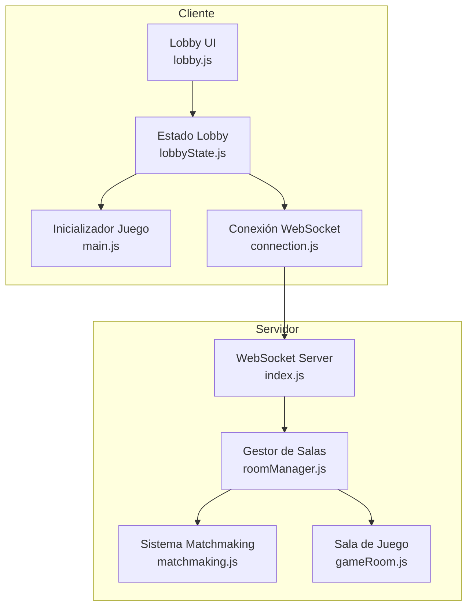
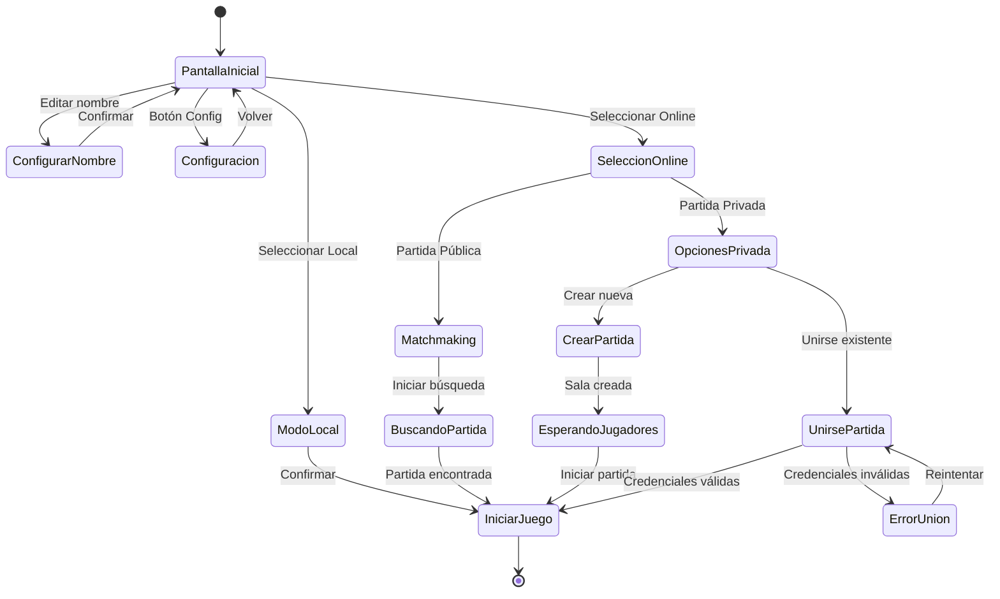

# Documento de Diseño - Sistema de Lobby

## Overview

El sistema de lobby es la puerta de entrada al juego FPS multijugador. Reemplaza el inicio directo del juego por una interfaz donde los jugadores pueden configurar su nombre, elegir modo de juego (local/online), y en caso de online, seleccionar entre partidas públicas con matchmaking automático o partidas privadas protegidas por contraseña.

El sistema se integra con la arquitectura existente del juego, modificando el flujo de inicio en `index.html` y `src/main.js`, y extendiendo el servidor WebSocket para soportar múltiples salas de juego.

## Architecture



### Flujo de Navegación del Lobby



## Components and Interfaces

### Cliente

#### 1. LobbyUI (`src/lobby/lobbyUI.js`)

Componente de interfaz de usuario que renderiza y gestiona las pantallas del lobby.

```javascript
/**
 * Inicializa el sistema de lobby UI
 * @param {Object} callbacks - Callbacks para eventos del lobby
 */
function inicializarLobbyUI(callbacks);

/**
 * Muestra una pantalla específica del lobby
 * @param {string} pantalla - Nombre de la pantalla ('inicial', 'online', 'privada', 'crear', 'unirse', 'config')
 */
function mostrarPantalla(pantalla);

/**
 * Actualiza el nombre mostrado del jugador
 * @param {string} nombre - Nombre del jugador
 */
function actualizarNombreJugador(nombre);

/**
 * Muestra mensaje de error en la pantalla actual
 * @param {string} mensaje - Mensaje de error
 */
function mostrarError(mensaje);

/**
 * Muestra indicador de carga con mensaje
 * @param {string} mensaje - Mensaje a mostrar
 */
function mostrarCargando(mensaje);

/**
 * Oculta el lobby y permite iniciar el juego
 */
function ocultarLobby();
```

#### 2. LobbyState (`src/lobby/lobbyState.js`)

Gestiona el estado del lobby y la lógica de negocio.

```javascript
/**
 * Estado del lobby
 */
const lobbyState = {
  nombreJugador: string,
  modoJuego: 'local' | 'online' | null,
  tipoPartida: 'publica' | 'privada' | null,
  salaActual: string | null,
  estadisticas: {
    kills: number,
    muertes: number,
    partidasJugadas: number
  }
};

/**
 * Establece el nombre del jugador
 * @param {string} nombre - Nombre a establecer
 * @returns {boolean} - true si el nombre es válido
 */
function establecerNombre(nombre);

/**
 * Genera un nombre aleatorio
 * @returns {string} - Nombre con formato "Jugador_XXXX"
 */
function generarNombreAleatorio();

/**
 * Valida un nombre de jugador
 * @param {string} nombre - Nombre a validar
 * @returns {{valido: boolean, error?: string}}
 */
function validarNombre(nombre);

/**
 * Valida una contraseña de sala
 * @param {string} password - Contraseña a validar
 * @returns {{valido: boolean, error?: string}}
 */
function validarPassword(password);

/**
 * Guarda configuración en localStorage
 */
function guardarConfiguracion();

/**
 * Carga configuración desde localStorage
 */
function cargarConfiguracion();
```

#### 3. LobbyConnection (`src/lobby/lobbyConnection.js`)

Maneja la comunicación con el servidor para operaciones del lobby.

```javascript
/**
 * Solicita matchmaking para partida pública
 * @param {string} nombreJugador - Nombre del jugador
 * @returns {Promise<{salaId: string, jugadores: number}>}
 */
async function solicitarMatchmaking(nombreJugador);

/**
 * Crea una partida privada
 * @param {string} nombreJugador - Nombre del jugador
 * @param {string} password - Contraseña de la sala
 * @returns {Promise<{salaId: string, codigo: string}>}
 */
async function crearPartidaPrivada(nombreJugador, password);

/**
 * Se une a una partida privada
 * @param {string} nombreJugador - Nombre del jugador
 * @param {string} codigo - Código de la sala
 * @param {string} password - Contraseña de la sala
 * @returns {Promise<{success: boolean, error?: string}>}
 */
async function unirsePartidaPrivada(nombreJugador, codigo, password);

/**
 * Obtiene lista de salas públicas disponibles
 * @returns {Promise<Array<{id: string, jugadores: number, maxJugadores: number}>>}
 */
async function obtenerSalasPublicas();
```

### Servidor

#### 4. RoomManager (`server/roomManager.js`)

Gestiona todas las salas de juego activas.

```javascript
/**
 * Clase que gestiona las salas de juego
 */
class RoomManager {
  /**
   * Crea una nueva sala
   * @param {Object} opciones - Opciones de la sala
   * @returns {GameRoom}
   */
  crearSala(opciones);
  
  /**
   * Obtiene una sala por ID
   * @param {string} salaId - ID de la sala
   * @returns {GameRoom|null}
   */
  obtenerSala(salaId);
  
  /**
   * Obtiene una sala por código (para privadas)
   * @param {string} codigo - Código de 6 caracteres
   * @returns {GameRoom|null}
   */
  obtenerSalaPorCodigo(codigo);
  
  /**
   * Elimina una sala
   * @param {string} salaId - ID de la sala
   */
  eliminarSala(salaId);
  
  /**
   * Obtiene salas públicas con espacio
   * @returns {Array<GameRoom>}
   */
  obtenerSalasPublicasDisponibles();
  
  /**
   * Limpia salas vacías antiguas
   */
  limpiarSalasVacias();
}
```

#### 5. GameRoom (`server/gameRoom.js`)

Representa una sala de juego individual.

```javascript
/**
 * Clase que representa una sala de juego
 */
class GameRoom {
  constructor(opciones) {
    this.id = string;           // ID único de la sala
    this.codigo = string;       // Código de 6 caracteres (solo privadas)
    this.tipo = 'publica' | 'privada';
    this.password = string;     // Hash de contraseña (solo privadas)
    this.maxJugadores = 8;
    this.jugadores = Map;       // Map<playerId, PlayerState>
    this.gameManager = GameManager;
    this.creadaEn = Date;
    this.ultimaActividad = Date;
  }
  
  /**
   * Agrega un jugador a la sala
   * @param {string} playerId - ID del jugador
   * @param {string} nombre - Nombre del jugador
   * @returns {boolean}
   */
  agregarJugador(playerId, nombre);
  
  /**
   * Remueve un jugador de la sala
   * @param {string} playerId - ID del jugador
   */
  removerJugador(playerId);
  
  /**
   * Verifica si la sala tiene espacio
   * @returns {boolean}
   */
  tieneEspacio();
  
  /**
   * Verifica la contraseña (para privadas)
   * @param {string} password - Contraseña a verificar
   * @returns {boolean}
   */
  verificarPassword(password);
  
  /**
   * Obtiene el estado de la sala para broadcast
   * @returns {Object}
   */
  obtenerEstado();
}
```

#### 6. Matchmaking (`server/matchmaking.js`)

Sistema de emparejamiento automático.

```javascript
/**
 * Encuentra la mejor sala para un jugador
 * @param {RoomManager} roomManager - Gestor de salas
 * @returns {GameRoom} - Sala seleccionada o nueva sala creada
 */
function encontrarMejorSala(roomManager);

/**
 * Calcula puntuación de una sala para matchmaking
 * @param {GameRoom} sala - Sala a evaluar
 * @returns {number} - Puntuación (mayor = mejor)
 */
function calcularPuntuacionSala(sala);
```

## Data Models

### Configuración del Jugador (localStorage)

```javascript
{
  nombreJugador: string,        // Nombre guardado del jugador
  configuracion: {
    sensibilidad: number,       // 0.001 - 0.01
    volumen: number,            // 0 - 1
    mostrarFPS: boolean,
    crosshairDinamico: boolean
  },
  estadisticas: {
    kills: number,
    muertes: number,
    partidasJugadas: number,
    tiempoJugado: number        // En segundos
  }
}
```

### Mensaje de Lobby (WebSocket)

```javascript
// Cliente -> Servidor
{
  type: 'lobby',
  action: 'matchmaking' | 'createPrivate' | 'joinPrivate' | 'listRooms',
  data: {
    playerName: string,
    password?: string,          // Para crear/unirse privada
    roomCode?: string           // Para unirse a privada
  }
}

// Servidor -> Cliente
{
  type: 'lobbyResponse',
  action: string,
  success: boolean,
  data: {
    roomId?: string,
    roomCode?: string,          // Código de 6 caracteres
    players?: number,
    error?: string
  }
}
```

### Estado de Sala

```javascript
{
  id: string,                   // UUID de la sala
  codigo: string,               // Código de 6 caracteres (ej: "ABC123")
  tipo: 'publica' | 'privada',
  jugadores: [{
    id: string,
    nombre: string,
    listo: boolean
  }],
  maxJugadores: 8,
  estado: 'esperando' | 'jugando',
  creadaEn: timestamp
}
```

## Correctness Properties

*A property is a characteristic or behavior that should hold true across all valid executions of a system-essentially, a formal statement about what the system should do. Properties serve as the bridge between human-readable specifications and machine-verifiable correctness guarantees.*

### Property 1: Validación de nombre de jugador
*For any* string de entrada como nombre de jugador, la función de validación SHALL retornar `valido: true` si y solo si el string tiene entre 3 y 16 caracteres y contiene únicamente caracteres alfanuméricos (a-z, A-Z, 0-9, _).
**Validates: Requirements 1.5**

### Property 2: Generación de nombre aleatorio
*For any* invocación de `generarNombreAleatorio()`, el resultado SHALL tener el formato "Jugador_XXXX" donde XXXX son exactamente 4 dígitos numéricos (0-9).
**Validates: Requirements 1.4**

### Property 3: Validación de contraseña
*For any* string de entrada como contraseña, la función de validación SHALL retornar `valido: true` si y solo si el string tiene entre 4 y 20 caracteres.
**Validates: Requirements 4.4**

### Property 4: Unicidad de códigos de sala
*For any* conjunto de salas creadas, todos los códigos de sala SHALL ser únicos y tener exactamente 6 caracteres alfanuméricos.
**Validates: Requirements 4.2, 10.1**

### Property 5: Persistencia de configuración (Round-trip)
*For any* configuración guardada en localStorage, al cargarla posteriormente SHALL retornar un objeto equivalente al original.
**Validates: Requirements 2.2, 7.3**

### Property 6: Matchmaking selecciona sala óptima
*For any* conjunto de salas públicas disponibles con espacio, el matchmaking SHALL seleccionar la sala con mayor número de jugadores activos.
**Validates: Requirements 6.2, 10.2**

### Property 7: Validación de credenciales de sala
*For any* solicitud de unirse a sala privada, el servidor SHALL permitir acceso si y solo si el código existe Y la contraseña coincide Y la sala tiene espacio.
**Validates: Requirements 10.4**

### Property 8: Límite de jugadores por sala
*For any* sala de juego, el número de jugadores SHALL ser menor o igual a 8 en todo momento.
**Validates: Requirements 10.5**

## Error Handling

### Errores del Cliente

| Error | Causa | Manejo |
|-------|-------|--------|
| `NOMBRE_INVALIDO` | Nombre no cumple validación | Mostrar mensaje específico, mantener en pantalla de nombre |
| `PASSWORD_INVALIDA` | Contraseña no cumple validación | Mostrar mensaje, mantener en formulario |
| `CONEXION_FALLIDA` | No se puede conectar al servidor | Ofrecer modo local o reintentar |
| `TIMEOUT_MATCHMAKING` | Matchmaking tarda más de 30s | Cancelar y mostrar opción de reintentar |

### Errores del Servidor

| Error | Causa | Respuesta |
|-------|-------|-----------|
| `SALA_NO_ENCONTRADA` | Código de sala no existe | `{success: false, error: 'Sala no encontrada'}` |
| `PASSWORD_INCORRECTA` | Contraseña no coincide | `{success: false, error: 'Contraseña incorrecta'}` |
| `SALA_LLENA` | Sala alcanzó máximo de jugadores | `{success: false, error: 'Partida llena'}` |
| `SALA_EN_JUEGO` | Partida ya iniciada | `{success: false, error: 'Partida en progreso'}` |

### Recuperación de Errores

1. **Desconexión durante matchmaking**: Cancelar búsqueda, volver a pantalla de selección
2. **Desconexión en sala de espera**: Notificar a otros jugadores, remover de la sala
3. **Error al crear sala**: Mostrar error, permitir reintentar
4. **Servidor no disponible**: Ofrecer modo local automáticamente

## Testing Strategy

### Enfoque Dual de Testing

El sistema utilizará tanto pruebas unitarias como pruebas basadas en propiedades (PBT) para garantizar la correctitud:

- **Pruebas unitarias**: Verifican ejemplos específicos, casos edge y condiciones de error
- **Pruebas basadas en propiedades**: Verifican propiedades universales que deben cumplirse para todas las entradas válidas

### Framework de Testing

- **Unit Tests**: Vitest (ya configurado en el proyecto)
- **Property-Based Testing**: fast-check (biblioteca PBT para JavaScript)

### Configuración de PBT

Cada prueba basada en propiedades ejecutará un mínimo de 100 iteraciones para garantizar cobertura adecuada.

### Pruebas Unitarias

1. **LobbyUI**
   - Renderizado correcto de cada pantalla
   - Transiciones entre pantallas
   - Manejo de eventos de botones

2. **LobbyState**
   - Carga/guardado de configuración
   - Gestión de estadísticas

3. **RoomManager**
   - Creación y eliminación de salas
   - Limpieza automática de salas vacías

4. **GameRoom**
   - Agregar/remover jugadores
   - Verificación de contraseña

5. **Matchmaking**
   - Selección de sala óptima
   - Creación de sala cuando no hay disponibles

### Pruebas Basadas en Propiedades (PBT)

Cada prueba PBT debe estar etiquetada con el formato:
`**Feature: sistema-lobby, Property {number}: {property_text}**`

1. **Property 1**: Validación de nombre
   - Generar strings aleatorios
   - Verificar que validación acepta solo strings de 3-16 caracteres alfanuméricos

2. **Property 2**: Generación de nombre aleatorio
   - Generar múltiples nombres
   - Verificar formato "Jugador_XXXX" con 4 dígitos

3. **Property 3**: Validación de contraseña
   - Generar strings aleatorios
   - Verificar que validación acepta solo strings de 4-20 caracteres

4. **Property 4**: Unicidad de códigos
   - Generar múltiples salas
   - Verificar que todos los códigos son únicos y de 6 caracteres

5. **Property 5**: Round-trip de configuración
   - Generar configuraciones aleatorias
   - Guardar y cargar, verificar equivalencia

6. **Property 6**: Matchmaking óptimo
   - Generar conjuntos de salas con diferentes cantidades de jugadores
   - Verificar que siempre se selecciona la de mayor ocupación

7. **Property 7**: Validación de credenciales
   - Generar combinaciones de código/contraseña
   - Verificar que solo combinaciones correctas permiten acceso

8. **Property 8**: Límite de jugadores
   - Intentar agregar jugadores a salas
   - Verificar que nunca se excede el límite de 8

### Cobertura de Requisitos

| Requisito | Unit Test | Property Test |
|-----------|-----------|---------------|
| 1.4 | ✓ | Property 2 |
| 1.5 | ✓ | Property 1 |
| 2.2 | ✓ | Property 5 |
| 4.2 | ✓ | Property 4 |
| 4.4 | ✓ | Property 3 |
| 6.2 | ✓ | Property 6 |
| 7.3 | ✓ | Property 5 |
| 10.1 | ✓ | Property 4 |
| 10.2 | ✓ | Property 6 |
| 10.4 | ✓ | Property 7 |
| 10.5 | ✓ | Property 8 |
