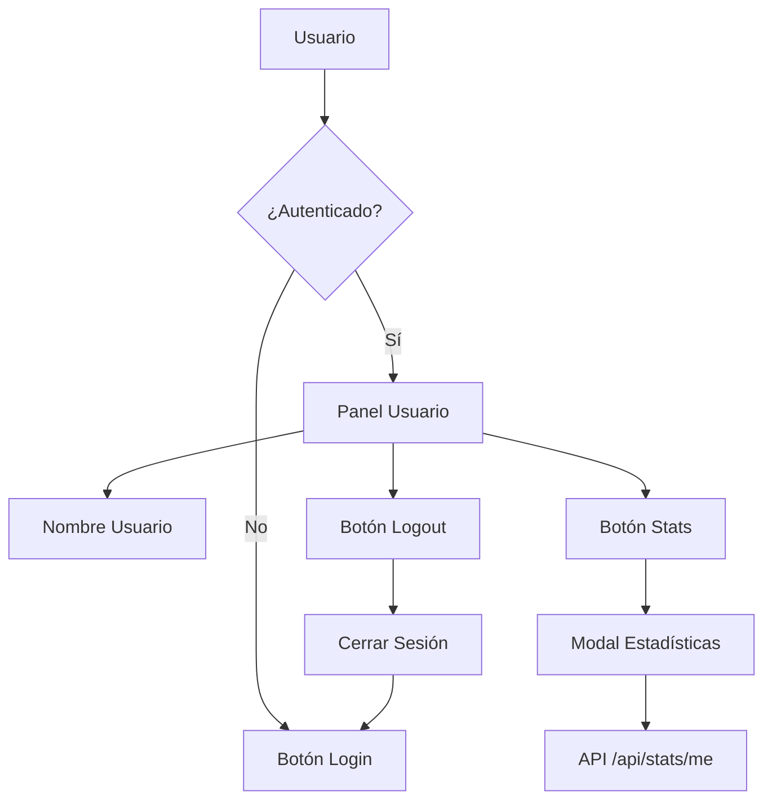

# Design Document: User Session Lobby Panel

## Overview

Este documento describe el diseño para implementar un panel de usuario en el lobby que reemplaza el botón de "Iniciar Sesión" cuando el usuario está autenticado. El panel mostrará el nombre de usuario y proporcionará acceso a las estadísticas guardadas en la base de datos.

## Architecture

El sistema sigue una arquitectura de componentes frontend que se integra con el sistema de autenticación existente (`auth.js` y `authUI.js`).



## Components and Interfaces

### 1. User Panel Component (HTML)

Nuevo componente que reemplaza el botón de login en `.corner-options`:

```html
<!-- Panel de usuario autenticado -->
<div id="user-panel" class="user-panel hidden">
  <div class="user-info">
    <span class="user-avatar"><i data-lucide="user"></i></span>
    <span id="user-panel-name" class="user-name">Username</span>
  </div>
  <div class="user-actions">
    <button id="btn-user-stats" class="user-action-btn" title="Ver estadísticas">
      <i data-lucide="bar-chart-3"></i>
    </button>
    <button id="btn-user-logout" class="user-action-btn logout" title="Cerrar sesión">
      <i data-lucide="log-out"></i>
    </button>
  </div>
</div>
```

### 2. Stats Modal Component (HTML)

Modal para mostrar estadísticas del usuario:

```html
<!-- Modal de estadísticas del usuario -->
<div id="user-stats-modal" class="stats-modal hidden">
  <div class="stats-modal-content">
    <div class="stats-modal-header">
      <h3>Mis Estadísticas</h3>
      <button id="stats-modal-close" class="stats-modal-close">&times;</button>
    </div>
    <div id="stats-modal-body" class="stats-modal-body">
      <!-- Contenido dinámico -->
    </div>
  </div>
</div>
```

### 3. AuthUI Module Updates

Modificaciones al módulo `src/sistemas/authUI.js`:

```javascript
// Nuevas funciones a implementar
export function actualizarPanelUsuario(user)
export function mostrarEstadisticas()
export function ocultarEstadisticas()
function cargarEstadisticasUsuario()
function renderizarEstadisticas(stats)
function mostrarErrorEstadisticas(error)
```

### 4. CSS Styles

Nuevos estilos en `css/estilos.css` para el panel de usuario y modal de estadísticas.

## Data Models

### User Panel State

```typescript
interface UserPanelState {
  isVisible: boolean;
  username: string | null;
  isLoadingStats: boolean;
  statsError: string | null;
}
```

### User Statistics

```typescript
interface UserStats {
  kills: number;
  deaths: number;
  matches: number;
  kdRatio: number; // Calculado: kills / max(deaths, 1)
}
```

## Correctness Properties

*A property is a characteristic or behavior that should hold true across all valid executions of a system-essentially, a formal statement about what the system should do. Properties serve as the bridge between human-readable specifications and machine-verifiable correctness guarantees.*

### Property 1: Login hides login button and shows user panel
*For any* successful login event with a valid user, the login button SHALL be hidden and the user panel SHALL be visible with the correct username displayed.
**Validates: Requirements 1.1, 1.2**

### Property 2: User panel contains required elements
*For any* authenticated state, the user panel SHALL contain the username, a statistics button, and a logout button.
**Validates: Requirements 1.3, 2.1, 3.1**

### Property 3: Session persistence shows correct UI
*For any* page load with an existing valid session, the user panel SHALL be displayed instead of the login button.
**Validates: Requirements 1.4**

### Property 4: Statistics display contains required fields
*For any* statistics response from the API, the stats modal SHALL display kills, deaths, matches, and calculated K/D ratio.
**Validates: Requirements 2.2, 2.3**

### Property 5: Logout restores login button
*For any* logout action, the user panel SHALL be hidden and the login button SHALL be restored to visible state.
**Validates: Requirements 3.2, 3.3**

### Property 6: UI updates without page reload
*For any* authentication state change (login or logout), the UI SHALL update without triggering a page reload.
**Validates: Requirements 4.1**

## Error Handling

| Scenario | Handling |
|----------|----------|
| Stats API request fails | Mostrar mensaje de error en el modal con opción de reintentar |
| Stats API timeout | Mostrar mensaje "No se pudieron cargar las estadísticas" |
| Session expired | Restaurar UI a estado no autenticado |
| Network error | Mostrar mensaje de error de conexión |

## Testing Strategy

### Unit Tests
- Verificar que `actualizarPanelUsuario` actualiza correctamente el DOM
- Verificar que `mostrarEstadisticas` abre el modal
- Verificar que `ocultarEstadisticas` cierra el modal
- Verificar cálculo correcto de K/D ratio

### Property-Based Tests
Se utilizará la librería **fast-check** para JavaScript para implementar los tests de propiedades.

Cada test de propiedad debe:
1. Estar anotado con el formato: `**Feature: user-session-lobby, Property {number}: {property_text}**`
2. Ejecutar un mínimo de 100 iteraciones
3. Referenciar el criterio de aceptación que valida

### Integration Tests
- Flujo completo de login → mostrar panel → ver stats → logout
- Persistencia de sesión al recargar página
- Manejo de errores de API
